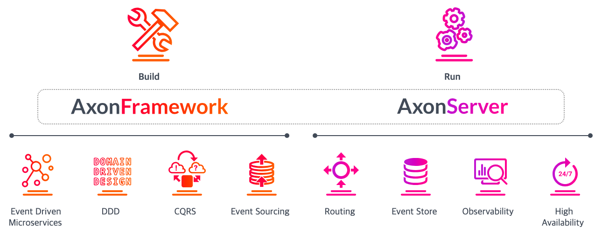

## Axon Framework란?


Axon Framework의 Document의 설명을 보면 첫줄은 아래와 같다.

> Axon Framework is a framework for building evolutionary, message-driven microservice systems based on the principles of Domain-Driven Design (DDD), Command-Query Responsibility Separation (CQRS), and Event Sourcing.

직역해보면 Axon Framework는 DDD, CQRS, EDA의 구현을 쉽게하기 위한 Open Source Framework 이다.

## Axon Framework와 Axon Server

AxonFramework는 기본적으로 Orchestration-based Saga를 구현한다. 즉, 별도의 Orchestrator를 사용한다.
- Choregraphy-based Saga도 구현할 수 있도록 지원한다.

AxonFramework는 내부적으로 아래의 컴포넌트로 나눌 수 있다.



#### 1. Axon Framework

Axon Framework는 Event Sourceing 기반으로 데이터를 관리할 수 있는 도구를 제공한다. (CQRS, DDD를 구현할 수 있도록 도와준다.)

- Event Sourcing이란 모든 데이터의 변화를 Event로 발행하는 기법이다.

#### 2. Axon Server

Axon Server는 아래의 역할을 수행한다.

- Axon Framework를 사용하는 애플리케이션들로부터 발행된 Event를 저장
- 각 애플리케이션의 상태를 관리하고 이벤트 큐의 유량을 관리
- 고가용성에 집중된 내부 구현이 되어 있고, 사용자 편리성을 위한 Observability를 제공

Axon에 대해 간단히 정리하면 Saga 구현을 위한 환경을 제공해준다고 생각하면 된다.

## Axon Framework 동작 방식

Axon Framework는 EDA(Event Driven Architecture)를 구현하기 위한 다양한 기능을 구현하고 있다.

Axon Framework는 아래의 동작 방식을 가진다. (Axon Framework로 CQRS를 구축하는 예제의 이미지이다.)


각 컴포넌트의 역할은 아래와 같다.
- Command Bus: Command가 지나갈 수 있는 통로
- Command Handler: Command Bus로부터 받은 Command를 처리
- Aggregate: Command를 할 수 있는 도메인의 단위 (DDD)
- Event Bus: Event가 지나갈 수 있는 통로
- Event Handler: Event Bus로부터 받은 Event를 처리

Axon은 위 컴포넌트들을 기반으로 동작한다.

## 적용 절차
 
아래의 절차로 Axon Framework에서 Orchestration-based Saga를 적용할 수 있다.

1. Axon Server를 구축(Axon Framework's Orchestrator)
2. 각 서비스에 Axon Framework 의존성 추가
3. Event Sourcing 방식을 사용해서 Event Driven Model 적용
4. Axon Framework가 지원하는 Saga를 구현

IntelliJ를 사용 중이라면 Axon Framework 플러그인을 설치하는 것을 권장한다.


해당 플러그인은 아래와 같이 Axon Framework의 동작 구조 파악을 위한 시각화 및 링크 기능을 제공한다.


추가로 Axon 기반의 코드 구조에 대한 검사하는 기능도 제공한다.

## 구현 코드

아래의 머니 충전 로직을 예시로 보자.

```
1. 고객 정보가 정상인지 확인 (멤버)
2. 고객의 연동된 계좌가 있는지, 고객의 연동된 계좌의 잔액이 충분한지도 확인 (뱅킹)
3. 법인 계좌 상태도 정상인지 확인 (뱅킹)
4. 증액을 위한 "기록". 요청 상태로 MoneyChangingRequest 를 생성한다.
5. 펌뱅킹을 수행하고 (고객의 연동된 계좌 -> 법인 계좌) (뱅킹)
6-1. 결과가 정상적이라면. 성공으로 MoneyChangingRequest 상태값을 변동 후에 리턴
6-2. 실패 시 펌뱅킹 수행 (법인 계좌 -> 고객의 연동된 계좌) 후 MoneyChangingRequest 상태값 변동
6-3. 성공 시 멤버의 MemberMoney 값 증액
```

해당 비즈니스를 Axon Framework를 활용한 Saga 패턴으로 **예시 코드**를 구현해보자.

머니 충전 Saga를 포함한 Axon Framework를 위한 구현은 아래 패키지에서 수행했다.


해당 부분은 Money Service의 구현이고 BankingService, RemittanceService, Common 에서도 Axon Framework의 Saga를 위한 구현이 있다.

#### Saga 실행

Axon Framework와 기본 코드 구조의 가장 큰 차이점은 서버가 요청이 들어오면 동기식으로 메서드를 호출하는 것이 아니다.

Service까지는 동기로 호출하지만 Service에서 **비즈니스를 수행(머니 조회)**한 후 아래와 같이 AxonServer의 **CommandBus에 Command를 보낸다.**


머니 **Aggregate**는 해당 Command를 받아서 **머니 충전 요청 생성 Event**를 발행한다.


Command Handling을 완료하면 최초 서비스 코드를 실행한 쓰레드는 종료된다.

`MoneyRechargeSaga`는 해당 Event를 구독하여 트리거되고, `@StartSaga`에 의해 Saga가 시작됨을 알린다.


`@SagaEventHandler(associationProperty = "rechargingRequestId")`는 구독할 Saga를 정하고 식별자를 지정하는 구문이다.

Service에서 Command를 생성할 때 `rechargingRequestId`에 유일한 키를 넣었다.

#### Saga -> 뱅킹 서비스 (검증 요청)

`MoneyRechargeSaga`는 CommandGateway를 통해 **뱅킹 계좌를 검증하는 Command**를 보낸다.


 
해당 Command를 핸들링하는 `Banking Service`의 **계좌 Aggregate**가 검증 비즈니스 로직을 호출한 후 **계좌 검증 완료 Event**를 발행한다.


해당 Event는 다시 `MoneyRechargeSaga`가 받는다.


#### Saga -> 뱅킹 서비스 (펌뱅킹 요청)

`MoneyRechargeSaga`는 검증이 성공했다면 CommandGateway를 통해 **펌뱅킹을 요청하는 Command**를 보낸다.


**펌뱅킹 Aggregate**는 해당 비즈니스를 수행한 후 **펌뱅킹 완료 Event**를 발행한다.


해당 Event는 다시 `MoneyRechargeSaga`가 받는다. (두 번째 파라미터는 로직 수행을 위해 주입받아야 하는 빈을 명시한 것이다.)


#### 머니 증액 / 보상 트랜잭션 시작

펌뱅킹이 완료되면 머니를 증액한다. 증액이 완료되면 Saga를 종료한다.

단, 머니 증액이 실패하면 펌뱅킹으로 송금했던 부분을 다시 롤백해야 한다. Saga는 이를 위해 CommandGateway로 **펌뱅킹을 롤백하는 Command**를 보낸다.


#### 펌뱅킹 롤백

**펌뱅킹 Aggregate**는 해당 펌뱅킹을 롤백하는 비즈니스를 수행한 후 **펌뱅킹 롤백 완료 Event**를 발행한다.


#### Saga 종료

해당 Event는 `MoneyRechargeSaga`가 받고 `@EndSaga`로 Saga를 종료한다. 


#### Orchestration-based Saga

이상으로 Axon으로 Orchestration Saga를 구현할 수 있었다.

Choregraphy Saga였다면 **비즈니스 로직**에서 **이벤트/롤백 이벤트를 발행**해서 비즈니스 로직이 지저분해졌을 것이다.

예제 코드에서는 **Orchestrator(Saga)가 직접 CommandGateway를 통해 서비스의 메서드를 호출**했다. 즉, Saga(Orchestrator)에서 비즈니스나 롤백 비즈니스를 직접 실행해서 트랜잭션을 집중해서 관리했다.

그래서 아래의 이점이 있었다.
- 각 서비스는 각자의 비즈니스만을 구현하면 되어서 코드가 간단해지고 테스트가 용이해졌다.
- 트랜잭션의 상태를 추적하거나 파악하기가 용이해졌다.

## Observability

Saga가 호출하는 각 서비스의 상태는 Axon Server에서 제공하는 UI에서 확인할 수 있다.


아래와 같이 각 Command가 몇 번 수행되었는 지도 확인할 수 있다.


발행된 이벤트를 모니터링해서 추적하기도 용이하다.


이외에도 Axon Server는 Saga 인스턴스 관리나 최근 N분 통계 등 사용자 편의성을 위한 다양한 기능을 제공한다.

## 예제 코드

예제 코드는 예외 처리나 디테일한 부분이 간소화된 코드인 점 참고 부탁드려요! 

코드는 아래에서 확인할 수 있습니다.
- https://github.com/violetbeach/payment-service

## Reference
- https://docs.axoniq.io/reference-guide
- https://nexocode.com/blog/posts/smooth-implementation-cqrs-es-with-sping-boot-and-axon
- https://medium.com/@positiveb16/choreography-based-saga-using-axon-framework-438a2d03b9ab