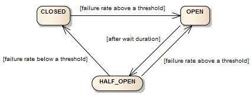
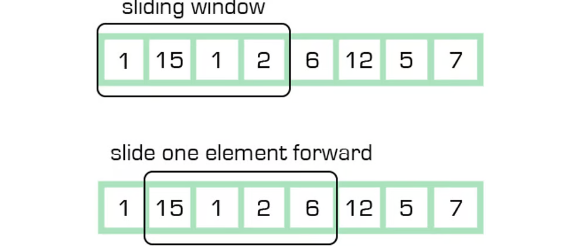
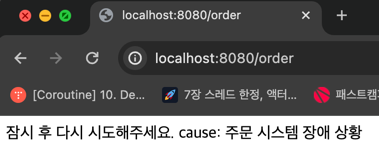
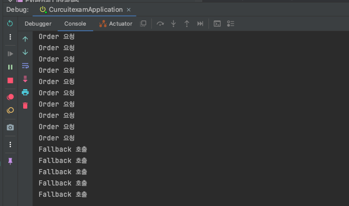

## Spring Cloud

Spring Cloud는 안정적인 Micro Service Architecture를 만들고 외부 환경에 대해 신경을 할애하지 않고 내부 로직에만 집중할 수 있게 도와주는 라이브러리이다.

Spring Cloud에서 지원하는 기능 중 Curcuit breaker에 대해 다룬다.

## Circuit breaker

Circuit breaker는 전기 회로의 차단기와 같은 역할을 하는 디자인 패턴을 말한다. 즉, CurcuitBreaker는 기술이 아닌 패턴을 말한다. 주요 목적은 다음과 같다.
- 외부의 장애를 격리하고 시스템 안정성을 유지할 수 있다.
- 장애 복구 시간을 확보할 수 있다.

특정 서비스의 과부하나 장애가 발생했을 때 복구가 될 때까지 추가적인 요청을 차단해서 시스템의 안정성을 유지한다.

그래서 Reactive Systems의 Resilient(복원력) 지원한다고 보면 될 것 같다.

Spring Cloud는 Spring Cloud Circuit Breaker라는 라이브러리를 지원한다.
- Spring Cloud Circuit Breaker의 구현체로는 Resilience4j와 Spring Retry, Sentinel을 제공한다.
- 해당 포스팅에서는 Resilience4j를 활용하는 예제에 대해서 다룬다.

### Circuit breaker 상태

CircuitBreaker는 FSM을 통해 구현한다.



Circuit breaker는 3가지 상태가 존재한다.
- Closed: 정상적으로 요청을 받을 수 있는 상태 (Open으로 상태 이동 가능)
- Open: Curcuit breaker가 작동하여 목적지로 가는 트래픽, 요청을 막고 fallback을 반환 (Half Open으로 상태 이동 가능)
- Half Open: 트래픽을 조금씩 흘려보고 Open을 유지할지 Closed로 변경할 지 결정(Open, Closed로 상태 이동 가능)

추가로 2가지 특별한 상태가 있다.
- Disabled: 항상 호출을 허용
- Forced Open: 항상 호출을 거부

#### Closed

Closed 상태는 가장 기본적인 상태이다.
- 들어오는 모든 요청을 대상 메서드, 서비스에 전달
- 서비스에 전달 후 응답이 느리거나 error가 발생한다면 fallback을 실행

#### Open

Open 상태에서는 기존에 호출하던 대상을 절대로 더 이상 호출하지 않는다.
- Fallback을 실행하여 반환
- 호출하는 서비스를 보호하고 복구할 수 있는 시간 확보

#### Half Open

Open 상태에서 Half open 상태로 바뀌면서 Circuit breaker는 State transition 이벤트를 발행한다.

Open 상태에서 Half open으로 가기 위해서는 2가지 방법이 존재한다.
- Circuit breaker API를 사용해서 직접 변경
- 옵션을 지정하여 특정 시간이 지나면 자동으로 변경

가령 60초에 한번씩 Open -> Half Open으로 자동 변경을 하게 설정할 수 있다.

Half Open 상태가 되면 Close가 되기 위해 아래의 역할을 수행한다.
- Half open 상태에서 N번의 동작에 대한 측정 결과를 저장한다.
- Failure rate가 임계점보다 높거나 같다면 Open으로, 낮다면 Close로 전환한다.

## Sliding window

Circuit breaker는 대상이 되는 서비스 호출의 결과를 Sliding window 형태로 저장한다.



CurcuitBreaker는 `Count-based sliding window`와 `Time-based sliding window`가 존재한다.

- Count-based sliding window: 
  - N개 만큼의 측정 결과를 저장
  - 1개의 요청마다 실패율 계산 필요
- Time-based sliding window:
  - 최근 N초의 실패율을 계산한다.
  - Count-based sliding window의 성능 문제를 개선
- 전체 대비 실패 비율을 failure rate라고 한다.
- Failure rate가 설정한 임계치에 도달하는 순간 Open 상태로 변경된다.

#### Resilience4j


Resilience4j는 Java에서 Curcuit breaker를 지원하는 러이브러리이다.

Gradle에 아래 의존을 추가한다.

```groovy
dependencies {
    // reactive
    implementation("org.springframework.cloud:spring-cloud-starter-circuitbreaker-reactor-resilience4j")
    // non-reactive
    // implementation("org.springframework.cloud:spring-cloud-starter-circuitbreaker-resilience4j")
}

dependencyManagement {
    imports {
        mavenBom("org.springframework.cloud:spring-cloud-dependencies:2021.0.8")
    }
}
```

## CircuitBreakerConfig

기본적으로 위 의존을 추가했다면 AutoConfiguration이 동작한다. (`spring.cloud.circuitbreaker.resilience4j.enabled`를 false로 설정하면 Off 할 수 있다.) 

아래는 예시로 작성한 빈 기반 커스텀 설정이다.

```java
@Bean
public Customizer<ReactiveResilience4JCircuitBreakerFactory> autoHalf() {
    var cbConfig = CircuitBreakerConfig.custom()
            .failureRateThreshold(50)
            .slidingWindowSize(100)
            .enableAutomaticTransitionFromOpenToHalfOpen()
            .waitDurationInOpenState(Duration.ofSeconds(5))
            .build();

    var targets = new String[]{"money"};
    return factory -> {
        factory.addCircuitBreakerCustomizer(
                getEventLogger(), targets);
        factory.configure(builder -> {
            builder.circuitBreakerConfig(cbConfig);
        }, targets);
    };
}
```

각 프로퍼티가 의미하는 것은 아래와 같다.
- failureRateThreshold: 장애로 인해 Open으로 상태를 전환할 FailureRate의 임계치
- slidingWindowSize: 최근 몇 개의 요청을 측정할 지
- enableAutomaticTransitionFromOpenToHalfOpen: 자동으로 Open -> Half open 변경을 사용할 지
- waitDurationInOpenState: Open에서 몇 초 뒤 Half Open으로 상태를 변경할 지

그 외에도 다양한 설정이 존재한다.
- ignoreExceptions: 서비스에서 Exception을 던질 경우 허용할 Excceptions 목록
- permittedNumberOfCallsInHalfOpenStatus: Half open 상태에서 허용할 호출 수
- maxWaitDurationInHalfOpenStatus: Hlf open 상태에서 대기할 수 있는 최대 시간

## TimeLimitConfig

아래와 같이 TimeLimitConfig를 설정할 수 있다.

```java
@Configuration
public class Resilience4JConfig {
    @Bean
    public Customizer<Resilience4JCircuitBreakerFactory> globalCustomConfiguration(){
        CircuitBreakerConfig circuitBreakerConfig = CircuitBreakerConfig.custom()
                .failureRateThreshold(4)
                .waitDurationInOpenState(Duration.ofMillis(1000))
                .slidingWindowType(CircuitBreakerConfig.SlidingWindowType.COUNT_BASED)
                .slidingWindowSize(2)
                .build();

        TimeLimiterConfig timeLimiterConfig = TimeLimiterConfig.custom()
                .timeoutDuration(Duration.ofSeconds(4))
                .build();

        return factory -> factory.configureDefault(id -> new Resilience4JConfigBuilder(id)
                .timeLimiterConfig(timeLimiterConfig)
                .circuitBreakerConfig(circuitBreakerConfig)
                .build()
        );
    }
}
```

TimeLimitConfig는 아래 프로퍼티를 제공한다.
- cancelRunningFuture: Future가 진행 중인 경우 Cancel 여부
- timeOutDaration: Timeout 기준 시간

#### yml 설정

CircuitBreakerConfig나 TimeLimiterConfig는 아래와 같이 yml 설정을 사용할 수도 있다.

```yaml
resilience4j:
  circuitbreaker:
    instances:
      order:
        sliding-window-size: 1
        failure-rate-threshold: 75
        automatic-transition-from-open-to-half-open-enabled: false
        wait-duration-in-open-state: 5s
        permitted-number-of-calls-in-half-open-state: 6
        ignore-exceptions:
          - java.lang.ArithmeticException
        max-wait-duration-in-half-open-state: 30s
        slow-call-rate-threshold: 50
        slow-call-duration-threshold: 1s
      payment:
        sliding-window-size: 4
        failure-rate-threshold: 50
        automatic-transition-from-open-to-half-open-enabled: true
        wait-duration-in-open-state: 5s
      shipment:
        sliding-window-size: 4
        failure-rate-threshold: 50
        automatic-transition-from-open-to-half-open-enabled: true
        wait-duration-in-open-state: 3s
        permitted-number-of-calls-in-half-open-state: 6
    configs:
      default:
        register-health-indicator: true
        sliding-window-size: 4
        failure-rate-threshold: 75
      mini-window-size:
        sliding-window-size: 4
  timelimiter:
    instances:
      order:
        timeout-duration: 1s
        cancel-running-future: true
      payment:
        timeout-duration: 1s
```

#### Circuit Breaker Group

해당 yml은 Circuit Breaker Group 별로 구성이 되어있다.
- Circuit Breaker Instance를 만들면서 Group을 지정할 수 임ㅆ다.
- 아래 순서로 설정을 적용하게 된다.
  - Instance id와 일치
  - Group과 정확히 일치
  - default 설정

## CircuitBreaker 적용

아래는 CircuitBreaker를 활용한 예시 코드이다. 

주입받은 `CircuitBreakerFactory`를 사용해서 메서드를 실행할용수 있다.

```java
@Service
public class DemoControllerService {
    private ReactiveCircuitBreakerFactory cbFactory;
    private WebClient webClient;


    public DemoControllerService(WebClient webClient, ReactiveCircuitBreakerFactory cbFactory) {
        this.webClient = webClient;
        this.cbFactory = cbFactory;
    }

    public Mono<String> slow() {
        return webClient.get().uri("/slow").retrieve().bodyToMono(String.class).transform(
            it -> cbFactory.create("slow").run(it, throwable -> return Mono.just("fallback")));
    }
}
```

모든 서비스 메서드에 해당과 같은 코드가 들어간다면 비즈니스 로직에 집중하기 어렵다.

그래서 AOP 기반 동작을 위한 `@CircuitBreaker` 애노테이션을 제공한다.

```kotlin
@RestController
class OrderController {

    @GetMapping("/order")
    @CircuitBreaker(name = "order", fallbackMethod = "orderFallback")
    fun order(): String {
        throw RuntimeException("주문 시스템 장애 상황")
        return "주문이 완료되었습니다."
    }

    fun orderFallback(e: Throwable): String {
        return "잠시 후 다시 시도해주세요. cause: ${e.message}"
    }
}
```

실제로 API Call을 해보면 일정 실패 이후부터 아래와 같이 핸들링 되는 것을 볼 수 있다.



Timeout 테스트도 아래와 같이 진행해봤다.

```kotlin
@RestController
class OrderController {

    @GetMapping("/order")
    @CircuitBreaker(name = "order", fallbackMethod = "orderFallback")
    fun order(): String {
        println("Order 요청")
        Thread.sleep(3000)
        return "주문이 완료되었습니다."
    }

    fun orderFallback(e: Throwable): String {
        println("Fallback 호출")
        return "잠시 후 다시 시도해주세요. cause: ${e.message}"
    }
}
```

아래와 같이 실제로 주문이 잘 진행되다가 TimeOut 상황이 되면 `order()` 자체를 실행시지 않고 바로 Fallback을 호출한다.



자동 Half Open 전환 설정을 하면 특정 개수만큼만 order 호출을 허용하면서 자동으로 복구할 수 있을 것이다.


## 참고

- https://docs.spring.io/spring-cloud-circuitbreaker