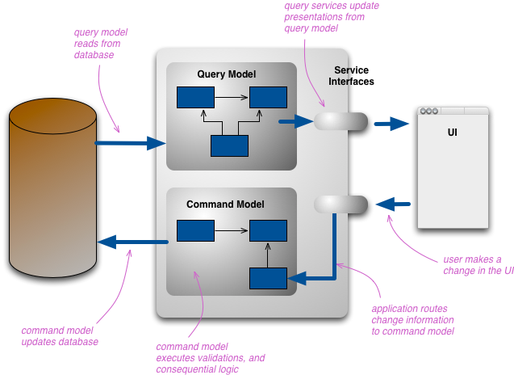

MSA 환경에서 데이터를 질의하기 위한 방법들을 정리해보자.

## 1. Client 측에서 책임

처음에는 각 Client가 API 서버에서 데이터를 질의해서 조합을 해서 사용했다.

그런데 일반적으로 Client와 API 서버는 1:n 관계이다. 
Client 측에서 각 API 서버로 질의를 해서 조합하는 **복잡한 로직을 중복으로 작성**해야 되는 문제가 생긴다.

그래서 아래와 같은 개념이 나오게 된다.

## 2. API Aggregation

API Aggregation(또는 API Composition)은 각 마이크로 서비스에 데이터를 요청해서 조합해서 클라이언트에게 내려주는 방식을 사용한다.

즉, 다수 개의 API 서버에 요청을 한 후 **데이터를 조합**하는 컴포넌트를 **상위 Layer** 로 올린 것이다.

하지만 비즈니스가 더 복잡해지고 질의할 데이터가 많아지면서 **Aggregation 서버**에서 **데이터를 메모리에서 조합**하면서 **메모리 부족** 문제에 마주하게 된다.

그래서 CQRS 패턴이 나오게 된다.

## 3. CQRS

아래는 마틴 파울러가 제시하는 CQRS 패턴의 아키텍처이다.

Write가 발생하면 Query Model을 생성/갱신한다.
- Event, CDC 등을 활용한다.

Query Model에서는 비즈니스에서 요구하는 여러 개의 API 서버가 담당하는 데이터를 포함한다.