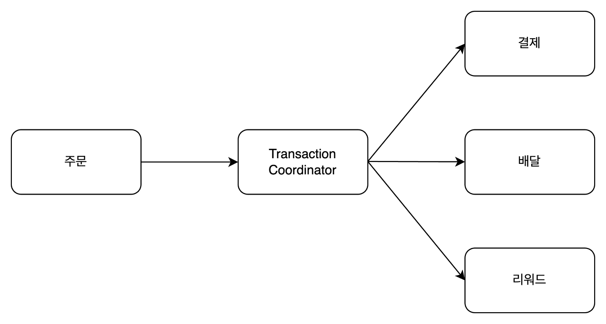
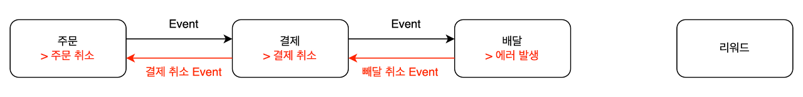
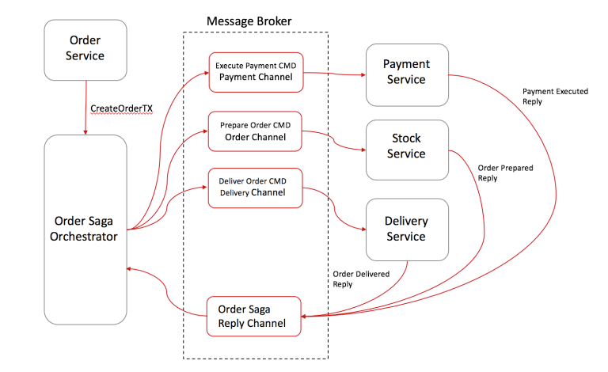
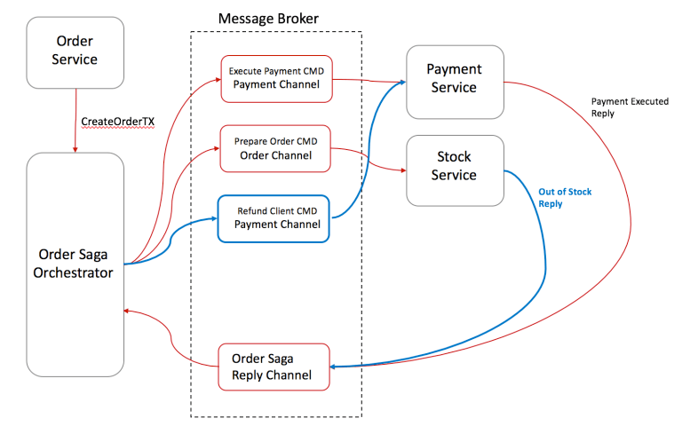

### 개요

1개 애플리케이션에서 여러 개의 DB 서버를 사용한다면 Java의 경우 **JTA**나 **ChainedTransactionManager** 등을 사용해서 분산 트랜잭션을 사용할 수 있다.
- 강한 일관성 모델의 경우 사용이 적합할 수 있다.
- 보통은 **최종적 일관성 모델**로도 해결되는 경우가 많다.

문제는 MSA에서 트랜잭션을 어떻게 보장하냐는 것이다.

결제을 한다고 하면 아래의 마이크로 서비스와의 연동이 있을 수 있다.

- 주문, 배달, 리워드

해당 기능들이 **결제 서버, 주문 서버, 배달 서버, 리워드 서버** 등으로 분리되어 있다. 트랜잭션을 어떻게 관리할 수 있을까?

### 2PC (Two-Phase Commit)

**2단계에 거쳐 영속**하는 작업을 말한다.

해당 가상의 서비스에서는 주문이 끝나면 회원에 등록된 카드로 금액이 결제 되어야 한다. 배달이 진행되어야 하고 사용한 포인트는 차감되어야 한다.

위 과정 중 배달 서비스에서 오류가 발생한 경우 **Transaction Coordinator**에서 **각 서비스 호출이 실패**하면 이**전 쿼리의 결과를 모두 Rollback**시킨다.

Two Phase Commit의 경우 RDB에 한정적으로 사용할 수 있다. (NoSQL에서는 분산 트랜잭션을 지원하지 않는다.)

DB 트랜잭션을 사용하기 때문에 **데드락이 발생**할 수 있다. Coordinator를 구성할 때 **서로 다른 특징을 가진 DBMS**를 사용하는 서비스 간에 구현은 **사실상 불가능**하다.

### Saga

보상 트랜잭션 방식으로 자주 사용되는 방법이다. Saga는 약자가 아니며 Long Lived Transactions를 의미하는 단어이다.

Saga 패턴은 크게 두 가지로 구분할 수 있다.

- Choregraphy-based SAGA
- Orchestration-based SAGA

#### Choregraphy-based Saga

순차적으로 **이벤트**가 전달되면서 트랜잭션이 관리되는 방식이다.

이벤트는 RabbitMQ, Kafka와 같은 메시지 큐 미들웨어를 사용해서 비동기 방식 혹은 분산 처리 형태로 전달할 수 있다.

순차적으로 이벤트를 발행하면서 Commit을 한 후 중간에 에러가 터지면 **취소 이벤트**를 발행해서 각 서버의 데이터를 처리한다.

#### Orchestration-based Saga

Event를 구독해서 서비스를 실행하지 않고, **Saga Orchestrator**에서 각 서비스를 호출하여 트랜잭션을 관리하는 방식이다.

트랜잭션에 관여하는 **모든 서비스는 Orchestrator에 의해 트랜잭션을 수행하**고 **결과를 Orchestrator에게 전달**한다.

1. 주문이 시작되면 SAGA Orchestrator에게 트랜잭션을 시작할 것을 알린다.
2. Orchestrator는 결제 명령을 결제 서비스로 보내고 결제 완료 메시지를 응답받는다. 
3. Orchestrator는 주문 준비 명령을 Order 서비스로 보내고 주문 준비 완료 메시지를 응답받는다. 
4. Orchestrator는 배달 명령을 Delevery 서비스로 보내고 배달 처리 완료 메시지를 응답받는다. 
5. 트랜잭션을 종료한다.

아래는 주문이 실패했을 때의 시나리오이다.

1. 주문 서비스는 재고부족으로 인한 주문이 실패했다는 결과를 Orchestrator에 전달한다. 
2. Orchestrator에서는 보상 트랜잭션으로 환불 명령을 결제 서비스로 보내고 환불 완료 결과를 받는다. 
3. 트랜잭션을 종료한다.

## 특징과 장단점

SAGA의 기본적 특징
- 최종적으로 데이터 무결성을 보장한다.

Choregraphy-based Saga
- 구성 난이도가 비교적 수월하다.
- 트랜잭션의 현재 상태를 파악하기 어렵다.

Orchestration-based SAGA
- 트랜잭션을 Orchestrator가 집중 관리해주므로 복잡도가 줄어들어서 구현 및 테스트가 용이하다.
- 트랜잭션의 관리가 한 곳에서 이루어진다.
- Orchestrator를 인프라에 추가로 사용해야 한다.

## Reference
- https://velog.io/@suhongkim98/MSA%EC%99%80-DDD-Saga-Pattern-6
- [https://blog.neonkid.xyz/243](https://blog.neonkid.xyz/243)
- [https://bravenamme.github.io/2020/08/06/msa-transaction](https://bravenamme.github.io/2020/08/06/msa-transaction/)
- [https://waspro.tistory.com/734](https://waspro.tistory.com/734)
- [https://blog.couchbase.com/saga-pattern-implement-business-transactions-using-microservices-part-2](https://blog.couchbase.com/saga-pattern-implement-business-transactions-using-microservices-part-2/)