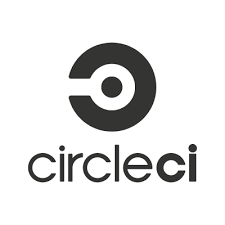
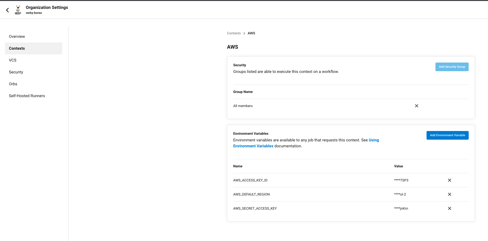
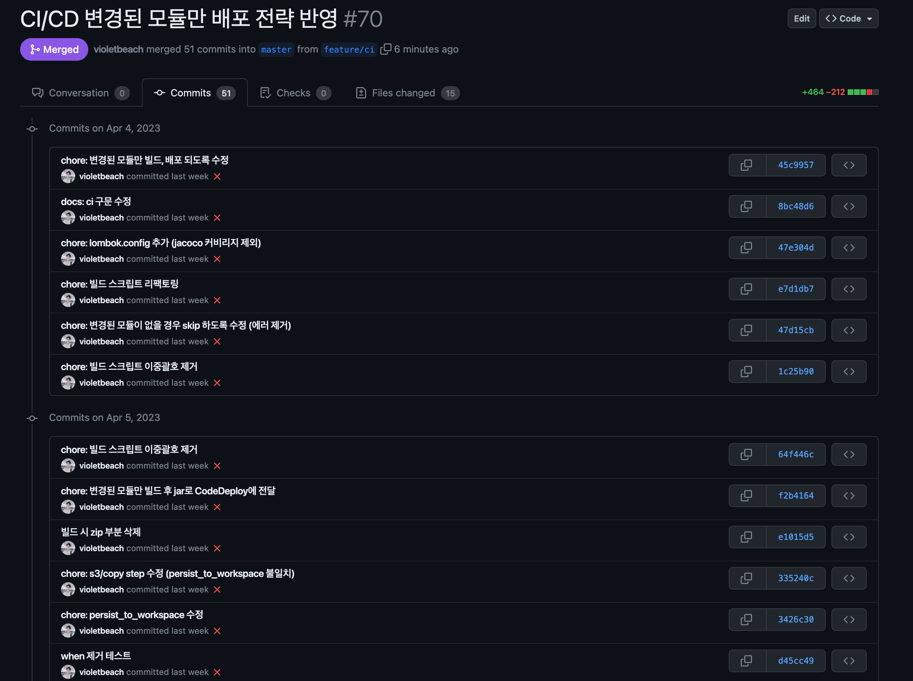
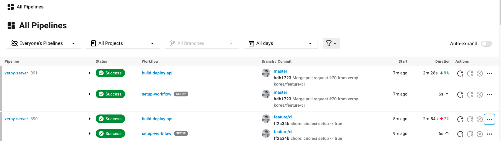

사이드 프로젝트를 진행하는 배포 프로세스를 고민하게 되었다. CI 도구로 Jenkins, Travice CI, CircleCI, Github Action 중 고민을 했고 젠킨스로 구성하고 싶었지만 별도 서버가 필요해서 포기했다.

Travice CI는 한 번 해보기도 했고 CircleCI가 인기가 많아진다고 하고 기능이 다양하고 Github 친화적이라고 해서 CircleCI로 진행해보게 되었다.

이번에는 오케스트레이션은 빠져있고 무중단 배포 환경을 구축한 것이 아니다. 테스트 자동화, 배포 자동화에 대해서만 다룬다. (나중에 여유가 된다면 k8s에 올릴 계획이다.)

## 기본 CI/CD Pipeline 구축

테스트 및 빌드, 배포 자동화까지 적용해보자.

### .circleci/config.yml

CircleCI의 config.yml은 아래와 같다.

```yaml
version: 2.1
orbs:
  aws-s3: circleci/aws-s3@1.0.13
  aws-code-deploy: circleci/aws-code-deploy@0.0.12

jobs:
  build:
    docker:
      - image: circleci/openjdk:17-jdk-buster

    steps:
      - checkout

      - restore_cache:
          keys:
            - v1-dependencies-{{ checksum "build.gradle" }}
            - v1-dependencies-

      - run:
          command: ./gradlew dependencies

      - save_cache:
          key: v1-dependencies-{{ checksum "build.gradle" }}
          paths:
            - ~/.gradle

      - run:
          command: ./gradlew clean build

      - run:
          command: |
            zip verby-rest-api.zip -r ./*
            mkdir -p deploy
            mv verby-rest-api.zip deploy/verby-rest-api.zip
      - persist_to_workspace:
          root: .
          paths:
            - deploy

  deploy:
    docker:
      - image: circleci/python:2.7

    steps:
      - attach_workspace:
          at: .

      - aws-s3/copy:
          from: deploy/*
          to: 's3://verby-deploy'
          aws-region: AWS_DEFAULT_REGION

      - aws-code-deploy/deploy-bundle:
          application-name: verby-server
          deployment-group: verby-group
          deployment-config: CodeDeployDefault.AllAtOnce
          bundle-bucket: verby-deploy
          bundle-key: verby-rest-api
          bundle-type: zip

workflows:
  version: 2

  build-deploy:
    jobs:
      - build
      - deploy:
          context: AWS
          requires:
            - build
```

한 가지 중요한 점이 있는데 docker image를 보면 circleci/openjdk~ 형식을 가진다. 일반 openjdk 이미지를 사용하면 중간에 지원하지 않는 command를 실행시키면서 에러가 터진다! (삽질..)

restore_cache와 save_cache는 gradle 부분을 캐시에 올려서 동일한 의존성의 경우 의존성 설치를 하지 않을 수 있게 해준다.

해당 동작들을 정리하자면 git의 원격 브랜치에 배포하면 해당 소스의 zip이 CircleCI에 의해 AWS S3에 배포된 후, AWS CodeDeploy 프로세스를 타게 된다.

### appspec.yml

```yaml
version: 0.0
os: linux
files:
  - source: /
    destination: /home/ec2-user/app/deploy/build
    overwrite: yes

permissions:
  - object: /
    pattern: "**"
    owner: ec2-user
    group: ec2-user

hooks:
  ApplicationStart:
    - location: scripts/deploy.sh
      timeout: 60
      runas: ec2-user
```

CodeDeploy 프로세스는 appspec.yml에 정의해서 실행할 수 있다. ApplicationStart의 hook으로 scripts/deploy.sh가 실행될 수 있도록 한다.

### scripts/deploy.sh

```bash
#!/bin/bash

REPOSITORY=/home/ec2-user/app/deploy

CURRENT_PID=$(pgrep -f restapi)

echo "$CURRENT_PID"

if [ -z $CURRENT_PID ]; then
    echo "> 현재 구동중인 애플리케이션이 없으므로 종료하지 않습니다."
else
    echo "> kill -2 $CURRENT_PID"
    kill -9 $CURRENT_PID
    sleep 5
fi

echo "> 새 어플리케이션 배포"

echo "> Build 파일 복사"
cp $REPOSITORY/build/build/libs/*.jar $REPOSITORY/jar/

JAR_NAME=$(ls $REPOSITORY/jar/ |grep 'restapi' | tail -n 1)

echo "> JAR Name: $JAR_NAME"

source /home/ec2-user/.bash_profile

nohup /opt/jdk-17/bin/java -jar $REPOSITORY/jar/$JAR_NAME --spring.profiles.active=prod \
> $REPOSITORY/nohup.out 2>&1 &
```

해당 스크립트는 CodeDeploy가 ApplicationStart를 진행할 때 실행한다.

일반적인 스크립트와 다른점은 아래의 부분들이다.

- source /home/ec2-user/.bash_profile
    - 운영 환경 설정 때문이다.  (아래에서 다시 다룬다.)
- nohup /opt/jdk-17/bin/java -jar $REPOSITORY/jar/$JAR_NAME -spring.profiles.active=prod > $REPOSITORY/nohup.out 2>&1 &
    - `java`가 아니라 `/opt/jdk-17/bin/java`를 사용한 이유는 CodeDeploy가 java 커맨드를 실행할 때 환경 변수를 사용하지 않기 때문이다. 그냥 java를 사용하게 되면 java is not recognized command 등과 같은 오류가 발생한다.
    - `> $REPOSITORY/nohup.out 2>&1 &`를 뒤에 추가한 이유는 nohup 실행 시 CodeDeploy가 무한정 대기하는 현상 때문이다. 표준 입출력으로 출력하도록 변경한다.

이제 작성해둔 스크립트를 실행하면 잘 동작한다. 만약 제대로 동작하지 않는다면 로그를 보면서 해결해나가면 된다.

- CodeDeploy 인스턴스 배포 로그:
    - less /var/log/aws/codedeploy-agent/codedeploy-agent.log
- CodeDeploy 스크립트 로그:
    - less /opt/codedeploy-agent/deployment-root/deployment-group-ID/deployment-ID/logs/scripts.log
    - (deploy.sh 스크립트 로그는 여기 저장된다.)
- less ${REPOSITORY}/nohup.out
    - 런타임 또는 컴파일 에러는 표준 입출력으로 저장한 nohup.out 파일에 저장된다.

### 실서버 운영용 yml/properties 세팅

위에서 deploy.sh에서 아래의 command를 실행한다.

- source /home/ec2-user/.bash_profile

이는 CodeDeploly는 .bashrc의 환경 변수를 보지 않기 때문이다. 그러면 .bashrc를 왜 보는 것인지에 대한 답은 이것이다.

#### application-prod.yml

```yaml
spring:
  datasource:
    driver-class-name: org.mariadb.jdbc.Driver
    url: ${VERBY_MAIN_URL}/verby_main?serverTimezone=Asia/Seoul
    username: ${VERBY_MAIN_USERNAME}
    password: ${VERBY_MAIN_PASSWORD}
```

실서버용 yml/properies 파일에서는 환경 변수를 통해 프로퍼티를 주입한다. (Verby는 서비스 이름이다.)

그럼 해당 환경변수를 주입하는 방법은 무척 간단하다. 원래는 아래와 같이 Application을 Run할 때 넣어주려 했다.

```shell
nohup /opt/jdk-17/bin/java -jar $REPOSITORY/jar/$JAR_NAME --spring.profiles.active=prod \
--VERBY_MAIN_URL=${VERBY_MAIN_URL} --VERBY_MAIN_USERNAME=${VERBY_MAIN_USERNAME} --VERBY_MAIN_PASSWORD=${VERBY_MAIN_PASSWORD} \
> $REPOSITORY/nohup.out 2>&1 &
```

하지만 그럴 필요가 없다. 서버(물리/VM/클라우드)에서 시스템 환경변수를 설정했다면 Spring을 실행할 때 알아서 시스템 환경변수를 읽어다가 값을 binding 시켜준다.

즉, 아래 커맨드면 충분하다.

```shell
nohup /opt/jdk-17/bin/java -jar $REPOSITORY/jar/$JAR_NAME --spring.profiles.active=prod \
> $REPOSITORY/nohup.out 2>&1 &
```

해당 프로퍼티들은 서버에 접속해서 OS 환경변수로 세팅하면 된다. (영구적으로 사용하려면 ~/.bashrc에 적용하는 것을 권장한다.)

```shell
export VERBY_MAIN_URL=verby-main.ccjpkq8eugyd.ap-northeast-2.rds.amazonaws.com
export VERBY_MAIN_USERNAME=violetbeach
export VERBY_MAIN_PASSWORD=example123
```

### CircleCI Envrionment (AWS)

위에서 작성한 .circleci/config.yml 구성을 동작시키기 위해서는 아래와 같은 세팅이 필요하다.

메인페이지의 Organization Settings로 들어간 후 Context를 아래와 같이 세팅하면 된다. (Context명은 dev/prod 등을 사용해도 무관하다.)



### Gradle - Plain Jar

SpringBoot 2.5 버전부터 Build를 하면 JAR 파일이 두 개가 생긴다. 이 중 "{Project}-{VERSION}-plain.jar"라는 JAR 파일은 의존성을 포함하고 있지 않기 때문에 java -jar로 실행하면 에러가 터진다.

이에 해당 JAR이 생성되지 않도록 처리가 필요하다. 해당 프로젝트의 경우 Gradle 7.2를 사용하고 있고 build.gradle에 아래 코드를 추가하면서 해결할 수 있었다.

```groovy
tasks.named("jar") {
    enabled = false
}
```

이제 기본적인 배포 환경은 구성이 되었다.

## 멀티 모듈 - 변경된 모듈만 배포하자!

멀티모듈을 구성하면 배포할 모듈이 늘어난다.

- 참고: [https://jaehoney.tistory.com/318](https://jaehoney.tistory.com/318)

그래서 변경된 모듈만 빌드하고 배포하여 불필요한 영향을 최소화하고 싶었다.

이번에 적용한 CircleCI는 변경된 모듈만 파악하는 기능을 제공하지 않아서.. 애를 먹었다. (레퍼런스도 많이 없다.)

- `appspec.yml`에서 환경 변수를 지원하지 않는 점도 한 몫했다..

결과부터 설명을 해보자면 무수한 삽질 끝에.. (commit 51개)



드디어! 변경된 모듈만 배포할 수 있게 되었다!



#### .circleci/config.yml

아래는 변경된 모듈만 빌드하고 배포하도록 수정된 버전이다.

```yaml
version: 2.1

setup: true

orbs:
  path-filtering: circleci/path-filtering@0.1.4

workflows:
  setup-workflow:
    jobs:
      - path-filtering/filter:
          base-revision: master
          config-path: .circleci/continue-config.yml
          mapping: |
            api-server/.* api-server true
            batch-server/.* batch-server true
            internal-consumer-server/.* consumer-server true
            core/.* core true
```

circleci는 only.changes와 같은 구문을 지원하지 않아서 오픈소스인 `circleci/path-filtering`을 사용해야 한다.

- 오픈 소스를 활용하지 않고는 `path`, `filtering` 등 구문이 없어서 어떻게 해도 소용이 없었다.

`path-filtering`을 사용하면 각 Path가 변경된 여부를 다음 `yml` 스크립트로 전달할 수 있다.

#### .circleci/continue-config.yml

아래 스크립트는 전달된 각 Path의 전달 여부로 jobs을 실행하는 조건을 설정하는 부분이 추가되었다.

```yaml
version: 2.1
orbs:
  aws-s3: circleci/aws-s3@1.0.13
  aws-code-deploy: circleci/aws-code-deploy@0.0.12

parameters:
  api-server:
    type: boolean
    default: false
  batch-server:
    type: boolean
    default: false
  consumer-server:
    type: boolean
    default: false
  core:
    type: boolean
    default: false

jobs:
  # API server 빌드
  build-api:
    docker:
      - image: circleci/openjdk:17-jdk-buster
    steps:
      - checkout
      - restore_cache:
          keys:
            - v1-dependencies-{{ checksum "build.gradle" }}
            - v1-dependencies-
      - save_cache:
          key: v1-dependencies-{{ checksum "build.gradle" }}
          paths:
            - ~/.gradle

      - run:
          command: ./gradlew :api-server:buildNeeded

      - run:
          command: |
            zip verby-api-server.zip ./api-server/build/libs/api-server-0.0.1.jar ./scripts/api-server/* -j
            mkdir -p deploy
            mv verby-api-server.zip deploy/verby-api-server.zip

      - persist_to_workspace:
          root: .
          paths:
            - deploy
  # Batch server 빌드
  build-batch:
    docker:
      - image: circleci/openjdk:17-jdk-buster
    steps:
      - checkout
      - restore_cache:
          keys:
            - v1-dependencies-{{ checksum "build.gradle" }}
            - v1-dependencies-
      - save_cache:
          key: v1-dependencies-{{ checksum "build.gradle" }}
          paths:
            - ~/.gradle

      - run:
          command: ./gradlew :batch-server:buildNeeded

      - run:
          command: |
            zip verby-batch-server.zip ./batch-server/build/libs/batch-server-0.0.1.jar ./scripts/batch-server/* -j
            mkdir -p deploy
            mv verby-batch-server.zip deploy/verby-batch-server.zip

      - persist_to_workspace:
          root: .
          paths:
            - deploy

  # Internal consumer server 빌드
  build-consumer:
    docker:
      - image: circleci/openjdk:17-jdk-buster
    steps:
      - checkout
      - restore_cache:
          keys:
            - v1-dependencies-{{ checksum "build.gradle" }}
            - v1-dependencies-
      - save_cache:
          key: v1-dependencies-{{ checksum "build.gradle" }}
          paths:
            - ~/.gradle

      - run:
          command: ./gradlew :internal-consumer-server:buildNeeded

      - run:
          command: |
            zip verby-consumer-server.zip ./internal-consumer-server/build/libs/internal-consumer-server-0.0.1.jar ./scripts/consumer-server/* -j
            mkdir -p deploy
            mv verby-consumer-server.zip deploy/verby-consumer-server.zip

      - persist_to_workspace:
          root: .
          paths:
            - deploy

  deploy-api:
    docker:
      - image: circleci/python:2.7

    environment:
      MODULE: api-server

    steps:
      - attach_workspace:
          at: .

      - aws-s3/copy:
          from: deploy/*
          to: 's3://verby-deploy'
          aws-region: AWS_DEFAULT_REGION

      - aws-code-deploy/deploy-bundle:
          application-name: verby-server
          deployment-group: verby-api-server
          deployment-config: CodeDeployDefault.AllAtOnce
          bundle-bucket: verby-deploy
          bundle-key: verby-api-server
          bundle-type: zip

  deploy-batch:
    docker:
      - image: circleci/python:2.7

    environment:
      MODULE: batch-server

    steps:
      - attach_workspace:
          at: .

      - aws-s3/copy:
          from: deploy/*
          to: 's3://verby-deploy'
          aws-region: AWS_DEFAULT_REGION

      - aws-code-deploy/deploy-bundle:
          application-name: verby-server
          deployment-group: verby-batch-server
          deployment-config: CodeDeployDefault.AllAtOnce
          bundle-bucket: verby-deploy
          bundle-key: verby-batch-server
          bundle-type: zip

  deploy-consumer:
    docker:
      - image: circleci/python:2.7

    environment:
      MODULE: internal-consumer-server

    steps:
      - attach_workspace:
          at: .

      - aws-s3/copy:
          from: deploy/*
          to: 's3://verby-deploy'
          aws-region: AWS_DEFAULT_REGION

      - aws-code-deploy/deploy-bundle:
          application-name: verby-server
          deployment-group: verby-consumer-server
          deployment-config: CodeDeployDefault.AllAtOnce
          bundle-bucket: verby-deploy
          bundle-key: verby-consumer-server
          bundle-type: zip

workflows:
  version: 2

  build-deploy-api:
    when:
      or:
        - << pipeline.parameters.api-server >>
        - << pipeline.parameters.core >>
    jobs:
      - build-api
      - deploy-api:
          context: AWS
          requires:
            - build-api

  build-deploy-batch:
    when:
      or:
        - << pipeline.parameters.batch-server >>
        - << pipeline.parameters.core >>
    jobs:
      - build-batch
      - deploy-batch:
          context: AWS
          requires:
            - build-batch

  build-deploy-consumer:
    when:
      or:
        - << pipeline.parameters.consumer-server >>
        - << pipeline.parameters.core >>
    jobs:
      - build-consumer
      - deploy-consumer:
          context: AWS
          requires:
            - build-consumer
```

아래는 삽질을 하면서 주의가 필요하겠다고 생각한 부분이다.

- CodeDeploy
    - deploy-group은 각 배포마다 별개로 설정해야 한다. (동시에 실행 못함)
    - appspec.yml은 bundle의 루트에 꼭 있어야 한다. (bundle은 jar만 할 수 없다. appspec.yml, 배포 스크립트도 함께 필요하며, zip, tar 등이 가능하다!)
- CircleCI
    - persist_to_workspace와 from을 일치시켜야 S3로 배포가 가능하다.
    - job.requires 구문으로 각 빌드와 배포를 연결할 수 있다.
- Gradle
    - ./gradlew :{MODULE}:build 만으로는 하위 모듈 테스트를 실행하지 않는다.
        - :{MODULE}:**buildNeeded**나 :{MODULE}:**buildDependents**를 사용하면 하위/상위 모듈을 함께 테스트할 수 있다.
        - 참고: [https://docs.gradle.org/current/userguide/intro_multi_project_builds.html](https://docs.gradle.org/current/userguide/intro_multi_project_builds.html)
    - Gradle 스크립트에서 task를 수정하거나 CI에서 하위 모듈 테스트도 수행하는 방법도 있다.

### scripts/{module}/appspec.yml

destination 부분(`verby-api-server`)은 각 모듈 별로 작성한다.

```yaml
version: 0.0
os: linux
files:
  - source: /
    destination: /home/ec2-user/deploy/verby-api-server
    overwrite: yes

permissions:
  - object: /
    pattern: "**"
    owner: ec2-user
    group: ec2-user

hooks:
  ApplicationStart:
    - location: deploy.sh
      timeout: 60
      runas: ec2-user
```

appspec.yml을 모듈별로 작성한 이유는 아래의 문제 때문이다.

- appspec.yml에서 circleci의 환경 변수를 전달받을 수 없었다.
- appspec.yml에서 스크립트(deploy.sh)를 실행 시킬 때 인자를 전달할 수 없다. (환경 변수 세팅도 안된다.)
    - location에서 script.sh {args}, args 속성 추가, envrionment_variable 추가 모두 안된다!
- 모듈 별로 destination이 다르다.
    - 동일한 destination에 배포하면 overwrite 속성에 의해 다른 모듈 데이터가 전부 날라간다.

### scripts/{module}/deploy.sh

```bash
#!/bin/bash

deploy_module "verby-api-server" "api-server"

function deploy_module {
  local BUNDLE=$1
  local JAR_NAME=$2
  local REPOSITORY_PATH="/home/ec2-user/deploy/$BUNDLE"

  local current_pid=$(pgrep -f "$JAR_NAME")

  echo "$current_pid"

  if [ -z "$current_pid" ]; then
    echo "> 현재 구동중인 애플리케이션이 없으므로 종료하지 않습니다."
  else
    echo "> kill -2 $current_pid"
    kill -9 "$current_pid"
    sleep 5
  fi

  echo "> 새 어플리케이션 배포"

  echo "> Build 파일 복사"

  jar_name=$(ls "$REPOSITORY_PATH/" | grep "$JAR_NAME" | head -n 1)

  echo "> JAR Name: $jar_name"

  source /home/ec2-user/.bash_profile

  nohup /opt/jdk-17/bin/java -jar "$REPOSITORY_PATH/$jar_name" --spring.profiles.active=prod > "$REPOSITORY_PATH/nohup.out" 2>&1 &
}
```

이렇게 해서 멀티 모듈 프로젝트에서 변경된 모듈만 빌드/배포까지 할 수 있었다!

소스 코드는 아래에 있으니 필요 시 참고 부탁드립니다! 🙏🙏

- [https://github.com/violetbeach/verby-server](https://github.com/violetbeach/verby-server)

## Reference

- [https://blogshine.tistory.com/447](https://blogshine.tistory.com/447)
- [https://jojoldu.tistory.com/265](https://jojoldu.tistory.com/265)