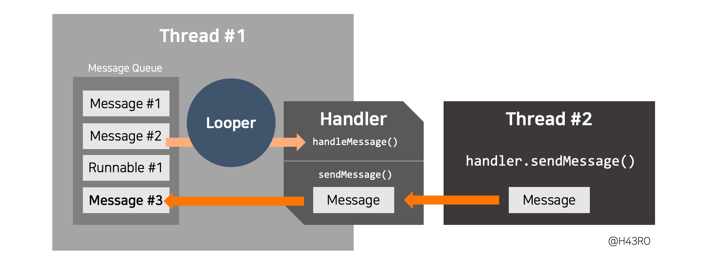

멀티 쓰레드 관련 CS 정리

## 멀티 스레드와 싱글 스레드의 차이

멀티 스레드는 싱글 스레드랑 다르게 1개 스레드로 어디 요청을 보내놓고 다른 스레드로 스위칭을 하고 작업을 하는 그런 방식을 의미합니다.

## 스레드와 프로세스의 차이

프로세스는 어떤 작업을 실행시킨 프로그램을 의미하고, 스레드는 프로세스 내에서 실행되는 흐름의 단위를 말합니다.

프로세스는 Code, Data, Stack, Heap 영역을 모두 독립적으로 사용합니다. 그래서 다른 프로세스의 자원에 접근하려면 IPC를 통해 접근해야 합니다.

스레드의 경우에는 Stack만 별도로 사용하고 나머지 Heap이나 Code, Data 같은 영역은 각 스레드가 공유할 수 있습니다. 

## 멀티 프로세스와 멀티 쓰레드의 차이

멀티 프로세스의 경우에는 장점이 다른 프로세스가 영향을 받지 않는다는 점이구요.

Context Switching에서 캐쉬 메모리 초기화 등 비용이 더커서 오버헤드가 발생합니다.
- 처음부터 가져와야 함

프로세스 간 통신할 때도 IPC 기반으로 더 복잡하다.

반면 멀티 쓰레드의 경우 Context Switching이 더 활발하게 일어난다.

## 멀티 쓰레드의 동시성과 병렬성

동시성은 멀티 작업을 위해 싱글 코어에서 여러 개의 쓰레드를 번갈아 실행하는 것을 말하고
- 사실 동시에 실행되는 것이 아니라, 번갈아가며 실행하는 것이다.

병렬성은 멀티 작업을 위해 멀티 코어에서 여러 개의 쓰레드를 동시에 실행하는 것이다.

## 페이지 교체 알고리즘에 대해 설명해주세요.

OS에서 메모리보다 더 용량이 큰 프로그램을 올리기 위해서, 또 메모리를 효율적으로 사용하기 위해서

실제 메모리에는 프로그램에서 현재 필요한 부분만 페이지 단위로 올리게 되는데,

이때 페이지를 교체하는 알고리즘입니다.

## Multi Thread에서 Single 인스턴스를 사용할 때 주의할 점?

공유 자원에 대해 접근할 때 동시성 제어 전략이 필요할 수 있다.

잘못 사용하면 Lock 제어나 Context Switching 비용으로 인해 단일 스레드보다 느려질 수도 있다.

## 동기와 비동기의 차이에 대해 설명해주세요

동기는 결과 값을 기다리는 것. 비동기는 결과를 기다리지 않는것

블로킹은 제어권을 넘겨주는 것. 논블로킹은 제어권을 넘겨주지 않는 것

## 선점형 스케줄링과 비선점형 스케줄링의 차이를 설명해주세요.

선점형 스케줄링: 하나의 프로세스가 다른 프로세스 대신 CPU를 차지할 수 있음

비선점형 스케줄링: 하나의 프로세스가 다른 프로세스는 CPU를 차지할 수 없음

## sleep() vs wait() 차이

sleep()은 lock을 유지하고 blocking 상태로 전환되지만, wait()은 lock 해제와 동시에 Block 상태로 전환한다.

## Stack, Heap 차이

Stack은 스레드가 독립적으로 가지고 있는 영역

Heap은 스레드가 공유하고 있는 영역

## 멀티 스레드를 사용하는 이유는 무엇인가요? 그리고 어떤 상황에서 유용하게 쓰일까요?

목적
- 성능 향상
- 레이턴시 감소
- 자원 효율

상황
- 병렬 처리가 가능한 경우 (멀티 코어)
- CPU를 많이 사용하는 작업 (계산 등)
- 외부 인프라를 많이 활용하는 경우
- 대규모 데이터 처리

## 스레드 간 동기화란 무엇이며 왜 필요한가요?

각 스레드가 조회한 공유 자원이 일관성을 유지할 수 있도록

공유 자원에 대한 접근을 동기화, 그러니까 예를 들면 공유 자원에 대해서 읽고 쓰는 것을 1개의 작업으로 하고

1개 스레드에서만 해당 작업을 수행하고, 나머지는 대기해서 동기적으로 실행될 수 있도록 하는 것입니다.

## 멀티 스레드 환경에서 발생할 수 있는 버그 또는 문제에 대해 어떻게 대응하나요?

동기화를 해줘야 한다.

교착상태를 방지해야 한다. 만약 발생 시 복구를 해줘야 한다.

우선순위를 부여해야 한다.

가능한 공유 자원에 대한 접근을 최소화 해서 경쟁을 최소화한다.

컨텍스트 스위칭에 대한 고려

## 임계 영역

임계 영역은 프로그램에서 공유 자원에 접근하는 코드 영역을 의미한다.
- 동시성 문제가 발생하지 않게 독점을 보장해줘야 하는 그 영역

## 컨텍스트 스위칭

CPU가 다른 스레드로 작업을 전환하는 과정을 말합니다.

Context(아래의 정보)를 다른 스레드에 넘겨준다.
- 프로그램 카운터
- 레지스터 상태
- 스케줄링 정보
- 메모리 관련 정보

Context는 요약하면 현재까지의 작업 상태나 다음 작업에 대한 데이터이다.

문맥 교환에 필요한 데이터가 많거나 로직이 복잡할 수록 멀티 스레딩의 효율이 저하됩니다.

## 경쟁 조건(Race Condition)이 무엇이며 어떻게 해결할 수 있나요?

동기화 기법을 사용해서 여러 스레드가 동시에 공유 리소스에 접근하지 못하도록 제어하거나,

원자적인 연산을 사용해서 한 번에 하나의 스레드만 리소스를 수정하도록 보장하는 방법을 사용할 수 있다.

## 데드락(Deadlock)이란 무엇인가요? 데드락을 예방하거나 해결하기 위한 방법은 무엇인가요?

- 상호 배제(뮤텍스): 여러 스레드가 동시에 접근하지 못하도록
- 보유와 대기(Hold and wait): 

## 스레드 풀(Thread Pool)이란 무엇이며, 어떤 상황에서 사용하는 것이 좋은가요?

스레드 풀은 병렬 처리를 위해 미리 생성된 스레드들의 집합이다.

미리 스레드를 생성하고 재사용함으로써 스레드 생성과 삭제에 따른 오버헤드를 줄여준다.

스레드 풀은 아래의 구성 요소로 이루어진다.
- 작업 큐
- 스레드 집합
- 스레드 관리자

이는 아래와 같은 상황에 주로 사용된다.
- 자주 반복되는 작업 처리: 웹서버 요청 처리, DB에서 데이터를 가져오는 등
- 동시성을 관리할 필요가 있는 상황 (스레드 설정을 통해 시스템 부하를 조절)
- 스레드 생성과 제거 오버헤드를 줄이는 경우
- 작업의 처리 순서를 보장하고 싶을 때

## 스레드 간 통신하는 방법에 대해 설명해주세요. (예: 공유 메모리, 메시지 큐 등)

공유 메모리: 동일한 메모리 영역을 공유하는 방식

스레드 간 동기화가 필요하다. 동기화를 위한 락 등의 매커니즘을 통해 스레드 간 충돌을 방지하고 일관성을 보장

메시지 큐: 스레드 간 데이터 교환을 위한 비동기 방식

각 스레드가 메시지를 큐에 보내거나 큐에서 메시지를 받는다. 메시지큐를 사용하면 스레드 간 동기화를 위한 별도의 락이 필요하지 않다.

각 스레드는 루퍼, 핸들러, 메시지 큐를 가지고 있다.

- 핸들러의 sendMessage()를 통해서 다른 스레드 루퍼의 메시지 큐에 메시지를 전달

## 스레드의 생명주기(Life Cycle)에 대해 설명해주세요.

- 생성
  - 언어나 환경에 따라 스레드 객체를 생성
- 준비
  - 스레드가 생성되었지만, CPU를 할당받지 못한 상태
  - 스케줄러에 의한 실행을 기다리고 있음
- 실행
  - 준비 상태에 있는 스레드가 CPU를 할당받아 실제로 코드를 실행
- 블록
  - 스레드가 실행 중일 때, 특정 이벤트가 발생하여 일시적으로  멈춰야 하는 경우
  - 이벤트가 처리되기를 기다리거나, 입출력 작업이 완료되기를 기다리는 등의 상황
- 종료
  - 스레드가 작업을 모두 마치거나, 예외가 발생하여 강제로 종료되는 경우 스레드가 종료

## 뮤텍스(Mutex)와 세마포어(Semaphore)의 차이점은 무엇인가요?

뮤텍스는 하나의 스레드만 공유 자원에 접근할 수 있도록 하는 동기화 기법이다.

세마포어는 특정 자원에 접근을 허용하는 허용 가능한 스레드 수를 지정하여 동기화하는 제어 방법이다.

> https://jaehoney.tistory.com/286

## 스레드의 동기화를 위해 사용되는 도구 또는 라이브러리에 대해 아는 대표적인 예시는 무엇인가요? (예: Java에서의 synchronized, C#에서의 lock 등)

volatile, synchronized, atomic, reentrantLock

ReantrantLock 기능

- lock
- unlock
- tryLock
- isHeldByCurrentThread
- hasQueuedThreads
- getOwner

## 멀티 스레드 애플리케이션을 디자인하거나 구현할 때 고려해야 할 최적화 방법은 무엇인가요?

- 동기화 최소화
  - 트랜잭션과 마찬가지로 동기화도 자원을 소모하므로 최대한 범위를 필요한 만큼만 가져가는 것이 좋다.
  - 락 최소화도 마찬가지
- 스레드 풀 사용
- 비동기 프로그래밍
- 스레드 로컬 저장소
- 무계층 설계
  - 각 계층에서 다중 스레드를 충분히 활용하도록
- CPU 캐시 최적화
  - 스레드 간 데이터의 접근 패턴을 고려하여 CPU 캐시의 효율성을 높일 수 있다. 예를 들어, 데이터를 연속적으로 배치하여 캐시 라인을 최대한 활용하거나, false sharing을 피하기 위해 변수들 간의 간격을 둘 수 있다.

## 참고
- https://dev-coco.tistory.com/162