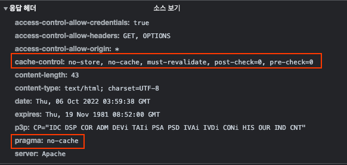
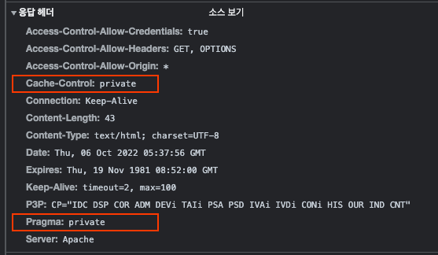
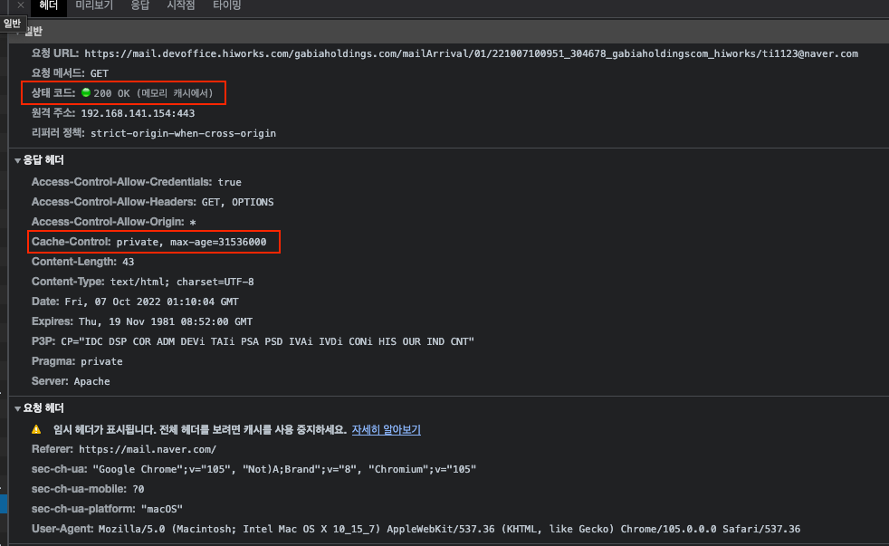

## HTTP - Cache-Control 헤더 이해하기 (+ 웹캐시 사용하기!)

회사의 메일 서비스의 수신 확인 태그 API에 캐시를 적용하면서 공부한 것을 공유하겠습니다.

이해를 위해 수신확인 태그를 먼저 설명드리겠습니다.
- 메일 수신 확인 태그란 A가 B에게 메일을 보냈을 때 B가 메일을 확인 했는 지와 언제 확인했는 지 등을 확인할 수 있게 도와주는 기능입니다.
- 메일을 보낼 때 발송 서버에서 수신 확인 태그를 `` 형식으로 이미지 태그를 붙여서 발송해요
  - 해당 이미지 태그의 src는 수신 확인 태그의 end-point를 넣습니다.
  - 수신 확인 태그의 end-point는 DB에 해당 메일에 대해 읽음을 표시를 해주고 빈 이미지를 반환해줍니다.

현재 MailArrival (수신 확인 요청)의 응답헤더는 아래와 같습니다.

캐시와 관련된 부분은 아래 2가지입니다.

- cache-control: 콘텐츠에 대한 캐싱 정책을 정의할 수 있음
- pragma: HTTP/1.1 버전의 Cache-Control 헤더가 생기기 전에에 사용하던 헤더

## Issue

문제는 각 사용자의 해당 수신 확인 태그를 설정하는 end-point에 대한 호출이 너무 많아서 서버 호출이 너무 많다는 점입니다.

그래서 웹 캐시를 적용하기로 했어요!

## Cache-Control

Cache-Control의 기존 헤더는 no-strore, no-cache, must-revalidate, post-check=0, pre-check = 0입니다.

- no-cache - 서버에 캐시를 사용해도 되는 지 여부를 재확인하라.
- no-store - 결과를 캐시에 절대로 해서는 저장해선 안된다.
- public - 공유 캐시(중개서버, CDN, 프록시 캐시, ...)에 저장해도 된다.
- private - 브라우저 캐시 같은 특정 사용자 환경에만 저장하라. (다른 사용자가 조회했을 시 캐싱된 결과가 노출되어선 안된다.)
- max-stale - 만료된 캐시를 재사용할 수 있는 시간을 정한다.
- must-revalidate -  만료된 캐시만 서버에 유효한지 확인을 받도록 한다.
- max-age - 캐시의 유효시간(초 단위)

해당 솔루션의 리소스는 **정적**이므로 ETag와 같은 헤더는 고려하지 않아도 됩니다.

### public vs private

사용자마다 요청 end-point가 다르므로, 굳이 공유 캐시에 저장하지 않고 브라우저 캐시에 저장하면 되기에 private을 사용합니다.

(사용자 마다 요청을 가지고, 추가로 메일을 조회할 때마다 해당 태그 내용 1개를 요청할텐데 해당 요청을 모두 중개서버에서 캐싱하면, 정말 필요한 정적 데이터(html, css, javascript, ...)가 캐싱 미스로 처리될 수 있기 때문)

### max-age

max-age도 영구적으로 유지해도 상관은 없습니다.
  - 캐시에 너무 많은 내용이 쌓일 수 있는 게 걱정이라서 '30일 정도가 적당하지 않을까?' 생각이 들었는데, 어차피 캐시가 만료되었다고 해서 사용하지 못할 뿐이지, 브라우저 캐시에서 삭제되는 것은 아니기에 max-age인 31536000을 사용했습니다.

<참고>
토스 프론트엔드 챕터는 Cache-Control의 s-max-age 값으로 최대치인 31536000를 사용한다고 합니다.
- https://toss.tech/article/smart-web-service-cache

해당 내용들을 정리하면 `Cache-Control: private, max-age=31536000`이 됩니다.

## Pragma

해당 값은 HTTP 1.0 통신을 위한 헤더입니다.

pragma는 사용할 수 있는 속성이 no-cache, public, private 밖에 없습니다.

사실 해당 서비스의 웹서버(Apache)에서 HTTP 1.0을 허용 여부를 disable로 처리했지만, SideEffect를 고려하여 Cache-Control과 동일하게 private 으로 설정합니다.

## 수정 후 헤더

## 결과

### 1. Network 분석

수정 결과 캐시가 잘되어서 메모리 캐시를 조회한 것을 볼 수 있습니다.

### 2. Access Log 확인

다음으로 access_log를 확인해보겠습니다.

새로고침을 반복할 때 최초 조회 1회 말고는 서버에 접근을 하지 않게 변경된 것을 확인했습니다.

강력 새로고침 후에는 액세스 로그가 찍히는 것을 확인할 수 있었습니다.

## 주의 사항

캐시는 한번 저장되면 만료될 때까지 계속 브라우저에 남아 있게 됩니다.

즉, 서버 측에서 어떠한 작업을 하더라도 브라우저의 캐시를 지우기는 어렵습니다.
