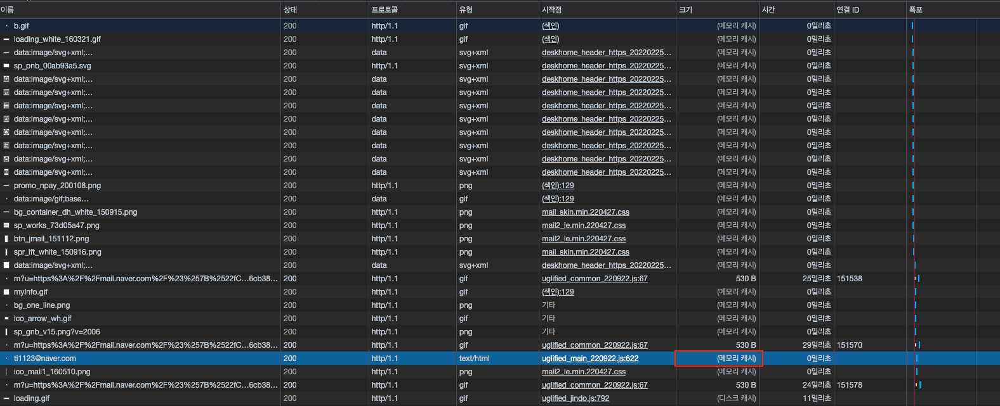
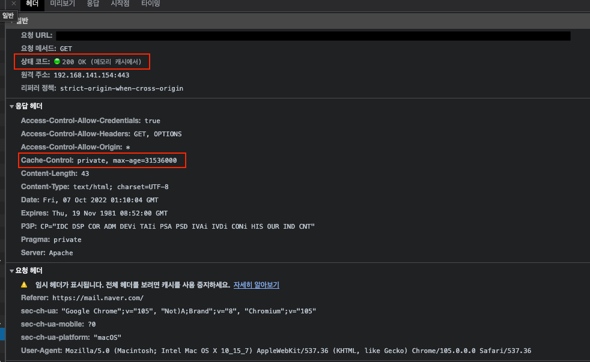

## HTTP - Cache-Control 헤더 이해하기 (+ 웹캐시 사용하기!)

회사의 메일 서비스의 수신 확인 태그 API에 캐시를 적용하면서 공부한 것을 공유하곘습니다.

이해를 위해 수신확인 태그를 먼저 설명드리겠습니다.
- 메일 수신 확인 태그란 A가 B에게 메일을 보냈을 때 B가 메일을 확인 했는 지와 언제 확인했는 지 등을 확인할 수 있게 도와주는 기능입니다.
- 메일을 보낼 때 발송 서버에서 수신 확인 태그를 `` 형식으로 이미지 태그를 붙여서 발송해요
  - 해당 이미지 태그의 src는 수신 확인 태그의 end-point를 넣습니다.
  - 수신 확인 태그의 end-point는 DB에 해당 메일에 대해 읽음을 표시를 해주고 빈 이미지를 반환해줍니다.

현재 MailArrival (수신 확인 요청)의 응답헤더는 아래와 같습니다.

캐시와 관련된 부분은 아래 2가지입니다.

- cache-control: 콘텐츠에 대한 캐싱 정책을 정의할 수 있음
- pragma: HTTP/1.1 버전의 Cache-Control 헤더가 생기기 전에에 사용하던 헤더

## Issue

문제는 각 사용자의 해당 수신 확인 태그를 설정하는 end-point에 대한 호출이 너무 많아서 서버 호출이 너무 많다는 점입니다.

그래서 웹 캐시를 적용하기로 했어요!

## Cache-Control

Cache-Control의 기존 헤더는 no-strore, no-cache, must-revalidate, post-check=0, pre-check = 0입니다.

no-cache - 서버에 캐시를 사용해도 되는 지 여부를 재확인하라.
no-store - 결과를 캐시에 절대로 해서는 저장해선 안된다.
public - 공유 캐시(중개서버, CDN, 프록시 캐시, ...)에 저장해도 된다.
private - 브라우저 캐시 같은 특정 사용자 환경에만 저장하라. (다른 사용자가 조회했을 시 캐싱된 결과가 노출되어선 안된다.)
max-stale - 만료된 캐시를 재사용할 수 있는 시간을 정한다.
must-revalidate -  만료된 캐시만 서버에 유효한지 확인을 받도록 한다.
max-age - 캐시의 유효시간(초 단위)

추가로 아래의 속성이 있지만 위 내용에서는 고려할 필요가 없는 것이라 생략합니다.

Age
Expires
ETag
If-None-Match
If-Modified-Since

public vs private

사용자마다 요청 end-point가 다르므로, 굳이 공유 캐시에 저장하지 않고 브라우저 캐시에 저장하면 되기에 private을 사용합니다.
(사용자 마다 요청을 가지고, 추가로 메일당 1개가 발급 되는데 해당 요청을 모두 중개서버에서 캐싱하면, 정말 필요한 정적 데이터(html, css, javascript, ...)가 캐싱 미스로 처리될 수 있을 것 같습니다.)

max-age: 토스 프론트엔드 챕터는 Cache-Control의 s-max-age 값으로 최대치인 31536000(max-age와 s-max-age를 분리하기 위함)을 사용한다고 합니다.

https://toss.tech/article/smart-web-service-cache
그래서 사실상 max-age도  영구적으로 유지해도 상관은 없지만, 메일 당 요청이 1개가 있는데 각 요청을 전부 브라우저 캐시에 저장하면 악영향을 끼칠 수 있습니다.
그래서 max-age는 7일을 사용합니다.  (604,800)
max-age를 설정했다고 해서 해당 캐시가 만료되었을 때 버려지는 것이 아닙니다. 즉, 캐시는 어차피 브라우저에 남게 되므로 max-age는 영구로 설정하는 것이 좋을 듯합니다.

정리하면 Cache-Control: private, max-age=31536000이 됩니다.

Pragma
해당 값은 HTTP 1.0 통신을 위한 헤더입니다.

pragma는 사용할 수 있는 속성이 no-cache, public, private 밖에 없습니다.

사실 Apache에서 HTTP 1.0을 허용 여부를 disable한 것으로 보이지만, SideEffect를 고려하여 Cache-Control과 동일하게 private 으로 설정합니다.

수정 후 헤더

결과
Network 분석
수정 결과 캐시가 잘되어서 메모리 캐시를 조회한 것을 볼 수 있습니다.

아래는 전체 요청 Spec 입니다.

Access Log 확인
다음은 access.log로 확인 결과입니다.

새로 고침을 반복했으나, 최초 1회 말고는 서버에 접근을 안하고 있었습니다.

강력 새로고침후에는 액세스 로그가 찍히는 것을 확인할 수 있었습니다.

주의 사항

캐시는 한번 저장되면 만료될 때까지 계속 브라우저에 남아 있게 됩니다.

즉, 서버 측에서 어떠한 작업을 하더라도 브라우저의 캐시를 지우기는 어렵습니다.