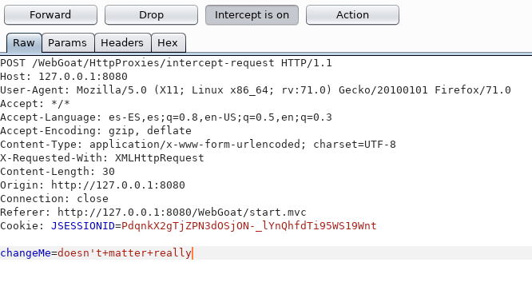
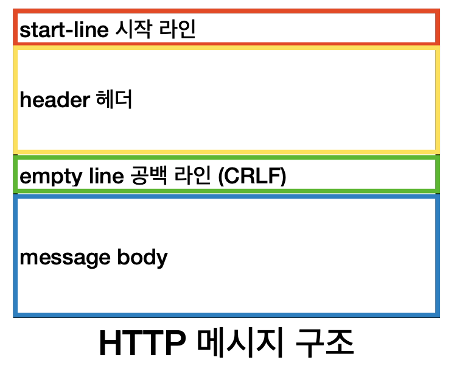

## HTTP 메시지(message) 원문 분석해보기!

HTTP 원문이란?

아래와 같이 HTTP 메시지 전체를 의미한다. 

해당 HTTP 메시지는 어떤 구조를 가지고 있는 지 알아보자.

## HTTP 메시지 구조

HTTP의 Message는 요청과 응답 구분 없이 아래의 구조를 가진다.

### 1. 시작 라인

시작 라인(start-line)은 항상 HTTP Message의 첫 번째 줄에 위치한다.

시작 라인은 요청 메시지 / 응답 메시지 인지에 따라 아래의 정보를 포함한다.
- 요청 메시지 - HTTP Method, 요청 대상, HTTP Version (ex. GET /background.png HTTP1.1)
- 응답 메시지 - HTTP Version, HTTP Status Code, Http Status Text (ex. HTTP/1.1 404 Not Found.)

**요청 메시지**의 경우 추가로 아래의 형식으로 구분할 수 있다.
- origin 형식 - POST, GET, HTTP, OPTIONS 등의 method와 함께 사용한다.
  - `POST /resources HTTP1.1`
- absolute 형식 - 완전한 URL 형싱그로, 프록시에 연결하는 경우 대부분 GET method와 함께 사용한다.
  - `GET <http://developer.mozilla.org/en-US/docs/Web/HTTP/Messages> HTTP/1.1`
- authority 형식 - 도메인 이름과 포트 번호로 이루어진 URL의 authority component이다.
  - HTTP 터널을 구축하는 경우 CONNECT와 함께 사용할 수 있다.
  - `CONNECT developer.mozilla.org:80 HTTP/1.1` 
- asterisk 형식 - OPTIONS와 함께 별표(*)를 사용해서 서버 전체를 표현한다.
  - `OPTIONS * HTTP/1.1`

응답 메시지에서는 start-line(시작 라인)이 아니라 status-line(상태 라인)이라고 부른다.

### 2. HTTP 헤더

헤더에는 HTTP 전송에 필요한 모든 부가정보가 포함되어 있다.

각 헤더는 요청을 지정하거나, 메시지에 포함된 본문을 설명하는 역할을 한다.

헤더는 대소문자 구분이 없는 문자열과 콜론(:)으로 key, value를 구분하여 입력한다.

필요 시 임의의 헤더 추가가 가능하다.

헤더는 아래와 같이 구분할 수 있다.
- Request headers
  - User-Agent, Accept-Type, Accept-Language와 같이 요청을 구체화 하거나 클라이언트 자체에 대한 정보를 포함한다.
- Response headers
  - Vary, Accept-Range와 같이 응답을 구체화하고 서버 자체에 대한 정보를 포함한다.
- General headers
  - Connection, Keep-Alive와 바디에서 최종적으로 전송되는 데이터와는 상관이 없는 헤더를 말한다.
- Entity headers
  - Content-Encoding, Content-Type과 같이 엔터티 바디에 대한 자세한 정보를 포함한다.
  - body가 비어있는 경우, entity headers는 전송되지 않는다.

### 3. 공백 라인

공백 라인(empty line)은 헤더와 본문을 구분하기 위해 사용한다.

### 4. HTTP 메시지 바디

요청과 응답의 본문은 HTTP Message 구조의 마지막에 위치한다.

바디는 실제 전송할 데이터를 포함한다.

요청과 응답의 유형에 따라 선택적으로 사용한다.

body는 다음과 같이 두 종류로 나눌 수 있다.
- Single-resource bodies(단일-리소스 본문) - Content-Type과 Content-Length로 정의된 단일 파일로 구성된다.
- Multiple-resource boides(다중-리소스 본문) - 여러 파트로 구성된 본문에서는 각 파트마다 다른 정보를 지닌다.
  - 보통 Form-data를 사용한다.

## 추가

Start-line과 HTTP headers를 묶어서 요청이나 응답의 헤드(head)라고 이야기한다. payload는 body를 의미한다.

## 참고
- https://hanamon.kr/%EB%84%A4%ED%8A%B8%EC%9B%8C%ED%81%AC-http-%EB%A9%94%EC%84%B8%EC%A7%80-message-%EC%9A%94%EC%B2%AD%EA%B3%BC-%EC%9D%91%EB%8B%B5-%EA%B5%AC%EC%A1%B0/
- https://intrepidgeeks.com/tutorial/http-http-basic