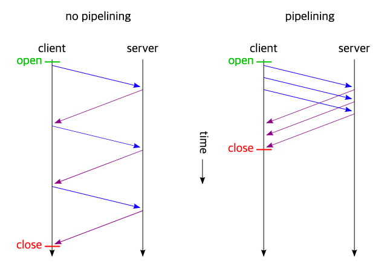

## HTTP 1.0과 HTTP 1.1의 차이 (지속성, 파이프라이닝, ...)

HTTP(Hyper Text Transfer Protocol)는 인터넷에서 주로 사용하는 데이터를 송수신하기 위한 프로토콜이다.

HTTP의 변환점 중 가장 큰 부분이 HTTP 1.0 -> HTTP 1.1과 HTTP 1.1 -> HTTP 2.0로의 발전이다.

해당 포스팅에서는 HTTP 1.0과 HTTP 1.1의 차이에 대해서 알아보자.

## 지속성

HTTP 1.0과 HTTP 1.1의 가장 큰 차이점은 지속성이다. 그렇다. 바로 `Connection: Keep-alive` 속성이다.

HTTP 1.0에서 요청하고 수신할 때마다 새로운 TCP 세션을 맺어야 한다.

반면, **HTTP 1.1**부터는 **TCP 세션을 한 번만** 맺으면 여러 개의 요청을 보내고 응답을 수신할 수 있다.

결과적으로 **TCP 세션을 처리하는 비용을 줄이고 응답속도를 개선**할 수 있게 된다.

(HTTP 1.0에도 지속 커넥션이 있었지만 다소 실험적이여서 여러가지 문제가 있었다. 이는 HTTP 1.1에서 개선되었고 지속 커넥션이 default로 활성화되었다.)

## 파이프라이닝

HTTP 1.0과 HTTP 1.1의 큰 차이 중 하나가 파이프라이닝 기능의 유무이다.

HTTP 1.0 환경에서는 요청에 대한 응답이 와야 다음 응답을 보낼 수 있다.

반면, **HTTP 1.1**에서는 **요청을 병렬로 처리**할 수 있는 **파이프라이닝(Pipelining)** 기능을 지원한다.

결과적으로 HTTP 1.1에서는 여러 개의 요청을 처리하는 응답 속도가 훨씬 빨라지게 된다.

## 호스트 헤더

HTTP 1.0 환경에서는 하나의 IP에 하나의 도메인만 운영할 수 있었다.

(도메인을 여러 개 사용하려면 서버를 늘려야 한다.)

HTTP 1.1에서는 웹서버에서 요청 Header에 Host를 전달받아 서버로 보내주는 가상 호스팅이 가능해졌다. 즉, 서버 1대가 여러 개의 Host를 담당할 수 있다. (HTTP 1.1 부터는 Header에 Host가 없으면 400을 응답한다.)

## 프록시 인증

HTTP 1.1 부터 다음의 헤더가 추가되었다.
- Proxy-Authentication
- Proxy-Authorization

HTTP 1.0 에서 클라이언트 인증을 담당하는 www-authentication 헤더는 요청 사이에 프록시가 있을 경우 인증 인가를 수행할 수 없었다.

## 참고
- https://code-lab1.tistory.com/196

- https://m.blog.naver.com/dlaxodud2388/221914655332
