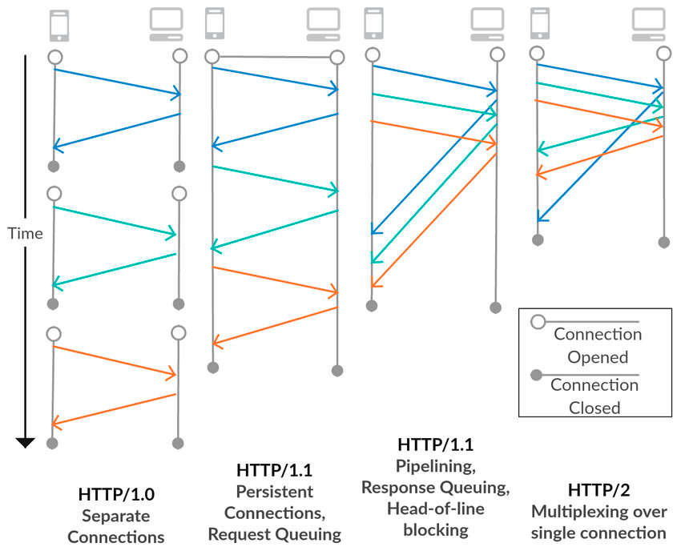
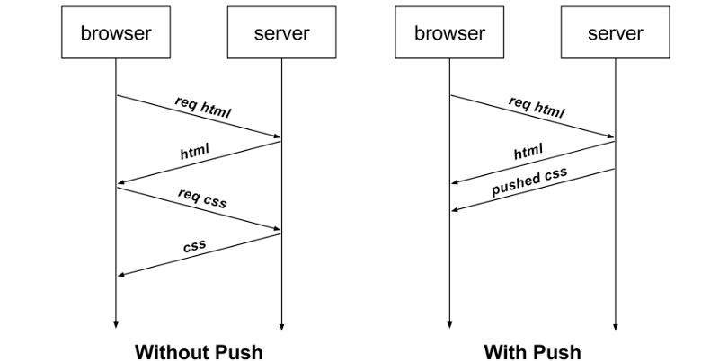
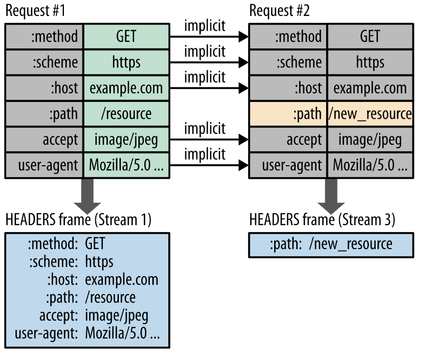

## HTTP 1.1과 HTTP 2.0의 차이

HTTP 1.1 버전은 15년 동안 지속되었습니다.

하지만 하나의 웹사이트에 무수한 리소스가 존재하고 무수한 요청을 주고 받게 되면서 HTTP 1.1이 가진 **문제점**이 대두되면서 HTTP 2.0이 등장했습니다.

HTTP 1.1과 HTTP 2.0의 **차이점**을 **HTTP 1.1(기존)의 문제점**과 **HTTP 2.0의 해결 전략**을 중심으로 알아보겠습니다.

## Multiplexed Streams

HTTP 1.0에서 TCP 세션을 맺는 것을 중복해서 수행하는 성능 이슈가 있었고, HTTP 1.1에서 Keep-alive를 통해서 해당 문제를 풀어냈었습니다.
- https://jaehoney.tistory.com/279

HTTP 2.0에서는 Multiplexed라는 기술을 도입하는데 1개의 세션으로 여러 개의 요청을 순서 상관없이 Stream으로 받아서 동시다발적으로 처리하고 응답할 수 있게 됩니다.

이는 특정 요청이 먼저 끝나면 해당 요청에 대해 먼저 응답해버립니다.

(HTTP 1.1의 HOL 블로킹(Head-Of-Line Blocking)문제를 해결하게 됩니다.)

HOL 블로킹은 가장 앞선 요청에 대한 응답이 지연되면 이후 응답도 모두 지연되는 현상입니다. (서버는 TCP에서 요청을 받은 순서대로 응답을 해야합니다.)
- HTTP 2.0에서는 요청을 Stream으로 받아서 처리하므로 HOL 블로킹이 발생하지 않습니다.

추가로 우리는 위와 같이 요청 수를 줄이기 위해 아이콘을 모아둔 Image Sprite를 만들어서 CSS에서 각 아이콘의 좌표값을 지정해서 사용했다. 이러한 노력을 더 이상 하지 않아도 된다.

## Stream Priorityzation

위에서 언급했듯 HTTP 2.0은 요청을 Stream 형식으로 처리하게 됩니다.

추가로 HTTP 2.0에서는 각 요청에 Priority(우선 순위)를 부여합니다.

예를 들어, 1. HTML 문서와 2. 해당 문서에서 사용할 Image를 요청한다고 가정합니다.

Image를 먼저 응답 받아도, 렌더링할 HTML 문서가 처리가 안되면 의미가 없습니다.

이때 1. HTML 문서의 우선순위를 높여서 먼저 응답하고, Image는 이후에 응답하면 더 효율적으로 동작하게 됩니다.

## Server Push

HTML 문서가 있고, 해당 문서에서 사용하는 CSS와 Images가 있다고 가정합시다.

기존(HTTP 1.1)에서는 HTML 문서를 요청한 후, 해당 문서에서 필요한 CSS와 Images를 요청했었습니다.

HTTP 2.0부터는 HTML 문서를 요청하면, 클라이언트가 추가로 요청을 하지 않아도 서버가 필요한 리소스를 알아서 보내줍니다.

## Header Compression

기존(HTTP 1.1)에서는 이전에 보냈던 요청과 중복되는 Header도 똑같이 전송하느라 자원을 낭비했습니다.

HTTP 2.0부터는 허프만 코딩을 사용한 HPACK 압축 방식으로 이를 개선했습니다.

클라이언트와 서버는 각각 Header Table을 관리하고, 이전 요청과 동일한 필드는 table의 index만 보냅니다.

변경되는 값은 Huffman Encoding 후 보냄으로써 Header의 크기를 경량화 하였습니다.

## 참고
- https://ssungkang.tistory.com/entry/%EB%84%A4%ED%8A%B8%EC%9B%8C%ED%81%AC-HTTP-11-VS-HTTP-20
- https://developers.google.com/web/fundamentals/performance/http2/?hl=ko

