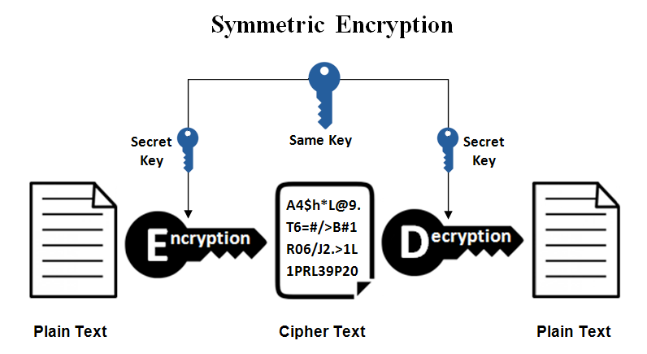
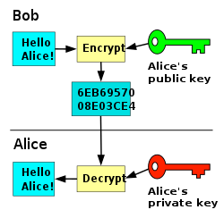

## 대칭키, 공개키(비대칭키)란 무엇인가?!

대칭키랑 공개키의 차이를 수도 없이 봤지만, 막상 설명해야 할 때 헷갈리는 경우가 많다.

대칭키의 장단점은 무엇이고, 어떠한 단점을 해결하기 위해 공개키가 등장하게 되었는지 등을 알아보자.

해당 포스팅에서 내용을 확실하게 정리하면서 다시는 헷갈리지 않도록 하자!

## 개요

- **대칭키 암호화 방식**은 암복호화에 사용하는 키가 동일한 암호화 방식을 말한다.
- **공개키 암호화 방식**은 암복호화에 사용하는 키가 서로 다른 암호화 방식을 말한다. (비대칭키 암호화라고도 한다.)

## 대칭키

대칭키는 위에서 설명한대로 암복호화키가 동일하므로 해당 키를 아는 사람이 문서를 복호화할 수 있게 된다.

대표적인 알고리즘은으로는 **DES**, **3DES**, **AES**, **SEED**, **ARIA** 등이 있다.

공개키 암호화 방식에 비해 속도가 빠르다는 장점이 있지만, **키를 교환해야 하는 문제가 발생**한다. 키를 교환하는 중 키가 탈취될 수 있다.

추가로 사용자가 증가할수록 각각의 키가 필요하기에 관리해야 할 키가 방대하게 많아진다.

이러한 문제를 해결하기 위한 방법으로 **키의 사전 공유**, **키 배포 센터 사용**, **Diffie-Hellman 키 교환**, **공개키 암호화 방식** 등이 있다.

## 공개키

위에서 설명했듯 공개키 암호화 방식은 효율은 떨어지지만, **대칭키 암호화 방식의 키를 교환해야 하는 문제를 해결**하기 위해 등장했다.

A가 B에게 데이터를 보낸다고 할 때, A는 B의 공개키로 암호화한 데이터를 보내고 B는 본인의 개인키로 해당 암호화된 데이터를 복호화해서 보게 된다.
- 암호화된 데이터는 B의 공개키에 대응되는 개인키를 갖고 있는 B만이 볼수 있게 된다.

공개키는 키가 공개되어 있기 때문에 따로 키 교환이나 분배를 할 필요가 없게 된다. 중간 공격자가 B의 공개키를 얻는다고 해도 B의 개인키로만 복호화가 가능하다.

## 참고
- https://liveyourit.tistory.com/183
