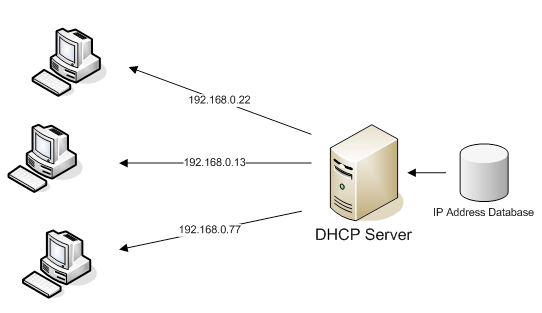
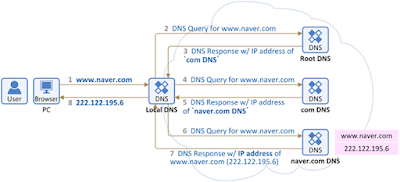

## Network - 주소 창에 www.naver.com을 치면 일어나는 일 (세분화!)

지난 포스팅에서는 DNS의 동작 원리와 과정만 다뤘다.
> https://jaehoney.tistory.com/74

이번 포스팅에서는 더 상세히 세분화해서 작성하는 것을 목표로 한다.

같이 알아보자.

## 세분화

주소 창에 www.naver.com을 치면 일어나는 일을 아래의 과정으로 세분화할 수 있다.
1. 도메인 네임 조회 (Local)
2. 라우팅
3. DNS에 도메인 정보를 질의
4. TCP 커넥션
5. HTTP 요청
6. 컨텐츠 다운로드
7. 브라우저 렌더링

## 1. 도메인 네임 조회

가장 먼저 하는 것은 해당 도메인에 대한 주소가 있는 지 검사하는 것입니다.

DNS 서버에 질의하기 전에 브라우저의 DNS 캐시를 확인해서 www.naver.com에 대한 정보가 있는 지 확인합니다.

해당 캐시가 존재하지 않다면 로컬의 hosts 파일에 www.naver.com에 대한 정보가 있는 지 확인합니다.

해당 정보도 없으면 비로소 아래에서 설명할 라우팅을 거쳐서 DNS 서버에 질의를 해야 한다.

## 2. 라우팅

대부분의 가정집에서는 DHCP로 인터넷에 접속한다. DHCP는 Dynamic Host Configuration Protocol의 약자로 호스트의 IP 주소 및 TCP / IP 설정을 클라이언트에 자동으로 제공하는 프로토콜이다.

사용자들은 DHCP 서버에 자신의 시스템을 위한 IP 주소를 요청하고, IP를 부여 받으면 다른 호스트와 TCP / IP를 사용해서 통신을 할 수 있게 된다.

이때 추가로 가장 가까운 라우터의 IP주소, **가장 가까운 DNS 서버의 IP 주소**를 추가로 전달받습니다.

그리고 해당 IP 주소를 ARP 프로토콜을 이용해서 MAC 주소를 구해야 합니다.

MAC 주소는 왜 필요할까요?!
- 로컬 네트워크(LAN, Local Area Network)에서 단말과 단말 간의 통신을 하기 위해서는 IP 주소와 함께 MAC 주소도 필요하게 됩니다. 
- 끊임없이 변화하는 IP 주소를 MAC Address와 매칭하여 목적지의 IP의 단말이 소유한 MAC 주소를 제대로 찾아가기 위함입니다.
- 이러한 이유로 **LAN의 정의를 ARP Request가 미치는 영역이**라고 표현하기도 합니다. 

ARP란?!
- IP 주소와 MAC 주소를 일대일 매칭하여 **ARP Table**에 저장합니다.
- 저장한 ARP Table을 사용해서 정확한 목적지에 찾아갈 수 있도록 돕습니다.

## 3. DNS에 도메인 정보를 질의

이제 라우팅을 거쳐서 가장 가까운 DNS 서버(Local DNS)와 통신해서 www.naver.com의 IP로 요청을 보내야 한다.

Local DNS는 아래의 절차로 www.naver.com의 IP를 응답으로 돌려줍니다.
1. Local DNS에 해당 IP 정보가 있으면 가져온다.
2. (만약 없다면) Root DNS 서버에 www.naver.com 중 com의 정보가 있는지 확인한다.
3. (없다면 404) 있다면 com DNS로 요청을 보내서 naver의 정보가 있는 지 확인한다.
4. (없다면 404) 있다면 naver.com DNS로 요청을 보내서 www.naver.com의 주소를 가져온다. 
5. Local DNS는 www.naver.com에 대한 주소를 캐시로 저장한다. 
6. Local DNS에서 www.naver.com에 대한 주소 정보를 전달한다.

## 4. TCP 커넥션 (초기 연결)

이제 실제 www.naver.com과 통신하기 위해 TCP 커넥션을 맺습니다.

이때 3-way handshake가 사용됩니다.

## 5. HTTP 요청

TCP 커넥션에 성공하면 연결된 TCP 소켓으로 HTTP Request를 보냅니다.

## 6. 컨텐츠 다운로드

뷰를 렌더링하기 위해 HTTP, CSS, Javascript 또는 해당 페이지에서 필요한 image src등을 다운로드합니다.

## 캐시

만약 유효한 캐시가 존재하다면 해당 캐시를 사용할 수 있습니다.

**공유 프록시 캐시**와 **브라우저 캐시**에서 **해당 리소스가 있는지** 확인합니다.

공유 프록시 캐시
- 클라이언트와 서버의 중간에서 한 명 이상의 사용자에 의해 재사용되는 응답을 저장하는 캐시입니다.

브라우저 캐시
- 브라우저에서 자체적으로 저장하는 로컬 스토리지, 쿠키 등을 말합니다.

## 7. 브라우저 렌더링

이후 브라우저 렌더링을 통해 사용자에게 뷰가 보여지고, TCP 연결을 종료하게 됩니다.

## 참고
- https://ugong2san.tistory.com/4240
- https://github.com/WooVictory/Ready-For-Tech-Interview/blob/master/Network/%EC%A3%BC%EC%86%8C%EC%B0%BD%EC%97%90%20naver.com%EC%9D%84%20%EC%B9%98%EB%A9%B4%20%EC%9D%BC%EC%96%B4%EB%82%98%EB%8A%94%20%EC%9D%BC.md
- https://aws-hyoh.tistory.com/entry/ARP-%EC%89%BD%EA%B2%8C-%EC%9D%B4%ED%95%B4%ED%95%98%EA%B8%B0
