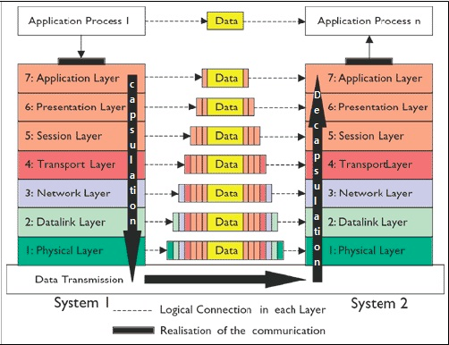
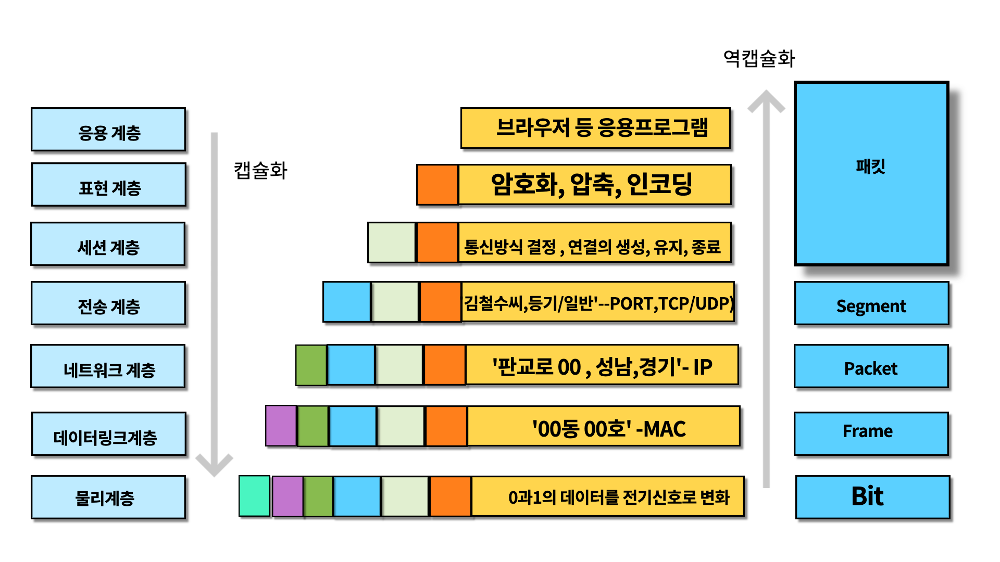

## OSI 7 Layer 제대로 이해하기! (심화)

OSI7 Layer는 어떠한 의미를 가질까..?

제대로 이해해보자.

## 7계층으로 왜 나눌까?

- 통신이 일어나는 과정을 단계별로 알 수 있다.
- 책임을 분산시킬 수 있다.
  - 특정한 곳에 이상이 생기면 해당 단계만 수정할 수 있다.
  
## OSI 7 계층 전체 구성도

OSI 7 계층의 전체 구성은 아래와 같다.

많은 분들은 OSI 7 계층이 책임을 분산하는 것에만 목적이 있다고 알고 있다.

하지만 OSI 7 계층은 각각 분리된 것이 아니라 **단계**를 가진다.

해당 구성을 보면 1계층으로 갈 수록 전송하는 데이터가 많은 것을 알 수 있다.

## 각 단계의 역할

아래는 각 단계가 하는 역할을 그린 것이다.

해당 과정을 이해하기 위해 HTTP 요청을 예로 들어보자.

## 응용 계층 (application layer)

HTTP 요청을 하기 위해서는 Application Layer를 거친다.

여기서 요청 본문을 작성해서 브라우저 등의 응용 프로그램을 통해 전송한다.

## 표현 계층 (presentation)

다음으로 표현 계층은 해당 데이터를 **표현**하는 계층으로 해당 데이터를 읽는 방법을 Header에 포함한다.

추가로 응용 계층의 메시지를 암호화, 인코딩, 압축 등을 처리하여 세션 계층에 넘겨준다.

수신 측의 표현 계층에서는 세션 계층이 보낸 메시지의 **송신 측 표현 계층이 남긴 Header**를 보고 복호화, 디코딩하여 응용 계층에서 해당 메시지를 읽을 수 있게 한다.

##

# 참고
- https://faq.hostway.co.kr/Linux_ETC/1434
- https://velog.io/@nellholic108/%EB%84%A4%ED%8A%B8%EC%9B%8C%ED%81%AC-OSI-7-%EA%B3%84%EC%B8%B5
