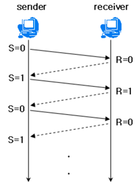
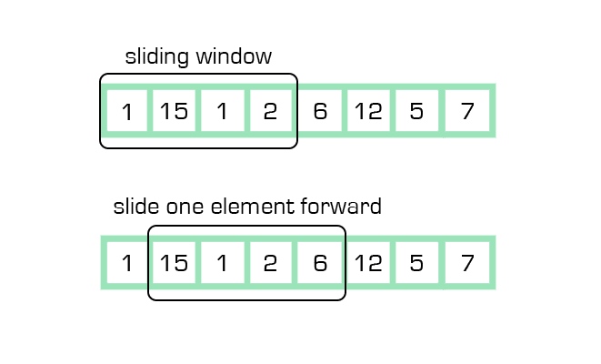
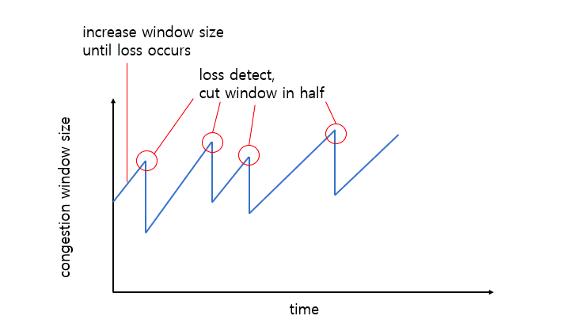
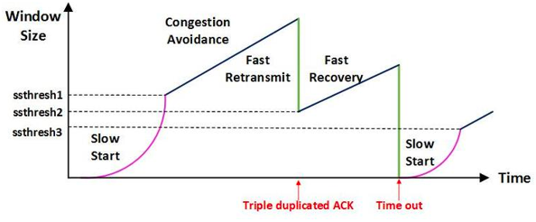

## TCP 통신 이해하기!

 TCP 통신이란?
 - 네트워크 통신에서 신뢰적인 연결방식
 - Unreliable network에서 Reliable network를 보장할 수 있도록 하는 프로토콜
 - Network congestion avoidance algorithm(혼잡 방지 알고리즘)을 사용한다.

## Reliable network
Reliable network를 보장한다는 것은 아래 4가지 문제를 해결한다는 것을 의미한다.
- 손실: Packet이 손실될 수 있다.
- 순서: packet의 순서가 바뀔 수 있다.
- 혼잡: 네트워크가 혼잡하다.
- 과부하: Receiver(수신자)가 과부하 될 수 있다.

TCP는 이러한 문제를 흐름 제어와 혼잡 제어 2가지 기법으로 해결한다.

## 흐름 제어

흐름 제어에 대한 설명이다.
- 흐름 제어는 송신측과 수신측의 데이터 처리 속도 차이를 해결하기 위한 기법이다.
- Flow Control은 receiver가 package을 지나치게 많이 받지 않도록 조절한다.
- 기본 개념은 receiver가 sender에게 현재 자신의 상태를 feedback 한다는 점이다.

수신측이 송신측보다 데이터 처리 속도가 빠르면 문제가 없지만, 송신측의 속도가 빠를 경우 문제가 생긴다.

(수신 측에서 제한된 저장 용량을 초과한 이후에 도착하는 데이터가 손실될 수 있다.) -> 불필요하게 응답과 데이터 전송이 송/수신 측 간에 빈번히 발생하게 된다.

이러한 위험을 줄이기 위해 **송신 측의 데이터 전송량**을 **수신 측의 상황에 따라 조절**한다.

#### Stop and Wait

매번 전송한 패킷에 대해 확인 응답을 받아야만 그 다음 패킷을 전송하는 방법이다.

#### Sliding Window

수신측에서 설정한 윈도우 크기만큼 송신측에서 확인응답없이 세그먼트를 전송할 수 있게 하여 데이터 흐름을 동적으로 조절하는 제어기법이다.

해당 기법은 전송은 되었지만, Acked(확인 응답)을 받지 못한 byte의 수를 파악하기 위해 사용한다.

호스트들은 실제로 데이터를 보내기 전에 **3 Way handshaking**을 통해 수신 호스트의 receive window size에 송신자의 send window size를 맞추게 된다.

## 혼잡 제어

송신측의 데이터 전달과 네트워크의 데이터 처리 속도 차이를 해결하기 위한 기법이다.

송신측의 데이터는 지역망이나 인터넷으로 연결된 대형 네트워크를 통해 전달된다. 여기서 한 라우터에 데이터가 몰릴 경우 자신에게 온 데이터를 모두 처리할 수 없게 된다.

-> 결국 호스트들은 재전송을 하게 되고 혼잡만 가중시켜 오버플로우나 데이터 손실을 발생시키게 된다. 이런 상황을 방지하기 위해 송신 측은 데이터의 전송속도를 강제로 줄여야 한다.

#### AIMD(Additive Increase / Multiplicative Decrease)

- 처음에 패킷을 하나씩 보내고 문제가 없을 시 window 크기(단위 시간 내에 보내는 패킷 수)를 1씩 증가시키며 전송하는 방법
- 패킷 전송에 실패하거나 일정 시간을 넘기면 패킷을 보내는 속도를 절반으로 줄인다.
- 초기에 네트워크의 높은 대역폭을 사용하지 못해서 처리 속도가 느리다.
- 네트워크가 혼잡해셔 문제가 생기고 나서야 대역폭을 줄일 수 있다.

#### Slow Start(느린 시작)

- AIMD 방식이 초기에 네트워크의 높은 대역폭을 사용할 수 없다는 문제를 해결한다.
- Slow Start 방식은 AIMD와 유사하지만, 패킷이 문제 없이 동작하면 window의 크기를 2배로 증가시킨다.
- 대신 혼잡 현상이 발생하면 window size를 1로 떨어뜨리게 된다.
- 네트워크의 수용량을 빠르게 예상할 수 있다.
- 네트워크의 수용량을 파악한 이후부터는 window size의 절반부터는 AIMD와 동일하게 window의 크기를 1씩 증가시킨다.

#### Fast Retransmit(빠른 재전송)

- 빠른 재전송은 TCP의 혼잡 조절에 추가된 정책이다.
- 패킷을 받는 쪽에서 먼저 도착해야할 패킷이 도착하지 않고 다음 패킷이 도착한 경우에도 ACK 패킷을 보내게 된다.
- 단, 순서대로 잘 도착한 마지막 패킷의 다음 번호를 ACK 패킷에 실어서 보내어서 송신 측에서는 손실된 패킷을 재전송할 수 있다.
- 중복된 순번의 패킷을 3개 받으면 재전송을 하게 된다. (혼잡을 예상하여 window size를 줄이게 된다.)

#### Fast Recovery(빠른 회복)
- 혼잡한 상태가 되면 window size를 1로 줄이지 않고 반으로 줄이고 선형증가시키는 방법이다.
- 혼잡 상황을 한번 겪고 나서부터는 순수한 AIMD 방식으로 동작하게 된다.

## 참고
- https://github.com/gyoogle/tech-interview-for-developer/blob/master/Computer%20Science/Network/TCP%20(%ED%9D%90%EB%A6%84%EC%A0%9C%EC%96%B4%ED%98%BC%EC%9E%A1%EC%A0%9C%EC%96%B4).md#tcp-%ED%9D%90%EB%A6%84%EC%A0%9C%EC%96%B4%ED%98%BC%EC%9E%A1%EC%A0%9C%EC%96%B4