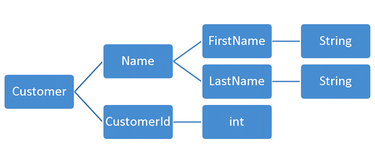

<center></center>

최근에 우아한형제들에서 코드 리뷰를 **객체지향 생활 체조 원칙**를 기반으로 한다는 얘기를 처음 접했다.

객체지향 생활 체조 원칙에 대해 관심을 가지고 찾아봤고, 객체지향의 사실과 오해라는 책과 DDD 관련 책에서도 많이 언급하던 내용에 대한 가이드와 다른 좋은 개념도 많았다.

이번 포스팅에서는 객체지향 생활 체조 원칙에 대해서 작성한다.

## 객체지향 생활 체조 원칙

객체지향 생활 체조 원칙은 **소트웍스 앤솔러지(ThoughtWorks Anthology)** 라는 책에 나오는 원칙이다.

소트웍스 앤솔로지에서는 9가지 원칙을 준수하면서 객체지향을 추구할 수 있다고 한다.

1.  한 메서드에 오직 한 단계의 들여쓰기(indent)만 한다.
2.  else 예약어를 쓰지 않는다.
3.  모든 원시 값과 문자열을 포장한다.
4.  일급 컬렉션을 쓴다.
5.  한 줄에 점을 하나만 찍는다.
6.  줄여 쓰지 않는다(축약 금지).
7.  모든 엔티티를 작게 유지한다.
8.  3개 이상의 인스턴스 변수를 가진 클래스를 쓰지 않는다.
9.  getter/setter/프로퍼티를 쓰지 않는다.

## 1. 한 메서드에 오직 한 단계의 들여쓰기(indent)만 한다.

1개 메서드 안에서 if/for/while 등을 2depth 이상 사용하지 않는다.

해당 부분만 지켜도 가독성이 향상되고 메서드가 자연스럽게 분리되는 효과가 있다.

##### 기존 코드

```java
public static int operate(int[] numArray, String op) {
    int result = 0;
    if(op.equuals("+")) {
        for(int i = 0; i < numArray.length; i++) {
            result += numArray[i];
        }
        return result;
    }
    if(op.equals("*")) {
        // ..생략
    }
}
```

##### 수정된 코드

```java
public static int operate(int[] numArray, String op) {
    if(op.equals("+")) {
        return sum(numArray);
    }
    // 생략
}

private static int sum(int[] numArray) {
    int result = 0;
    for(int i = 0; i < numArray.length; i++) {
        result += numArray[i];
    }
    return result;
}
```

함수는 한 가지 일만 해야 한다. 중첩 구조가 많다는 것은 함수가 하는 일이 많다는 것을 의미한다.

최대 indent를 1로 유지함으로써 함수의 역할을 줄일 수 있다. public 메서드에는 의도만 담고 내부 로직은 private 메소드에 숨겨야 한다.

## 2. else 예약어를 쓰지 않는다.

else가 있는 코드는 의도를 파악하기 어렵다.

**ealry exit pattern**을 적용해서 의도를 분명히 나타낼 수 있다.

##### 기존 코드

```java
public static int operate(int[] numArray, String op) {
    int result = 0;
    if(op.equals("+")) {
        result = sum(numArray);
    } else if(op.equals("-")) {
        result = minus(numArray);
    } else {
        result = avg(numArray);
    }
    return result;
}
```

##### 수정된 코드

```java
public static int operate(int[] numArray, String op) {
    if(op.equals("+")) {
        return sum(numArray);
    } 
    if(op.equals("-")) {
        return minus(numArray);
    }
    return avg(numArray);
}
```

수정 후 자연스레 가독성이 증가했고 이해하기 쉬워졌다.

**ealry exit pattern**으로 흐름이 빨리 종료되므로 코드 뒤편까지 분석하는 것을 방지할 수 있다.

## 3. 모든 원시 값과 문자열을 포장한다.

1번에서 indent를 나누면서 메서드를 분리했었다. 별도의 메서드로 분리하는 것이 아니라 **클래스로 분리**할 수 있는 부분들이 생긴다.

numArray에 음수가 오면 예외를 터트린다는 요구사항이 추가되었다.

##### 기존 코드

```java
private static int sum(int[] numArray) {
    int result = 0;
    for(int i = 0; i < numArray.length; i++) {
        int num = numArray[i];
        if(num < 0) {
            throw new RuntimeException();
        }
        result += num;
    }
    return result;
}
```

##### 수정된 코드

```java
public class Positive {
    private int number;

    public Positive(int number) {
        if (number < 0) {
            throw new RuntimeException();
        }
        this.number = number;
    }

    public Poisitive add(Positive other) {
        return new Positive(this.number + other.number);
    }

    public int getNumber() {
        return number;
    }
}

private static Positive[] toPositives(int[] values) {
    Positive[] numbers = new Positive[values.length];
    for (int i = 0; i < values.length; i++) {
        numbers[i] = new Positive(values[i]);
    }
    return numbers;
}

private static int sum(Positive[] numbers) {
    Positive result = new Positive(0);
    for (Positive number : numbers) {
        result = result.add(number);
    }
    return result.getNumber();
}
```

이런 수정이 낯설게 느껴질 수 있다. 하지만 클래스 분리는 **객체 지향적인 코드를 유도**하고 SOLID의 **SRP**, **OCP**도 만족할 수 있게 돕는다.

`Positive` 객체는 도메인을 충분히 반영하고 스스로를 검증하는 자율적인 객체이다. 결과적으로 Calculator 같은 **상위 클래스에 비대한 책임을 주는 것을 막고** 추가적인 **요구사항에 대응하기가 매우 편리**해진다.

## 4. 일급 컬렉션을 사용한다.

일급 컬렉션이란 **Collection을 Wrapping**하면서 **Collection 외 다른 멤버 변수가 없는 상태**를 말한다.

EffectiveJava나 CleanCode에서도 자주 언급되는 내용이다.

```java
public class Store {
    private Set<Brand> brands;

    public Store(List<Brand> brands) {
        validSize(brands);
        this.brands = brands;
    }

    private void validSize(List<Brand> brands) {
        if(brands.size() >= 10) {
            throw new IllegalArgumentException("브랜드는 10개 초과로 입점할 수 없습니다.");
        }
    }
}
```

일급 컬렉션은 필요한 도메인 로직을 담을 수 있다. 이로써 컬렉션을 사용하는 클래스에서 검증하는 것이 아니라, 일급 컬렉션에서 **자율적으로 검증**할 수 있다.

일급 컬렉션을 사용하면 컬렉션의 **불필요한 메서드**에 대한 **가시성 문제**도 해결할 수 있다.

만약 Map를 사용했다면 remove, removeAll과 같이 도메인에 필요하지 않은 메서드까지 오용할 수 있게 된다.

- 서비스에서 remove, removeAll 등을 언제든지 호출할 수 있게 된다.
- 일급 컬렉션을 사용하면 이러한 넓은 인터페이스/클래스 문제를 막을 수 있다.
    - (클린 코드 8장 - 경계)

## 5. 한 줄에 점을 하나만 찍는다.

점은 **멤버 변수에 접근**하기 위한 점을 의미한다. 아래의 예시를 살펴보자.

##### 기존 코드

```java
if(user.getMoney().getValue() > 100_000L) {
    throw new IllegalArgumentException("소지금은 100_000원을 초과할 수 없습니다.");
}
```

해당 코드에서는 User, Money 두 객체에 의존한다.

**디미터 법칙**에서는 객체 그래프를 따라 멀리 떨어진 객체에게 메시지를 보내는 설계를 피해라고 한다. 이런 설계는 **거의 모든 객체간 결합도**가 생기게 되고 캡슐화가 깨지게 된다.

##### 수정된 코드

```java
if(user.hasMoney(100_000L)) {
    throw new IllegalArgumentException("소지금은 100_000원을 초과할 수 없습니다.");
}
```

그래서 위와 같이 UserService에서 `getMoney`를 수행한 후 직접 행하는 것이 아니라, 단지 User에게 물어보면 된다.

## 6. 줄여쓰지 않는다(축약 금지)

클린 코드에서는 의도가 분명하게 이름을 지으라고 한다. 

이러한 설계는 가독성을 향상시킨다. 아래 예시를 보자.

##### 기존 코드

```java
public boolean isAvailable() {
    return this.status == Status.LOCK;
}
```

##### 수정된 코드

```java
public void validUnlock() {
    if(this.status == Status.LOCK) {
        throw new IllegalArgumentException("잠금 상태에서는 수행할 수 없습니다.");
    }
}
```

객체지향 세계에서는 클래스명이나 필드명, 메서드명을 축약할 필요가 없다. 축약하려는 이유는 여러 개의 책임을 가지고 있기 때문일 것이다.

축약된 코드는 Code Smell을 감지하고 책임을 분리해야 한다.

## 7. 모든 엔티티를 작게 유지한다.

50줄이 넘는 클래스와, 파일이 10개 이상인 패키지를 지양하자는 원칙이다.

보통 50줄이 넘는 클래스는 여러 가지의 책임이 있고, 코드의 이해와 재사용을 어렵게 만든다. 패키지의 파일 수도 줄여야 하나의 목적을 달성하기 위한 연관된 클래스의 집합임이 드러날 수 있다.

##### 패키지 파일이 10개 이상인 경우

50줄이 넘는 클래스는 분리해야 한다는 것 정도는 잘 알고 있다. 그런데 패키지의 파일이 10개 이하여야 한다고 한다. 이부분을 지켜지지 않는 프로젝트를 무수히 많이 봤다.

헥사고날 아키텍처의 어댑터에서는 `package-private`을 사용하므로 JPA 엔터티나 Mapper, Adapter 등이 한 패키지에 있어야 한다. 그래서 한 패키지 안에서 많은 클래스가 존재할 수 있다. 

- 바운디드 컨텍스트를 충분히 분리했는 지를 고민해보자.
- Mapper, JPA Entity 정도만 public으로 사용하고 Adapter는 패키지에 맞게 분리하는 방법도 가능하다.

## 8. 3개 이상의 인스턴스 변수를 가진 클래스를 쓰지 않는다.

인스턴스 변수가 많아질수록 클래스의 응집도는 낮아진다.

마틴 파울러는 대부분의 **클래스가 인스턴스 변수 하나만**으로 일을 하는 것이 적합하다고 말한다.

이 원칙은 객체지향 생활 체조 원칙 중에 가장 어려운 원칙으로 설명한다. 아래는 그 예시이다.



최대한 클래스를 많이 분리하게 강제하여 높은 응집도를 유지할 수 있게 한다.

##### 기존 코드

```java
public class Car {
    private String brand;
    private String model;
    private int year;
    private String color;
    private int currentSpeed;
    private int maxSpeed;
    private boolean engineStarted;
    private boolean lightsOn;
    private boolean wipersOn;
    private boolean parkingBrakeEngaged;
    // ...
}
```

##### 수정된 코드

```java
public class Car {
    private String brand;
    private String model;

    public Car(String brand, String model) {
        this.brand = brand;
        this.model = model;
    }

    public String getBrand() {
        return brand;
    }

    public String getModel() {
        return model;
    }
}

public class Engine {};
public class Light {};
public class Wiper {};
public class Brake {};
// ..
```

이렇게 분리한 클래스들을 사용하는 클래스의 경우 Facade / Mediator / Aggregator 등을 활용하여 사용할 수 있다.

- 여기서 말하는 인스턴스 변수는 객체(Service, Repository, ...)가 아니라 상태를 갖는 변수를 말하는 것이라고 생각하면 된다.
- (모든 클래스의 인스턴스 변수를 1 ~ 2개로 줄여라는 것은 아니다.)

CleanCode에서는 인스턴스 변수 뿐 아니라 메소드의 가장 이상적인 파라미터 개수는 0개라고 말한다. 인스턴스 필드나 메서드 파라미터를 최대한 적게 유지해서 응집도를 높여야 한다.

## 9. 게터/세터/프로퍼티를 쓰지 않는다.

이부분은 Object, DDD 등에서 모두 강하게 강조하는 부분이다. (Tell, don't ask) 원칙에 따르면 묻지 말고 객체에게 행위를 시켜라고 한다.

##### 기존 코드

```java
ShippingInfo shippingInfo = order.getShippingInfo();

ShippingStatus status = shippingInfo.getStatus();
if(state != OrderState.PATMENT_WATTING && state != OderState.WATTING) {
    throw new IllegalArguementException();
}
shippingInfo.setAddress(newAddress);
```

여기서 ShippingInfo는 수동적인 데이터일 뿐이다. **도메인이 의도를 표현하지 못하고** 있고,  로직은 다양한 곳에서 중복으로 작성될 것이다.

##### 수정된 코드

```java
public Order {
    private ShippingInfo shippingInfo;

    public void changeshippingInfo(ShippingInfo newShippingInfo) {
        verifyNotYetShipped();
        setShippingInfo(newShippingInfo);
    }

    private void setShippingInfo(ShippingInfo newShippingInfo) {
        this.shippingInfo = newShippingInfo;
    }
}
```

getter와 setter를 닫으면 메서드의 의도를 노출하기가 쉬워진다.

Order 클래스는 ShippingInfo 클래스에게 필요한 메시지를 보내기만 하면 된다.

## TDD 강연

자바지기 박재성님께서 진행하신 TDD 강연에서도 **객체지향 생활 체조 원칙을 소개**하고 있습니다.

- [https://www.youtube.com/watch?v=bIeqAlmNRrA](https://www.youtube.com/watch?v=bIeqAlmNRrA)

혹시 글이 부족한 점이 있다면 강연을 참고하시는 것도 좋을 것 같습니다.

## 참고

- [https://williamdurand.fr/2013/06/03/object-calisthenics](https://williamdurand.fr/2013/06/03/object-calisthenics)
- [https://hudi.blog/thoughtworks-anthology-object-calisthenics/](https://hudi.blog/thoughtworks-anthology-object-calisthenics/)