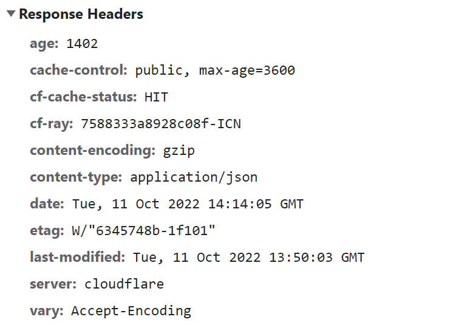

## 캐시 우회 전략 설계하기

대규모 웹 서비스에서 캐시는 반드시 필요하다.

만약 정적 파일(HTML, CSS, Image, JavaScript, ...)를 캐시에 저장하고자 한다.

문제는 해당 파일들이 캐시에 저장된다면, 새로운 버전으로 배포했을 때 캐싱된 이전 버전의 파일을 불러올 수 있다는 점이다.

이는 어떻게 처리해야 할까?

## 재검증

첫 번째 방법은 재검증이다.

가령, 아래의 요청 헤더들이 있다.
- If-None-Match: 캐시된 리소스 ETag 값과 현재 서버 리소스의 ETag 값이 같은 지 확인한다.
- If-Modified-Since: 캐시된 리소스의 Last-Modified 값 이후에 서버 리소스가 수정되었는 지 확인한다.

이 경우 재 검증 캐시가 유효하지 않을 때만, 서버는 200 OK 또는 적합한 상태 코드를 본문과 함께 내려준다.

만약 캐시가 유효하다면 서버는 캐싱되어 있는 이미지를 사용하라는 의미의 304 상태코드를 반환한다.

## ETag

그렇다면 위에서 언급한 ETag는 어떤 것일까?

ETag는 응답헤더의 한 종류로 웹 서버가 제공하는 컨텐츠들에 부여되는 식별자 정도로 이해할 수 있다.



ETag를 생성하는 알고리즘은 사용하는 플랫폼(Nginx, Tomcat 등)마다 로직이 다르다.

Nginx의 경우에는 마지막 수정 시간과 content 길이를 md5 해싱해서 얻어낸 값으로 사용한다.

추가로 ETag는 약한(Week)검사와 강한(Strong)검사를 지원한다.

강한 검사는 본문 길이 뿐 아니라 내용까지 ETag를 생성하는 데 사용한다.

## CDN Invalidation

두 번째 방법은 CDN Invalidation이다.

이 경우 CDN에 저장되어 있는 캐시를 삭제해주는 방법이다.

단, 배포를 할 때마다 이런 작업을 해주는 것은 어렵기 때문에 캐시 전략을 신중히 설계해야 한다.

## Cache-Control 전략

토스 프론트엔드 챕터에서는 Cache-Control을 `s-maxage=31536000, max-age=0`로 설정한다고 한다.

이 경우 브라우저에서는 매번 재검증 요청을 보내도록 하고, CDN 등 중간 캐시에서는 1년동안 캐싱을 사용하도록 설정할 수 있다.

## 배포 전략

단, 그런데 만약 재검증 절차 설정없이 공유 캐시나 브라우저에 정적 컨텐츠가 캐싱된다면, 이후 컨텐츠가 수정되었을 때 사용자에게 불편한 UX를 줄 수 있다.

그래서 배포가 되었을 때 별도의 처리 없이도 사용자가 즉각적으로 새로운 컨텐츠를 받을 수 있게 처리해야 한다면?

정적 컨텐츠에 아래(`v=202211041203`)와 같은 쿼리 스트링을 사용하면 이러한 캐시를 우회할 수 있다.
- `<link rel="stylesheet" type="text/css" href="/common/css/common.css?v=202211041203">`

즉, 배포했을 때 쿼리스트링 내용만 바꿔도 다른 자원으로 인식해서 기존의 캐싱된 자원을 활용하지 않을 수 있다.

그럼 매 배포마다 어떻게 해당 쿼리스트링을 바꿔줘야 할까?!

이는 어렵지 않게 해결이 가능하다.

```
<jsp:useBean id="today" class="java.util.Date" />
<fmt:formatDate value="${today}" pattern="yyyyMMdd" var="nowDate"/>
<link rel="stylesheet" type="text/css" href="<c:url value="/css/ik_intro.css"><c:param name="dt" value="${nowDate}"/></c:url>"/>
```
JSP의 경우 JSTL로 쿼리스트링을 동적으로 넣어주면 처리가 가능하다.

JavaScript의 경우에도 랜덤한 값을 사용해서 아래처럼 처리할 수 있다.
```javascript
var rand = Math.floor((Math.random() * 10000));
document.write('');
```

WebPack을 사용한 프로젝트의 경우 webpack.config.js에서 아래 설정을 넣어주면 더 쉽게 반영할 수 있다.
```javascript
output: {
	path: path.join(__dirname, '/src/'),
	filename: '[name].[chunkhash:8].js',
},
```

## 참고
- https://toss.tech/article/smart-web-service-cache
- https://jizard.tistory.com/449