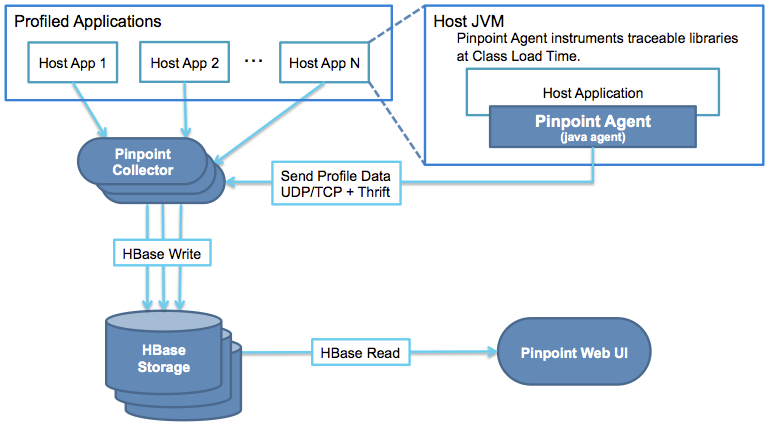
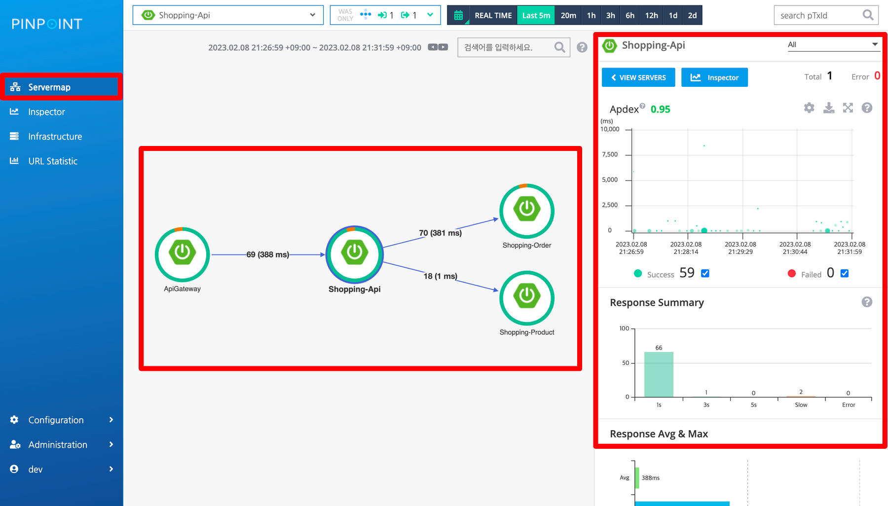
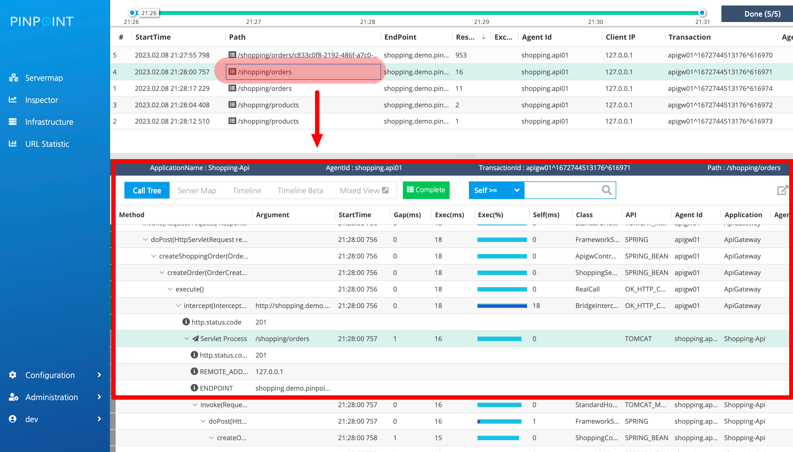
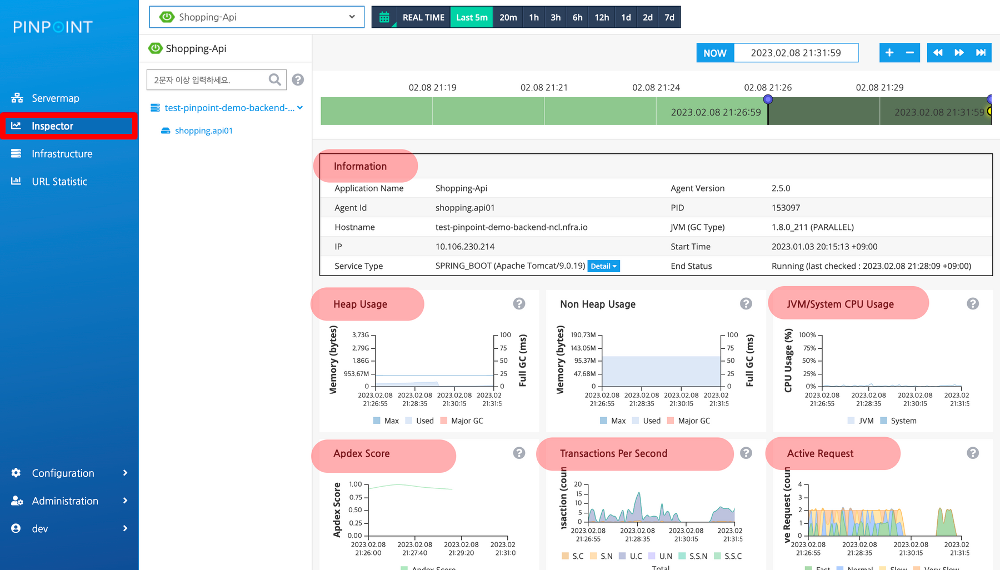
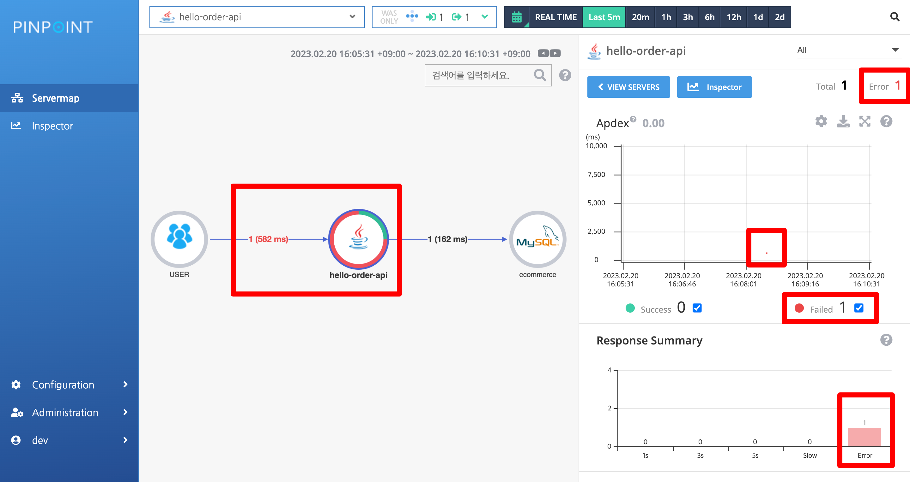
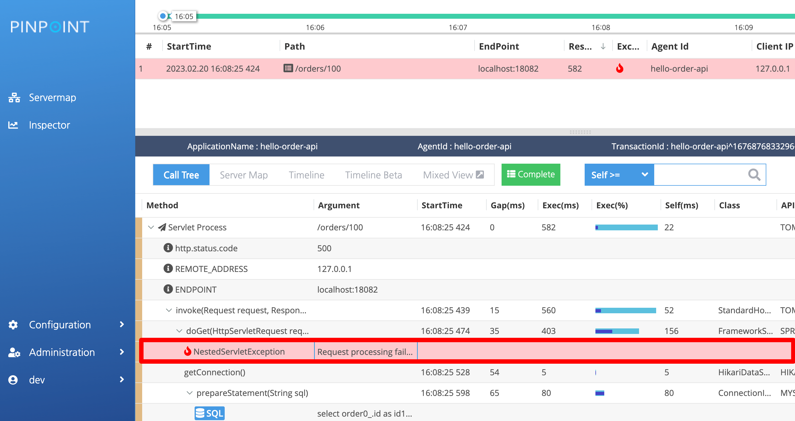
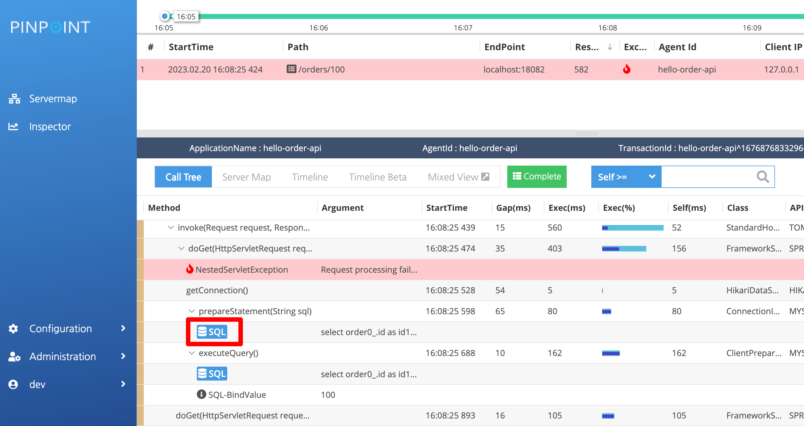
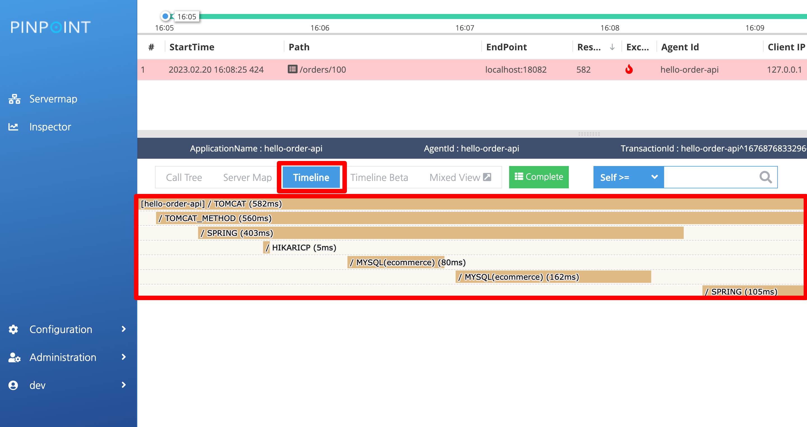

Pinpoint는 Naver에서 2015년에 오픈소스로 공개한 **APM 도구**이다.

분산 환경에서 JVM 언어 기반으로 작성된 서버에서 많이 사용한다.

## APM이란 ?

APM이란 Application Performance Management / Application Performance Monitoring의 약자이다.

즉, **애플리케이션의 성능을 관리/모니터링** 한다고 보면 된다.

APM 도구를 사용하면 서버에서 발생하는 메트릭(CPU, Memory, Thread, Transaction, ...), 이벤트, 로그, 트랜잭션 등을 모니터링할 수 있다.

이렇게 분석한 데이터는 아래의 목적을 위해 활용할 수 있다.
- 성능 문제를 예측하고 방지
- 고객 기대 성능 보장, 고객 경험 향상
- 응답 시간 보장
- 가용성 증대, 다운타임 감소

## vs Prometheus (+ Grafana)

처음 궁금했던 것은 'Pinpoint는 Prometheus와 무엇이 다를까..?' 였다.

Prometheus와 Pinpoint는 모두 APM(성능 모니터링) 도구이다.

### 1. 추적

Prometheus는 서버의 각 지표(metric)을 활용해서 JVM Memory, 초당 트랜잭션 발생 수, Redis 사용률, Thread 상황 등 자원 상태를 파악하기 좋다.

그렇지만, 문제가 발생할 경우 단순히 시각화만 가능할 경우 정확한 원인을 파악하기 힘들 수도 있다.

Pinpoint는 트레이싱(tracing)을 통해 요청을 추적할 수 있고, 어느 지점에서 문제가 되었는 지 정확히 파악하고 알려준다.

쉽게 말하면 숲을 보기에는 Prometheus + Grafana가 편리하고, 나무를 보기에는 Pinpoint가 유리하다고 할 수 있다.

### 2. 데이터 저장 및 질의

Prometheus는 내장된 시계열 데이터에 수집한 데이터를 저장하고, PromQL이라는 DSL을 사용해서 질의할 수 있다.

Pinpoint에서는 Elasticsearch와 HBase와 같은 분산 데이터베이스에 데이터를 저장할 수 있고, Kibana를 통해 저장된 데이터를 검색하고 시각화할 수 있다.

### 3. 확장성

두 APM 도구는 데이터 수집 방식에 따른 확장성 차이가 있다.

Prometheus는 Exporter가 주기적으로 메트릭 데이터를 **Pull** 방식으로 수집하기 때문 분산 서버에 적용하기에 적합하지 않다.

Pinpoint는 확장성을 제공하는 데 중점을 두었고, 수집된 데이터의 양이 증가해도 확장 가능한 아키텍처를 가지고 있다. Prometheus랑 다르게 **Push** 방식으로 데이터를 Collector에 전달하기 때문에 분산 서버에서도 잘 동작한다.

## Pinpoint의 Architecture



- Pinpoint Agent - 애플리케잇녀의 성능 관련 지표 수집 및 전달
- Pinpoint Collector - Agent에서 ㅂ다은 정보를 HBase에 적재
- Pinpoint Web UI - 수집된 정보를 화면으로 제공한다.(성능, 모니터링, 지표)

## Pinpoint의 특징

Pinpoint는 아래의 특징을 가진다.
- 연결된 분산 시스템에 대한 시각적 정보를 제공한다.
- 실시간으로 애플리케이션 및 서비스 모니터링이 가능하다.
- 각각의 트랜잭션을 분석하고 추적할 수 있다.
  - 특히 Code 레벨의 Call stack 정보를 활용해서 운영 이슈 해결에 매우 유용하다.
- 프로덕트 코드 변경 없이 APM Agents를 제공할 수 있다.

## Pinpoint의 기능

다음은 Pinpoint에서 제공하는 기능에 대해 알아보자.

### ServerMap

ServerMap 지표를 활용하면 서버의 전체적인 시스템 아키텍처와, 각 End-point에 대한 요청 비율 등을 쉽게 파악할 수 있다.



- 분산 시스템의 연결된 상황과 트랜잭션을 시각화
- 각 요청의 성공, 실패 지표 제공
- 각 end-point에 대한 요청 수 제공
- 각 요청의 응답 시간 제공
- ...

추가로 특정 Scatter를 드래그해서 상세 정보를 확인할 수 있다.

### CallStack

CallStack은 모든 트랜잭션에 대한 코드 수준의 가시성 정보를 제공한다.



- 코드 수준의 병목 지점이나 장애 지점을 식별할 수 있다.

일반적으로 Pinpoint에서는 ServerMap과 CallStack 기능을 가장 많이 사용한다.

### Inspector

Inspector는 애플리케이션에 대한 상세 정보를 제공한다.



- CPU 사용률
- Memory
- Garbage Collection
- TPS
- JVM arguments

## 실행 방법

앞서 말했듯 Pinpoint는 프로덕트 코드의 변경 없이도 적용할 수 있다.

프로젝트를 run할 때 아래의 옵션을 적용하면 된다.

```shell
java -jar -javaagent:[Pinpoint Agent Path]/pinpoint-bootstrap.jar -Dpinpoint.agentId=
[Agent ID] -Dpinpoint.applicationName=[Service Name] hello-rest-api-0.0.1-SNAPSHOT.jar
```

그러면 서버 인스턴스가 올라갈 때 pinpoint도 같이 실행된다. 즉, pinpoint도 서버의 자원을 일부 사용하게 된다.

## Sampling

Pinpoint도 다른 APM처럼 Sampling 설정을 적용할 수 있다.

```yml
profiler:
  sampling:
    # Allow sampling
    enable: true
    # COUNTING / PERCENT
    type: COUNTING
    # Counting -> 1: 100%, 20: 5%, 100: 1% 
    counting:
      sampling-rate: 1
    #  percent:
    #    sampling-rate: 100
```

당연히 Sampling Late가 높을 수록 서버의 자원을 많이 사용하게 된다.

## 에러 분석

에러 상황을 가정해보자.



에러가 캐치될 때마다 ServerMap에 빨간 점이 하나 생긴다.

해당 부분을 드래그하면 상세 조회를 할 수 있다.



선택한 트랜잭션의 Call Tree에서 각 지점의 소요 시간과 클래스 정보, 발생한 예외에 대한 상세 정보를 확인할 수 있다.



더 트리를 타고 내려가면 실행된 쿼리에 대해서도 확인할 수 있다.



ReadTimeOut 같은 문제가 발생한다면 Timeline을 활용해서 정확한 병목지점이 쿼리 실행 부분이 맞는 지 확인할 수 있다.

## 참고

해당 포스팅은 아래 패스트 캠퍼스 강의 내용을 활용했습니다. 기회가 된다면 꼭 추천드립니다!

- https://fastcampus.co.kr/dev_online_bedata

**추가 Reference**

- https://engineering.linecorp.com/ko/blog/server-side-test-automation-5
- https://pinpoint-apm.github.io/pinpoint/overview.html


