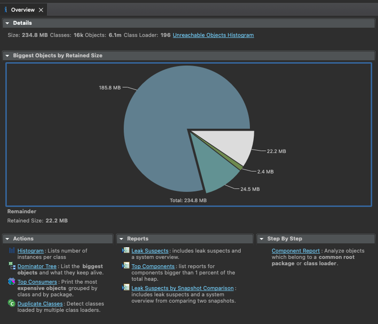
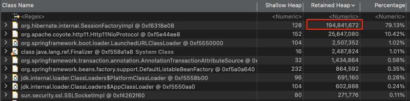
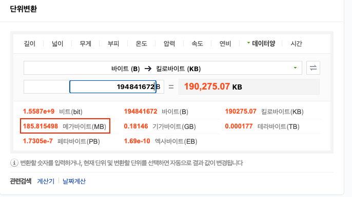
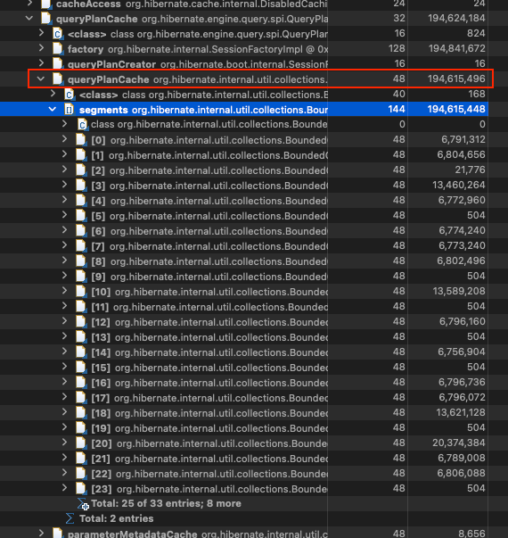

오늘 OOM이 터졌다는 요청이 왔다. 그래서 해당 API를 새로 배포한 후, 원인을 찾기로 했다.

## HeapSize 확인

첫 번째로 살펴본 부분은 HeapSize였다.
- `java -server -Xms256m -Xmx256m`

놀랍게도 HeapSize가 256m 이었다. 일단 Size가 너무 적었기 때문에 누수가 아니라, 트래픽 급증 등이 원인일 수도 있겠다고 생각을 했다.

## 문제가 되는 부분

해당 배치가 돌아간 시간을 확인해보니 아래 쿼리가 문제가 되었음을 확인했다.

```java
public interface CommentRepository extends JpaRepository<Comment, Long> {
    @Query("select m from Comment m where m.userId in (:userIds)")
    List<Comment> findAllByUserIds(@Param("userIds") Collection<Long> userIds);
}
```

서비스에서는 userIds로 최초 조회한 최대 10000개의 userId 리스트가 들어가고 있다.

## HeapDump 확인

HeapDump를 확인한 결과 185MB를 차지하는 부분이 있었다.



문제가 되는 부분은 아래와 같았다.





SessionFactoryImpl의 Retained Heap(연결된 오브젝트의 크기를 포함한 사이즈)의 byte를 MB로 환산해보니 185MB 정도 나왔다.

## queryPlanCache



SessionFactoryImpl 안에서도 queryPlanCache가 너무 큰 것을 확인할 수 있다.

Hibernate는 QueryPlanCache를 사용해서 파라미터와 반환값에 대한 정보를 저장하고, 모든 SQL 실행마다 Cache를 확인하여 Query Plain이 있는 지 확인한다. 없는 경우에만 Query Plan을 새로 생성한 후 캐시에 저장한다.
- 다행히 간단한 구글링으로도 쉽게 찾을 수 있었다.
- NHN 기술 블로그에 특히 잘 정리되어 있다. (https://meetup.nhncloud.com/posts/211)

즉, Where in 절의 다양한 케이스를 캐싱하지 않으려면 쿼리를 조정하거나 QueryPlanCache 조정이 꼭 필요한 것이 맞다.

## 해결 방법

해당 부분을 해결하기 위해서는 아래 방법을 적용할 수 있다.
1. in_clause_parameter_padding: true -> in 절을 2의 거듭제곱 단위로 Padding 처리한다.
2. plan_cache_max_size: {N} -> query Plan의 최대 개수 제한한다. 기본 값은 2048이다.
3. plan_parameter_metadata_max_size: {N} -> 캐시에 저장할 ParameterMetadata의 개수를 관리한다. 기본 값은 2048이다.

> 일반적으로 첫 번째 방법이 코드의 변경 없이 성능을 향상시킬 수 있는 좋은 방법이다.
> 
> 타 Reference에서 각 true, 64, 64를 줘서 문제를 해결한 Case를 찾을 수 있었다.

그래서 해당 옵션을 추가해서 문제를 해결할 수 있었다.

## 참고

- https://shuiky.tistory.com/entry/java-heap-dump-%EB%B6%84%EC%84%9D
- https://hyos-dev-log.tistory.com/29
- https://meetup.nhncloud.com/posts/211
- https://www.baeldung.com/hibernate-query-plan-cache

