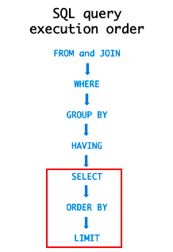

### 커버링 인덱스

**커버링 인덱스(Covering Index)**는 원하는 데이터를 **인덱스에서만** 추출할 수 있는 인덱스를 의미한다. B-Tree 스캔만으로 원하는 데이터를 가져올 수 있으며, 칼럼을 읽기 위해 **실제 데이터 블록에 접근할 필요가 전혀 없다.**

인덱스는 행 전체 크기보다 훨씬 작고 인덱스 값에 따라 정렬이 되기 때문에 Sequential Read로 접근할 수 있기 때문에 쿼리 성능을 크게 향상할 수 있다.

그래서 인덱스를 설계한다고 해서 `WHERE` 절에 국한된 문제가 아니라, 사실 **쿼리 전체**에 대해 **인덱스 설계**가 필요하다.

### 예시

**테이블 생성**

```
create table user (
    id int(11) not null auto_increment,
    name varchar(20) not null default '',
    email varchar(40) not null default '',
    -- ... 생략
    chgdate varchar(15) not null default '',
    key chgdate (chgdate)
) engine = innodb;
```

해당 테이블에 약 1,000만 건의 데이터를 무작위로 넣고 테스트를 진행한다.

아래의 sql문을 실행해보자.

```
select id from user limit 100000, 100
```

다음은 해당 쿼리의 실행 계획이다.

| id | select_type | table | type  | possible_keys | key     | key_len | ref  | rows     | Extra       |
|----|-------------|-------|-------|---------------|---------|---------|------|----------|-------------|
| 1  | SIMPLE      | user  | index | NULL          | CHGDATE | 47      | NULL | 9228802  | Using index |

쿼리 실행 계획의 Extra 필드에 **Using Index** 라는 결과를 볼 수 있는데, 이는 쿼리의 모든 항목이 인덱스 컬럼으로 이루어져 있기 때문에 인덱스만으로 데이터를 추출하였음을 알 수 있다.

이처럼 데이터 추출을 인덱스에서만 수행하는 것을 **커버링 인덱스**라고 한다.

### 비교

**1) 일반 쿼리**

먼저 user를 조회할텐데 name을 조건으로 전체 컬럼을 조회하는 경우이다.

```
select * from user where chgdate like '2010%' limit 100000, 100
```

쿼리 수행 속도는 30.37초이며, 쿼리 실행 계획은 다음과 같다.

| id | select_type | table | type  | possible_keys | key     | key_len | ref  | rows     | Extra       |
|----|-------------|-------|-------|---------------|---------|---------|------|----------|-------------|
| 1  | SIMPLE      | user  | range | CHGDATE       | CHGDATE | 47      | NULL | 4352950  | Using where |

**2) 커버링 인덱스를 사용한 쿼리**

다음 쿼리는 커버링 인덱스를 사용해서 필요한 데이터의 id 목록만을 먼저 조회한 후 해당 id 목록으로 전체 컬럼을 한번 더 조회한다.

```
select a.*
from (
      select id
      from user
      where chgdate like '2012%'
      limit 100000, 100
) b
join user a on b.id = a.id
```

이 경우 **인덱스만으로 필요한 컬럼을 빠르게 조회**한 이후 **좁혀진 범위**의 데이터에 다른 컬럼을 채워주면 된다.

쿼리 수행시간은 0.16초가 수행되며 실행 계획은 다음과 같다.

| id | select_type | table | type   | possible_keys | key     | key_len | ref    | rows     | Extra                   |
|----|-------------|-------|--------|---------------|---------|---------|--------|----------|-------------------------|
| 1  | PRIMARY     |       | ALL    | NULL          | NULL    | NULL    | NULL   | 100      |                         |
| 1  | PRIMARY     | a     | eq_ref | PRIMARY       | PRIMARY | 4       | b.id   | 1        |                         |
| 2  | DERIVED     | user  | range  | CHGDATE       | CHGDATE | 47      | NULL   | 4352950  | Using where; Using index |

마지막 row를 보면 **Using Index**로 **커버링 인덱스**를 사용했음을 알 수 있다. 이게 가능했던 이유는 테이블을 생성할 때 PK를 id로 하고 chgdate를 가진 Index가 있기 때문이다. 이 때 **chgdate 인덱스는 PK를 가지고 있다**.

### Why Fast(빠른 이유)

쿼리 수행시간의 차이가 극명하다. 이러한 차이는 **Group by, Order by 등이 추가된 복잡한 쿼리**라면 **더 극명하게 나타나게 된다.**

**그렇다면 커버링 인덱스는 왜 빠를까?**

#### 1. 인덱스 사용 유도

DB 상황에 따라 다르지만 **복잡한 쿼리**의 경우 Optimizer가 PK만으로 조회를 하는 것이 최선이라고 오판단(?)하여 **Index를 활용하지 않는 현상이 자주 발생**한다.

이 경우 강제로 Index를 태우도록 처리해야 하는데 유지보수 관점에서 좋지 않을 수도 있다. (ORM에서 Index를 강제로 태우기 어려움, Index를 수정, 삭제하면 문제가 생길 수 있음, ...)

그런데 **커버링 인덱스**로 조회 쿼리를 구상하면 대부분(거의 모든)의 경우 Optimizer가 **Index를 활용**하게 된다. 그래서 대용량 데이터에서 훨씬 유리하게 쿼리를 선택할 수 있다.

(위에서 보여준 성능 차이에서는 동일한 Index를 타므로 해당 부분과는 무관하다.)

- JPA, QueryDSL 등을 사용할 때 조회 쿼리에서 Index를 타지 않는 이슈를 아주 많이 봤다.

#### 2. 데이터 블록 조회


아래는 SQL이 실행되는 순서이다. FROM ~ JOIN부터 HAVING까지는 Index를 활용할 수 있다. 하지만 SELECT ~ LIMIT 부분에는 실제 데이터 블록을 조회해야 한다.



해당 내용을 살펴보면 각 과정에는 조회 성능이 낭비되는 순간들이 존재한다.

**SELECT**

SQL에서 select는 offset ~ limit보다 먼저 처리된다.

즉, LIMIT 처리가 되면 **필요 없을 수 있는 데이터**까지 **전부 포함한 전체 데이터의 전체 컬럼을** Index와 비교해가면서 읽어서 **로드**해야 한다.

해당 부분에서 로드하는 데이터의 row 수가 매우 많기 때문에 **가장 큰 부하**가 발생한다.

**ORDER BY**

order by의 경우 select보다 나중에 처리된다.

그래서 **전체 컬럼을 모두 포함**한 **무거운 데이터를 정렬**해야 한다.

**OFFSET ~ LIMIT**

offset ~ limit도 실제 데이터 블록을 기준으로 수행하므로 읽어야 할 데이터의 크기가 커서 부하가 발생한다.

#### 커버링 인덱스는 ?

일반적인 쿼리의 경우 order by, offset ~ limit 를 수행할 때도 데이터 블록을 조회하게 된다.

커버링 인덱스를 사용한 쿼리는 **모든 과정에서 인덱스만을 활용**해서 **데이터를 완성**한다. 그래서 인덱스와 데이터 블록을 비교하면서 데이터를 완성할 필요가 없다.

> **ORDER BY를 수행한다고 가정**하자. ORDER BY는 SELECT 이후에 실행되므로 무거운 데이터를 정렬해야 한다.
> 커버링 인덱스로 조회하면 **Index 컬럼들의 데이터만 정렬**하면 되므로 성능상 이점이 생긴다.

단점으로 **후속 쿼리**가 필요하지만 PK로 WHERE IN 쿼리를 사용하기 때문에 일반적으로 큰 문제가 되지 않는다.

### 단점

커버링 인덱스의 경우 아래의 주의사항이 존재한다.

- 인덱스가 많이 필요하게 된다.
    - 쿼리의 모든 항목이 인덱스에 포함되어 있어야 한다.
    - (쓰기 성능이 떨어질 수 있음)
- 여전히 페이지 번호가 뒤로 갈 수록 느려진다는 문제가 존재한다.
    - No Offset 방식과 함께 사용할 수 있다.
    - (일반 쿼리보다는 훨씬 빠르다.)

## Reference

- [https://gywn.net/2012/04/mysql-covering-index/](https://gywn.net/2012/04/mysql-covering-index/)
- [https://jojoldu.tistory.com/476](https://jojoldu.tistory.com/476)