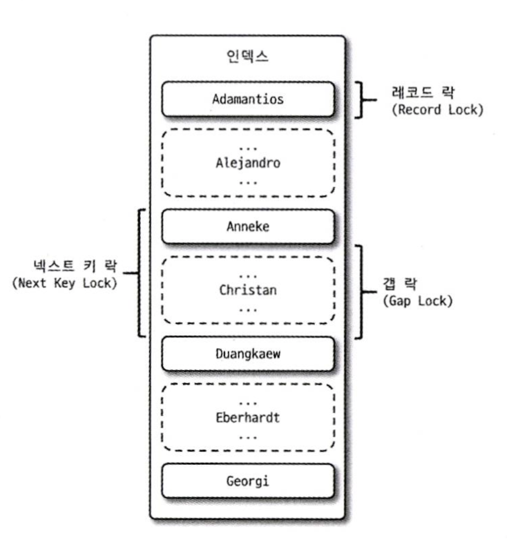

MySQL의 InnoDB(스토리지 엔진)에서 제공하는 비관적 락에 대해 살펴보자.



## 1. Record Lock

레코드 락의 경우 인덱스 레코드에 락을 걸어서 수정, 삽입, 삭제를 못하게 막는다.

## 2. Gap Lock

갭 락의 경우 개념적인 용어이며 실제로 InnoDB에서는 사용되지 않는다.
- Record Lock과 Gap Lock을 결합한 Next Key Lock을 대신 사용한다.

일반적으로 REPETABLE-READ 격리 수준에서 발생한다.

인덱스 레코드와 인접한 앞/뒤 사이 공간을 잠근다.

```mysql
SELECT * FROM my_table WHERE id > 100 AND id < 200;
```

해당 쿼리가 실행되었다고 하자. 그러면 해당 범위의 데이터가 삽입, 수정, 삭제되지 않도록 갭락을 걸게된다.
- Index를 기준으로 잠글 수 있으므로 100 이하의 인덱스 중 최댓값과 200 이상의 최솟값 인덱스까지 락이 걸린다.

## 3. Next key Lock

레코드 락 + 갭 락의 형태이다. 인덱스 레코드도 잠그고, 앞과 뒤 갭도 잠근다.

- 바이너리 로그에 기록되는 쿼리가 레플리카 서버에서 실행될 때 소스 서버에서 만들어낸 결과와 동일하게 하도록 보장하는 것이 목적

InnoDB에서는 아래의 조건으로 락이 선택된다.
- 쿼리의 조건이 1건의 결과를 보장하는 경우 (PK 또는 UK), Record Lock만 사용된다.
- 그렇지 않은 경우 Next key Lock이 사용된다.

## 4. Auto increment Lock

MySQL에서 자동 증가하는 AUTO_INCREMENT의 동기화를 보장한다.

아주 짧은 시간만 걸리기 때문에 문제가 되는 일은 거의 없다.

동시성이 매우 높은 환경의 경우 문제가 생길 수 있는데, 이런 경우 다른 유니크한 값 생성 방법을 고려할 수 있다. 

## 튜닝

갭 락(Gap Lock)이나 넥스트 키 락(Next key Lock)이 많이 발생하면 DB 부하에 영향을 미칠 수 있다.

다음은 갭 락과 넥스트 키 락을 줄이는 몇가지 방법이다.
- 적절한 인덱스 사용 - 효율적인 인덱스를 사용하면 쿼리 범위를 줄일 수 있다.
- 트랜잭션 크기 줄이기 - 트랜잭션 범위를 최소화하여 트랜잭션 내에서 락이 잡히는 시간을 최소화할 수 있다.
- 범위 잠금 - 갭 락은
- 바이너리 로그 포맷을 ROW 형태로 바꿔서 넥스트 키 락의 시간을 줄일 수 있다.

## 참고
- https://mangkyu.tistory.com/298