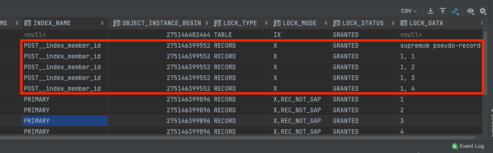
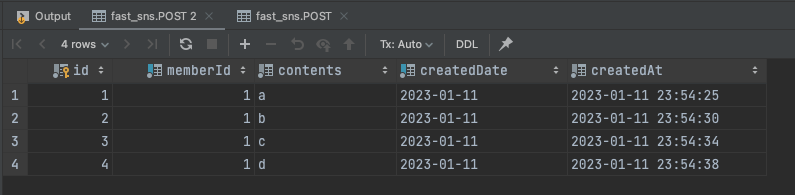

# MySQL - 락 불필요한 데이터를 잠그는 문제 정리! (+ 트랜잭션과 락의 차이)

락은 DBMS이나 애플리케이션에서 동시성을 제어할 수 있는 방법이다.

해당 포스팅에서는 MySQL의 락에 대해 다룬다.

## 락 이란?

락을 통해 동시성을 제어할 때는 락의 범위를 최소화하는 것이 중요하다.

- 락의 범위가 길어지면 대기중인 DB 커넥션이 많아지므로 커넥션 풀 고갈로 이어질 수 있다.

MySQL에서는 트랜잭션의 커밋 혹은 롤백시점에 잠금이 풀린다. 즉, 트랜잭션이 곧 락의 범위가 된다.

## 트랜잭션과 락

예시를 통해 알아보자.

한 트랜잭션 내에서 S3로 업로드를 한다고 가정하자.

트랜잭션과 락은 각각 아래의 역할을 수행한다.
- **트랜잭션**
  - S3 업로드가 진행되는 동안에도 DB 커넥션을 유지하고 트랜잭션을 지속한다. 
  - S3 업로드가 성공하면 트랜잭션을 커밋한다. 
  - S3 업로드가 실패하면 진행중이던 DB 트랜잭션을 롤백한다.
- **락**
  - S3 업로드가 진행되는 동안 다른 커넥션에서 데이터를 참조되는 것을 막는다.

즉, 트랜잭션과 락의 범위는 모두 DB 커넥션 풀에 영향을 미친다. 트랜잭션은 DB 커넥션을 지나치게 많은 시간을 점유하게 하고, 락은 다른 DB 커넥션이 접근하지 못하게 대기시킨다는 점에서 차이가 있다.

## 읽기 락과 쓰기 락

락은 읽기 락(Shared Lock)과 쓰기 락(Exclusive Lock)으로 나눌 수 있다. 각 락은 아래의 특징을 가진다.

읽기 락(Shared Lock)이 걸려있으면
- 읽기 락은 접근이 가능하다.
- 쓰기 락은 접근이 불가능하다.

쓰기락(Exclusive Lock)이 걸려있으면
- 읽기 락은 접근이 불가능하다.
- 쓰기 락도 접근이 불가능하다.

즉, 읽기 락끼리는 공유가 가능하지만 다른 경우들은 모두 데이터를 공유할 수 없고 대기를 하게 된다고 생각하면 된다.

MYSQL에서 읽기 락은 SELECT ... FOR SHARE 구문을 사용하고,

쓰기락은 SELECT ... FOR UPDATE 또는 UPDATE, DELETE 쿼리 시 획득할 수 있다.

## Lock의 범위

MySQL에서 잠금은 row가 아니라 인덱스를 잠근다.

그래서 인덱스가 없는 조건으로 Locking Read시 불필요한 데이터들이 잠길 수 있다.

예를 들어 아래의 쿼리를 실행한다고 가정해보자.

```sql
start transaction;
SELECT * FROM post WHERE memberId = 1 AND contents = 'string' FOR UPDATE;
```

여기서 만약 contents 컬럼에 인덱스가 없다면 어떻게 될까?!!

아래의 락 조회 문을 사용할 수 있다. (위에서 COMMIT을 수행하지 않았으므로 락을 유지하고 있을 것이다.)

```sql
# 실행중인 락 조회
SELECT * FROM performance_schema.data_locks;
# 실행중인 트랜잭션 조회
SELECT * FROM performance_schema.innodb_trx;
```




