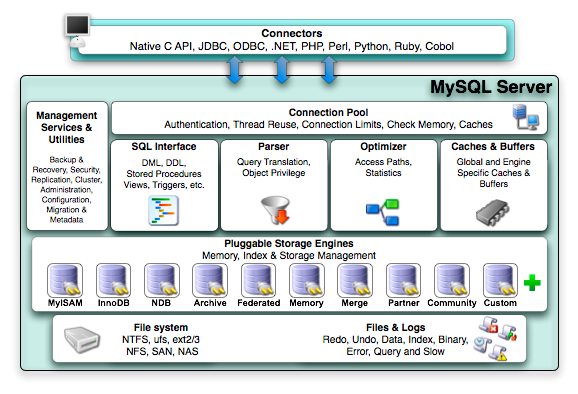
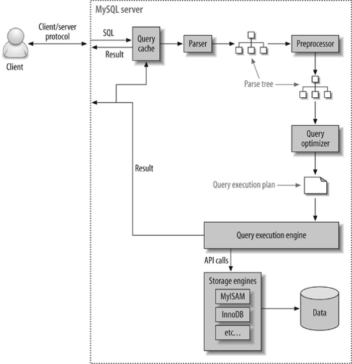
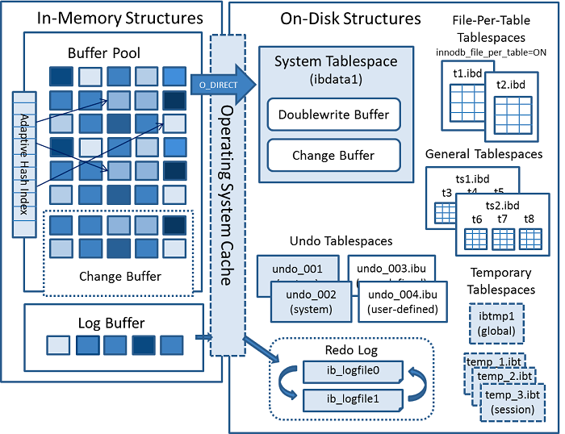

## Real MySQL - MySQL 기본 구조 (+ 쿼리 실행 과정, 메모리 할당 구조, ...)

**MySQL 서버 구조**

MySQL은 아래의 구조를 가집니다.

각 시스템의 역할은 **아래의 쿼리 실행 과정**을 참고부탁드립니다.

## 쿼리 실행 과정(순서)

쿼리 실행은 아래 그림으로 설명할 수 있습니다.

각 시스템의 역할을 간략하게 설명하면 아래와 같습니다.
- Parser(파서) - 파서는 사용자의 요청으로 들어온 쿼리 문장을 토큰으로 분리해 트리 형태의 구조로 만들어 내는 작업을 합니다. 쿼리의 기본 문법 오류는 이 단계에서 발견되며 사용자에게 오류 메세지를 통보합니다.
- Pre-processor(전처리기) - 파서에서 만들어진 파서 트리를 기반으로 쿼리 문장에 구조적인 문제점이 있는지 확인 합니다. 각 토큰을 테이블 이름이나 칼럼 이름 또는 내장 함수와 같은 개체를 매핑해 해당 객체의 존재 여부와 객체의 접근 권한을 등을 확인하는 과정을 이 단계에서 수행합니다.
- Optimizer(옵티마이저) -  사용자가 요청한 쿼리를 가장 낮은 코스트(cost)로 가장 빠르게 처리할지 결정하는 역할을 담당합니다.
- Execution engine(실행 엔진) - 옵티마이저의 명령을 받아서 핸들러에게 전달 합니다. 만들어진 계획대로 각 핸들러에게 요청해서 받은 결과를 또 다른 핸들러 요청의 입력으로 연결하는 역할을 수행합니다.
- Query cache(쿼리 캐시) - 큰 비용으로 실행된 쿼리의 결과를 캐시에 저장하고 동일한 쿼리 요청이 왔을 때 캐싱된 결과를 내려준다.
- Handler API(핸들러 API) - MySQL 엔진에서 쿼리 실행기에서 데이터를 쓰거나 읽기 위해 스토리지 엔진과 데이터를 주고받는 역할을 하는 API이다.
- Storage engine(저장 엔진) - MySQL 실행 엔진의 요청에 따라 데이터를 디스크로 저장하고 디스크로부터 읽어 오는 역할을 담당합니다.

MySQL에서는 이러한 과정을 거쳐 쿼리가 실행되게 됩니다.

해당 과정은 MySQL Engine과 StorageEngine의 영역으로 나눌  수 있습니다.

[MySQL Engine (두뇌 역할)]

1. MySQL 엔진 내부에 있는 커넥션 핸들러가 앱서버의 요청을 받는다.
2. Query Cache는 해당 쿼리의 결과가 캐싱되어 있다면 캐싱된 결과를 반환한다.
3. Query Parser가 SQL문을 트리 형태의 구조로 만듭니다. (+ 문법 오류 검출)
4. Pre-processor에서 트리 형태의 SQL문의 특정 칼럼이나 테이블의 존재여부, 권한 등을 확인합니다.
5. Optimizer가 해당 SQL문을 가장 저렴한 비용으로 빠르게 처리할 수 있도록 변경합니다.
6. 핸들러 API가 Storage Engine에 처리를 요청함.

[Storage Engine (손, 발 역할)]

7. Storage Engine(MyISAM, InnoDB 등)은 해당 쿼리문을 처리한다. (데이터 삽입, 조회 등)
8. 실행 결과는 핸들러 API를 통해 MySQL 엔진에 반환한다.

## Multi-thread
MySQL은 해당 과정을 프로세스 기반이 아니라 스레드 기반으로 작동합니다. 그래서 여러 개의 요청을 동시에 수행할 수 있습니다.

MySQL도 다른 멀티 스레드 프로그램들과 동일하게 ThreadPool(Thread pool)을 이용해서 스레드의 갯수를 제한한다.

**[포그라운드 스레드(Foreground Thread)]**

- 서버로 요청이 들어올 때마다 배정된다. (최소한 서버에 접속된 클라이언트 수만큼 존재하는 스레드)
- 사용자가 요청하는 쿼리 문장을 처리하는 역할
- 스토리지 엔진에 따라 포그라운드 스레드가 수행하는 일이 다르다.
  - MyISAM - 읽기 작업을 주로 하기 때문에 '디스크' 쓰기 작업까지 수행
  - InnoDB - 데이터 버퍼나 캐시영역까지만 처리하고 '디스크' 쓰기 작업은 백그라운드에서 처리함
- 클라이언트가 작업을 마치고 커넥션을 종료하면 다시 스레드 풀(ThreadPool)로 돌아간다.

**[백그라운드 스레드(Background Thread)]**
- 스토리지 엔진에 따라 포그라운드 스레드가 수행하는 일이 다르다.
  - MyISAM - 대부분 수행하는 읽기 작업은 포그라운드에서 수행하므로 별로 해당이 없다.
  - InnoDB - 쓰기작업은 백그라운드에서 하면서 여러가지 작업을 처리
    - 인서트 버퍼(Insert Buffer)를 병합
    - 잠금(Lock)이나 데드락(Deadlock)을 모니터링
    - 로그를 디스크에 기록

## 메모리 할당 구조

MySQL Server는 글로벌 메모리 영역과 로컬 메모리 영역이 있습니다. 각 영역의 메모리를 적절하게 설정해야 MySQL Server가 메모리 락 걸리는 현상을 방지할 수 있습니다.

**글로벌 메모리 영역**

스레드의 수와 무관하게 하나의 메모리 공간만 할당된 영역입니다. 글로벌 메모리 영역은 모든 스레드에 공유됩니다. 대표적인 영역은 아래와 같습니다.

-   테이블 캐시
-   InnoDB 버퍼 풀
-   InnoDB 어댑티브 해시 인덱스
-   InnoDB 리누 로그 버퍼

**로컬 메모리 영역**

세션 메모리 영역이라고도 표현하는데, 공유 되지 않고, 스레드 1개가 점유하는 영역이기 때문입니다. 대표적인 영역은 아래와 같습니다.

-   정렬 버퍼(Sort buffer)
-   조인 버퍼(Join buffer)
-   바이너리 로그 캐시
-   네트워크 버퍼

SQL 튜닝이나 인덱스 설계를 잘 갖춰서 로컬 메모리 영역을 보다 적게 사용하는 것이 바람직한 것 같습니다.

## **InnoDB 구조**

지금까지는 MyISAM이 기본 스토리지 엔진으로 사용되는 경우도 많았지만, MySQL 5.5부터는 **InnoDB가 기본 스토리지 엔진으로 채택**됐고, MySQL 8.0으로 업그레이드 되면서, InnoDB 스토리지 엔진이 MyISAM의 기능들을 받아서, 앞으로 MyISAM은 없어질 것으로 예상 됩니다.

**Architecture**

InnoDB는 다음의 특징들을 가진다.

-   모든 테이블은 PK를 기준으로 클러스터링되어 저장됨 (PK가 보조인덱스보다 비중 높음)
-   외래키를 지원 - FK도 Storage Engine Layer에서 지원
-   MVCC(다중 버전 동시성 제어) 사용 - 동시성 제어를 위해 잠금을 사용하지 않고, Undo 영역을 응용
-   자동 데드락 감지 - 데드락 감지 스레드가 주기적으로 교착 여부를 판단해서 해당 트랜젝션을 종료
-   자동화된 장애 복구
-   Buffer Pool 사용 - 데이터나 인덱스 정보를 메모리에 캐시하거나 쓰기 작업을 일괄로 처리할 수 있게함 (일괄로 Buffer에 담아서 처리하면, 디스크 랜덤 액세스 횟수를 줄일 수 있음)
-   Change Buffer 사용 - 레코드가 업데이트 시 인덱스도 업데이트 해야 함(이 때도 디스크 랜덤 액세스 횟수를 줄이기 위해서 Buffer를 둬서 일괄로 처리)
-   Redo Log - 반영되지 않은 데이터 변경 내용을 백업함 (MySQL Server가 강제 종료 되었을 때 실행)
-   Undo Log - 데이터 변경 전의 데이터를 백업함

## 참고
- https://12bme.tistory.com/73
- https://velog.io/@cmsskkk/realmysql42
- https://rrhh234cm.tistory.com/201