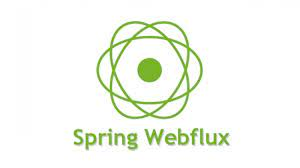

보통 증권이나, 대량의 트래픽이 발생하는 거래소, 뱅킹 시스템에서 필요로 하는 기술 스택 중에 아래의 것이 있다.
- Reactive Programming, 비동기 프로그래밍, Webflux, Netty,, ...

리액티브 프로그래밍에 대해서 알아보자.

## Reactive Programming(리액티브 프로그래밍)

Reactive Programming은 데이터 스트림과 변경 사항 전파를 중심으로 하는 비동기 프로그래밍 패러다임이다.
프로그래밍 언어로 정적/동적인 데이터 흐름을 쉽게 표현할 수 있어야하며, 데이터 흐름을 통해 하부 실행 모델에 변화를 전파할 수 있도록 프로그래밍하는 것을 의미한다.

요약하자면, **변화의 전파**와 **데이터 흐름**이 프로세스의 기반이 되고, 단순한 선형적 실행이 아닌 선언적 프로그래밍을 기반한다.

> 선언적 프로그래밍: 실행할 동작의 흐름을 자세히 정의하는 것이 아니라 단순히 목표를 선언한다.

Reactive Programming은 아래의 이점이 있다.
- 간결해진 Thread 사용
- 간단한 비동기 연산
- 콜백 지옥의 제거

## Webflux

Webflux는 **비동기 + 리액티브 프로그래밍**에 사용하고, Sprinb WebMvc를 대체하는 라이브러리이다.
- 요청을 Event-Driven 방식으로 해결한다.
- 요청이 완료될 때까지 다른 일을 하다가, 처리가 완료되면 Callback 메서드를 통해 응답을 반환한다.
- 비동기 + 논블로킹

즉, Webflux는 요청이 끝날 때까지 기다리지 않기 때문에 cpu, thread, memory의 자원을 최대한 낭비하지 않고 효율적으로 동작하는 고성능 애플리케이션 개발에서 사용한다.
토비님의 세미나에서는 **서비스 간 호출이 많은 마이크로 서비스 아키텍처에 적합**하다고 한다.

## Netty

Netty는 프로토콜 서버 및 클라이언트와 같은 네트워크 응용 프로그램을 쉽게 개발할 수 있는 NIO (Non-Blocking Input/Output) 클라이언트 서버 프레임 워크이다. TCP 및 UDP 소켓 서버와 같은 네트워크 프로그래밍을 크게 단순화하는 기능을 제공한다.

[Netty의 장점]
- 비동기 이벤트 기반 네트워킹(Event Driven)을 지원
- Tomcat과 다르게 자원이 항상 스레드를 점유하고 Block을 유지하지 않으므로 처리량 대폭 증가
- 스레드 수가 적다. (경합 빈도가 크다.)

Netty의 핵심 컴포넌트로 Channel, CallBack, Future, Event, Handler, Event Loop, PipeLine 이 있다.

- Channel: 하나 이상의 입출력 작업을 수행할 수 있는 하드웨어, 파일, 네트워크 소켓, 프로그램 컴포넌트와 같은 Connection
- CallBack: 다른 메서드로 자신에 대한 참조를 제공하는 메서드
- Future: 작업이 완료되면 애플리케이션에 알림. 비동기 작업의 결과를 담는 역할

## Event Loop

리액티브 프로그래밍의 핵심은 Event Loop이다.

사용자의 요청에 필요한 작업들을 EventLoop에서 처리하면서 NonBlocking 방식으로 동작한다.

Netty의 핵심 플로우는 위와 같다.

## 참고

- https://thalals.tistory.com/381