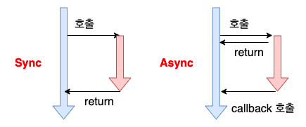
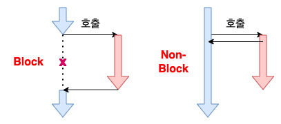
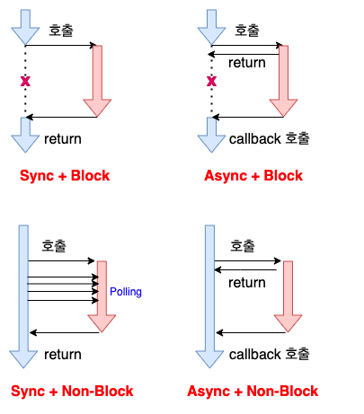
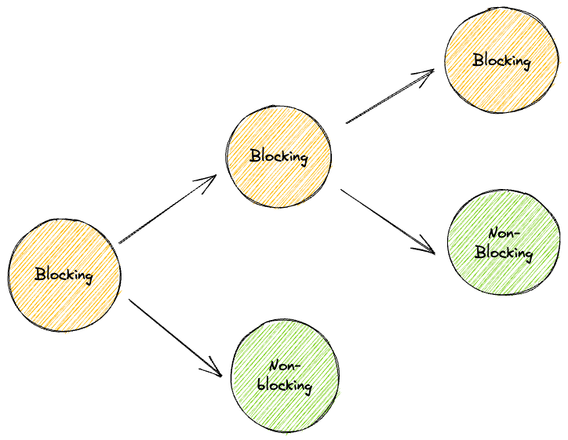
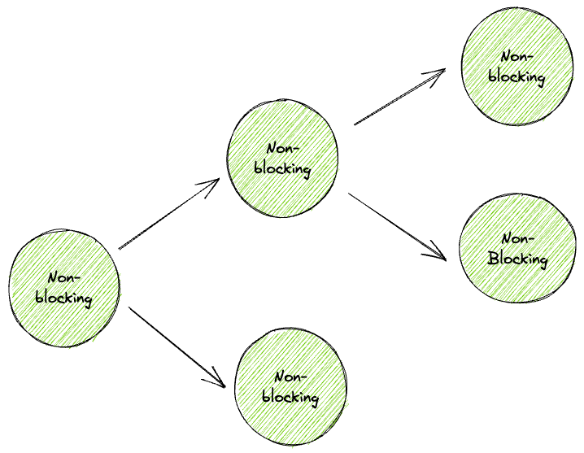

동기와 비동기, 블로킹과 논 블로킹을 같은 것이나 비슷한 것이라고 오해하는 경우가 많다. 해당 개념들은 전혀 다른 개념이며 직접적인 관련이 없다.

## Caller와 Callee

먼저 아래 개념을 이해하자.
- Caller: 호출하는 함수를 말한다.
- Callee: 호출당하는 함수를 말한다.

## 동기 & 비동기

동기와 비동기는 **프로세스의 수행 순서 보장**에 대한 **매커니즘**이다.

동기(Synchronous)는 Caller가 Callee의 작업 결과를 기다린다.

비동기(Asynchronous)는 Caller는 Callee의 작업 결과에 관심이 없다. Callee가 Caller에게 Callback을 수행한다.
- Callee에서 예외가 터져도 Caller는 영향을 받지 않는다.

일반적으로 Blocking(블로킹)과 Async(비동기)를 사용해야 하는 경우는 없다. 즉, 비동기는 논 블로킹과 함께 사용해야 비로소 의미를 가질 수 있다.

## 블로킹 & 논 블로킹

블로킹과 논블로킹은 처리되어야 하는 **작업**이 **전체적인 작업 흐름을 막는 지**에 대한 관점이다.

블로킹(Blocking)은 Callee가 작업을 마칠 때까지 Caller가 Blocking된다.
즉, 제어권을 Callee가 가지고 있다.

논 블로킹(Non-Blocking)은 Callee의 작업과 무관하게 Caller가 작업을 수행할 수 있다.
즉, 제어권을 Caller가 가지고 있다.

## 조합

조합을 정리하면 아래 그림과 같다.

- Sync-Blocking
    - Caller는 Callee의 결과를 받는다. (동기)
    - Caller는 Callee에게 제어권을 넘겨주고 대기한다. (블로킹)
- Sync-NonBlocking
    - Caller는 Callee의 결과를 받는다. (동기)
    - Caller는 Callee에게 제어권을 주지 않고 자신의 로직을 계속 실행한다. (논 블로킹)
    - Java의 Future를 사용하는 경우가 이에 해당한다.
- Async-Blocking
    - Caller는 Callee의 결과를 받지 않는다. (비동기)
    - Caller는 Callee에게 제어권을 넘겨주고 대기한다. (블로킹)
    - Sync-Blocking과 비교했을 때 이점이 없기 때문에 일반적으로 사용되지 않는다.
- Async-NonBlocking
    - Caller는 Callee의 결과를 받지 않는다. (비동기)
    - Caller는 Callee에게 제어권을 주지 않고 자신의 로직을 계속 실행한다. (논 블로킹)

## 논블로킹을 사용하는 경우

CPU 작업이 적고, IO 작업이 많은 경우에 논블로킹이 유용하다.

파일 시스템 읽기/쓰기, Network 요청 등의 경우 Thread는 대부분의 시간을 대기하게 된다.

Non-Blocking을 사용한다면 이를 해결하고 처리량을 극대화할 수 있다.

## Blocking의 전파

Blocking은 전파된다는 특징이 있다.

아래에서 Caller는 Blocking 방식인 A 함수와 Non-Blocking 방식인 B 함수를 실행한다. 그러면 Caller 입장에서는 다음 동작 전체가 블로킹될 수 밖에 없다.

즉, Blocking된 함수가 하나라도 존재하면 Caller는 Blocking이 된다.

그래서 Non-Blocking의 이점을 제대로 누리기 위해서는 모든 함수가 Non-Blocking이어야 한다.

아래는 "내가 만든 WebFlux가 느렸던 이유"라는 NHN의 강연이다.
- https://www.youtube.com/watch?v=I0zMm6wIbRI&t=1510s

실무에서도 Blocking 함수가 중간에 껴있어서 Non-Blocking의 이점을 못누리고 오히려 성능이 저하되는 문제가 종종 발생한다.

이 부분을 각별히 주의해야 한다.

## Reference

- https://wikidocs.net/168327
- https://fastcampus.co.kr/courses/216172
- https://www.youtube.com/watch?v=I0zMm6wIbRI