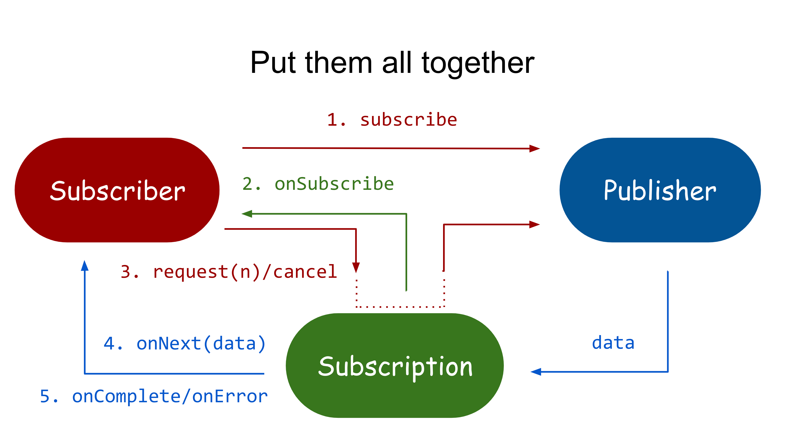

보통 증권이나, 대량의 트래픽이 발생하는 거래소, 뱅킹 시스템에서 필요로 하는 기술 스택 중에 아래의 것이 있다.
- Reactive Programming, 비동기 프로그래밍, Webflux, Netty,, ...

리액티브 프로그래밍에 대해서 알아보자.

## Reactive Programming(리액티브 프로그래밍)

Reactive Programming은 데이터 스트림과 변경 사항 전파를 중심으로 하는 비동기 프로그래밍 패러다임이다.
프로그래밍 언어로 정적/동적인 데이터 흐름을 쉽게 표현할 수 있어야하며, 데이터 흐름을 통해 하부 실행 모델에 변화를 전파할 수 있도록 프로그래밍하는 것을 의미한다.

요약하자면, **변화의 전파**와 **데이터 흐름**이 프로세스의 기반이 되고, 단순한 선형적 실행이 아닌 선언적 프로그래밍을 기반한다.

> 선언적 프로그래밍: 실행할 동작의 흐름을 자세히 정의하는 것이 아니라 단순히 목표를 선언한다.

Reactive Programming은 아래의 이점이 있다.
- 간결해진 Thread 사용
- 간단한 비동기 연산
- 콜백 지옥의 제거
- 높은 처리량

처리량이 높아지면 CPU, Memory 사용량이 급격히 늘어나면서 병목이 더 심해지는 악순환이 생긴다.

그래서 1ms의 latency에도 민감한 대규모 서비스에서는 Async/NIO를 고려하게 되면서 Reactive Programming을 많이 하는 것 같다.

## Spring Webflux



Webflux는 **비동기 + 리액티브 프로그래밍**에 사용하고, Sprinb WebMvc를 대체하는 라이브러리이다.
- 요청을 Event-Driven 방식으로 해결한다.
- 요청이 완료될 때까지 다른 일을 하다가, 처리가 완료되면 Callback 메서드를 통해 응답을 반환한다.
- 비동기 + 논블로킹

즉, Webflux는 요청이 끝날 때까지 기다리지 않기 때문에 cpu, thread, memory의 자원을 최대한 낭비하지 않고 효율적으로 동작하는 고성능 애플리케이션 개발에서 사용한다.

토비님의 세미나에서는 **서비스 간 호출이 많은 마이크로 서비스 아키텍처에 적합**하고, 함수형 프로그래밍의 이점이 있는 것도 Webflux를 선택하기에 충분한 이유가 된다고 한다.

## Netty


Spring Webflux를 사용하면 요청을 받는 내장 서버로 기본적으로 **Netty**를 사용한다.

Netty는 Async / NIO(Non-Blocking IO)에 초점을 둔 이벤트 기반 네트워크 애플리케이션 프레임워크로써 유지보수를 고려한 고성능 프로토콜 서버나 클라이언트를 개발할 때 주로 사용한다.

Netty의 장점은 아래와 같다.
- 비동기 이벤트 기반 네트워킹(Event Driven)을 지원
- Tomcat과 다르게 자원이 항상 스레드를 점유하고 Block을 유지하지 않으므로 처리량 대폭 증가
- 스레드 수가 적다. (경합 빈도가 크다.)
- Context switching 오버헤드 감소 (1개 Thread에서 쌓인 Event Queue를 기반으로 Non-Blocking으로 동작하기 때문!)


### Event Loop

Netty에서 핵심은 Event Loop이다.


- Channel은 하나의 이벤트 루프에 등록된다.
- Channel에서 이벤트가 발생하면 해당 이벤트 루프의 이벤트 큐에 등록된다.
- Event Loop: 이벤트 큐에서 이벤트를 꺼내어서 작업을 비동기로 실행 (스레드 당 여러개 가질 수 있다.)
- Pipeline: 이벤트를 받아서 Handler로 전달

## Mono, Flux

Spring Webflux에서는 Reactive Library로 **Reactor**를 사용한다.

**Reactor** 라이브러리는 `org.reactivestreams`의 구성요소들의 구현체를 제공한다.

대표적으로 `Publisher`를 구현하는 `Flux`와 `Mono`가 있다.

아래와 같이 `Flux`를 사용해서 Repository 조회를 한다면 **Async**/**Non-Blocking**으로 조회를 하여 리소스 효율성을 향상시킬 수 있다. 

```java
@GetMapping
private Flux<Employee> getAllEmployees() {
    return employeeRepository.findAllEmployees();
}
```

- Flux: 0 ~ N 개의 데이터 전달
- Mono: 0 ~ 1개의 데이터 전달

예제 코드는 아래 Repository에서 확인할 수 있습니다.
- https://github.com/violetbeach/reactive-axon-server

## 참고

- https://thalals.tistory.com/381
- https://perfectacle.github.io/2021/02/28/netty-event-loop
- https://recordsoflife.tistory.com/1314
- https://www.baeldung.com/spring-webflux-concurrency