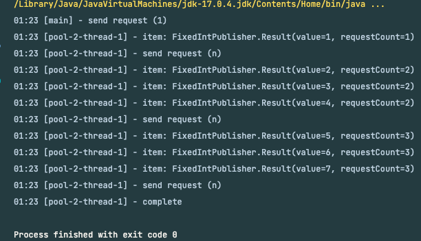

보통 증권이나, 대량의 트래픽이 발생하는 거래소, 뱅킹 시스템에서 필요로 하는 기술 스택 중에 아래의 것이 있다.
- Reactive Programming, 비동기 프로그래밍, Webflux, Netty,, ...

리액티브 프로그래밍에 대해서 알아보자.

## Reactive Programming(리액티브 프로그래밍)

Reactive의 정의는 "reacting to events or situations rather than acting first to change or prevent something" 이다.

이를 직역하면 "무언가를 바꾸거나 예방하기 위해 먼저 행동하기 보다는 사건이나 상황에 반응하는"이다.

Reactive Programming은 데이터 스트림과 변경 사항 전파를 중심으로 하는 비동기 프로그래밍 패러다임이다.
프로그래밍 언어로 정적/동적인 데이터 흐름을 쉽게 표현할 수 있어야하며, 데이터 흐름을 통해 하부 실행 모델에 변화를 전파할 수 있도록 프로그래밍하는 것을 의미한다.

요약하자면, **변화의 전파**와 **데이터 흐름**이 프로세스의 기반이 되고, 단순한 선형적 실행이 아닌 선언적 프로그래밍을 기반한다.

> 선언적 프로그래밍: 실행할 동작의 흐름을 자세히 정의하는 것이 아니라 단순히 목표를 선언한다.

Reactive Programming은 아래의 이점이 있다.
- 간결해진 Thread 사용
- 간단한 비동기 연산
- 콜백 지옥의 제거
- 높은 처리량

처리량이 높아지면 CPU, Memory 사용량이 급격히 늘어나면서 병목이 더 심해지는 악순환이 생긴다.

그래서 1ms의 latency에도 민감한 대규모 서비스에서는 Async/NIO를 고려하게 되면서 Reactive Programming을 많이 하는 것 같다.

## Reactive Manifesto (v2)

Reactive Manifesto(리액티브 선언문)는 Reactive System의 특성을 강조하고, 핵심 가치 4가지와 구축에 필요한 가이드라인을 제공한다. 

Reactive System의 핵심 가치 4가지는 아래와 같다.


각 가치의 의미는 다음과 같다.
- Responsive(응답성): 
  - 요구사항:
    - 문제를 신속하게 탐지하고 효과적으로 대처
    - 신속하고 일관성 있는 응답시간 제공
    - 신뢰할 수 있는 상한선을 설정하여 일관된 서비스 품질을 제공
  - 결과:
    - 요구사항:
      - 가능한 **즉각적으로 응답**
      - 사용자에게 신뢰를 제공
      - 오류 처리를 단순화
- Elastic(유연성):
  - 요구사항:
    - 경쟁하는 지점이나 단일 병목 포인트가 없어야 한다.
    - 컴포넌트를 샤딩하거나 복제하여 분산
      - 예측 가능한 분산 알고리즘을 사용
    - 실시간 성능을 측정하는 도구를 제공
  - 결과:
    - 작업량이 변화하더라도 응답성이 유지
- Resilient(탄력성):
  - 요구사항:
    - 봉쇄: 장애는 각각의 구성 요소에 포함
    - 격리: 구성 요소들은 서로 분리
    - 위임: 복구 프로세스는 다른 구성 요소에 위임
    - 복제: 필요한 경우 복제를 통해 고가용성을 보장
  - 결과:
    - **장애에 직면하더라도 응답성을 유지**
    - 시스템이 부분적으로 고장이 나더라도, 전체 시스템을 위험하게 하지 않고 복구를 보장
- Message Driven(메시지 주도):
  - 요구사항:
    - 비동기 메시지 전달에 의존
    - 명시적인 메시지 전달
    - 논블로킹 통신
  - 결과:
    - MQ 생성 및 배압 적용
    - 느슨할 결합, 격리, 위치 투명성을 보장하는 경계 형성
      - 경계는 장애를 메시지로 지정
    - 부하 관리 및 흐름 제어 가능해야 함

정리를 하자면, 핵심 가치는 **즉각적으로 응답**하는 것이다.

장애에 직면하거나 작업량이 변화하더라도 응답성을 유지해야 하고, 그것을 **비동기 Non-Blocking 기반의 메시지 큐로 달성**한다.

## Reactive Stream

자바에서 Future를 사용한다면 비동기 논블로킹으로 동작할 수 있지만, Reactive Manifesto의 메시지 주도가 아니며 배압도 적용할 수 없다.

아래는 **ReactiveStream API**의 모델이다.


각 컴포넌트의 역할은 아래와 같다.
- Publisher: 데이터, 이벤트를 전달
- Subscriber: 데이터, 이벤트를 수신
- Subscription: 데이터 흐름을 조절

**ReactiveStream**에서는 Callee(Subscriber)가 Subscription을 사용해서 처리 가능한 만큼의 값만 요청하여 배압을 적용할 수 있다.

그리고 ReactiveMenifesto의 Responssive, Resilient, Elastic, Message Driven까지 모두 충족할 수 있게 한다.

`org.reactivestreams`의 대표적인 인터페이스들은 아래와 같다.

Publisher는 `subscribe()`로 SubScriber를 등록할 수 있다.
```java
public interface Publisher<T> {
    void subscribe(Subscriber<? super T> s);
}
```

Subscriber는 Publisher로부터 받을 Subscription을 등록한 후, 각각의 Event가 들어오는 채널을 구현한다.

```java
public interface Subscriber<T> {
    void onSubscribe(Subscription s);
    void onNext(T t);
    void onError(Throwable t);
    void onComplete();
}
```

Subscription은 Back-pressure(배압)를 조절할 수 있는 `request()`를 제공한다.

```java
public interface Subscription {
    void request(long n);
    void cancel();
}
```

#### 예시 코드

아래는 예시로 구현한 ReactiveStreams의 구현체이다.

FixedIntPublisher는 `Flow.Publisher`를 구현하고,
고정된 7개의 숫자를 Subscriber에게 전달한다.

```java
public class FixedIntPublisher implements Flow.Publisher<FixedIntPublisher.Result> {
    
    @Data
    public static class Result {
        private final Integer value;
        private final Integer requestCount;
    }
    
    @Override 
    public void subscribe(Flow.Subscriber<? super Result> subscriber) {
        // Thread-Safety한 Collection을 사용해야 한다.
        var numbers = Collections.synchronizedList(
                new ArrayList<>(List.of(1, 2, 3, 4, 5, 6, 7))
        );
        Iterator<Integer> iterator = numbers.iterator();
        var subscription = new IntSubscription(subscriber, iterator);
        subscriber.onSubscribe(subscription);
    }
}
```

IntSubscription은 Flow.Subscription을 구현하고,
`request()`는 Subscriber의 `onNext()`가 동기적으로 동작하면 안되기 때문에 **별도 Thread의 Executor**를 사용한다.

```java
@RequiredArgsConstructor
private static class IntSubscription implements Flow.Subscription {
    private final Flow.Subscriber<? super Result> subscriber;
    private final Iterator<Integer> numbers;
    private final ExecutorService executor = Executors.newSingleThreadExecutor();
    private final AtomicInteger requestCount = new AtomicInteger(1);
    private final AtomicBoolean isCompleted = new AtomicBoolean(false);

    @Override
    public void request(long n) {
        executor.submit(() -> {
            for (int i = 0; i < n; i++) {
                if (numbers.hasNext()) {
                    int number = numbers.next();
                    numbers.remove();
                    subscriber.onNext(new Result(number, requestCount.get()));
                } else {
                    // 모두 완료한 경우 Executor를 종료 및 Complete 처리
                    var isChanged = isCompleted.compareAndSet(false, true);
                    if (isChanged) {
                        executor.shutdown();
                        subscriber.onComplete();
                        isCompleted.set(true);
                    }
                    break;
                }
            }
          requestCount.incrementAndGet();
        });
    }
}
```

디버깅을 위해 각 실행마다 `requestCount`를 증가시켰다. 

RequestNSubscriber는 `Flow.Subscriber`를 구현한다. 최초 구독할 때 `onSubscribe()`로 1개의 처리를 요청했고, `onNext()`로는 N개의 처리를 요청했다.

```java
@Slf4j
@RequiredArgsConstructor
public class RequestNSubscriber<T> implements Flow.Subscriber<T>{
    private final Integer n;
    private Flow.Subscription subscription;
    private int count = 0;

    @Override
    public void onSubscribe(Flow.Subscription subscription) {
        this.subscription = subscription;
        log.info("send request (1)");
        this.subscription.request(1);
    }

    @Override
    public void onNext(T item) {
        log.info("item: {}", item);

        if (count++ % n == 0) {
            log.info("send request (n)");
            this.subscription.request(n);
        }
    }

    @Override
    public void onError(Throwable throwable) {
        log.error("error: {}", throwable.getMessage());
    }

    @Override
    public void onComplete() {
        log.info("complete");
    }
}
```

메인 메서드를 실행해보자.

```java
public static void main(String[] args) {
    int N = 3;
    Flow.Publisher publisher = new FixedIntPublisher();
    Flow.Subscriber subscriber = new RequestNSubscriber<>(N);
    publisher.subscribe(subscriber);
    Thread.sleep(1000);
}
```

결과는 아래와 같다.



최초 1개 요청을 처리한 후, 상황에 맞게 3개씩 요청을 처리했다.

즉, 배압을 조절할 수 있었다.

`IntSubscription`의 `request()`는 비동기 쓰레드에서 실행되므로 여러 Publisher의 데이터에 반응하여 병렬로 처리할 수 있다.

```java
public static void main(String[] args) {
    int N = 3;
    Flow.Publisher publisher = new FixedIntPublisher();
    Flow.Subscriber subscriber = new RequestNSubscriber<>(N);
    publisher.subscribe(subscriber);

    Flow.Publisher publisher2 = new FixedIntPublisher();
    Flow.Subscriber subscriber2 = new RequestNSubscriber<>(N);
    publisher2.subscribe(subscriber2);

    Thread.sleep(1000);
}
```

아래는 두 개의 스트림을 순차적으로 실행한 결과이다.


## Reactor

Spring Webflux에서는 Reactive Library로 **Reactor**를 사용한다.

**Reactor** 라이브러리는 `org.reactivestreams`의 구성요소들의 구현체(`reactor.core.*`)를 제공한다.

대표적으로 `Publisher`를 구현하는 `Flux`와 `Mono`가 있다.

아래와 같이 `Flux`를 사용해서 Repository 조회를 한다면 **Async**/**Non-Blocking**으로 조회를 하여 리소스 효율성을 향상시킬 수 있다.

```java
@GetMapping
private Flux<Employee> getAllEmployees() {
    return employeeRepository.findAllEmployees();
}
```

- Flux: 0 ~ N 개의 데이터 전달
- Mono: 0 ~ 1개의 데이터 전달

## 참고
- https://www.reactivemanifesto.org
- https://engineering.linecorp.com/ko/blog/reactive-streams-with-armeria-1