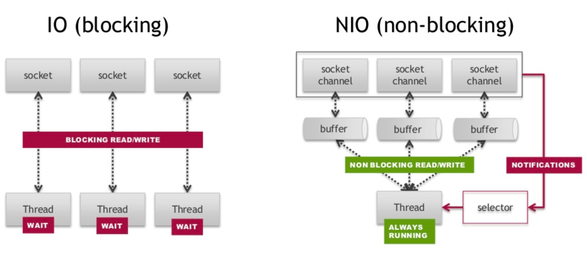
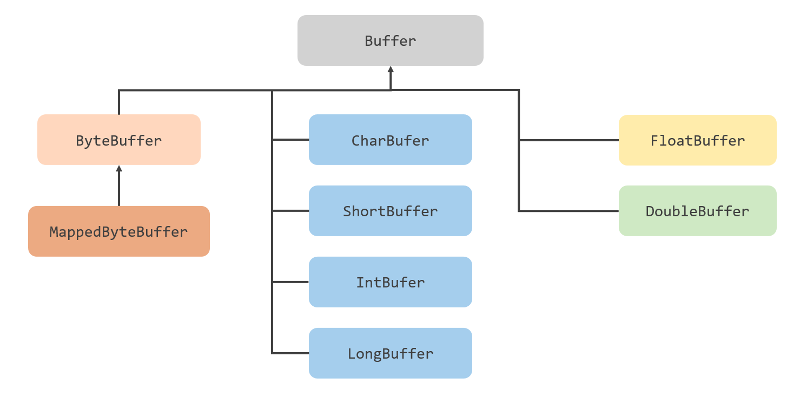
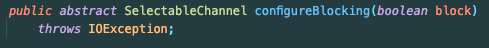
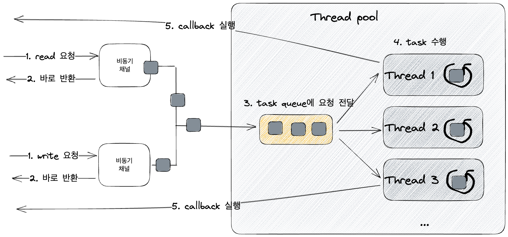

## Java NIO

자바에서 `InputStream`, `OutputStream`과 같이 *Stream으로 통신하는 모델을 Java IO 모델이라고 한다.
- 패키지는 `java.io.*`에 속한다.

자바 NIO란 New Input/Output의 약자이다. 아래는 Java IO와 Java NIO의 차이이다.

 구분      | IO              | NIO     |
|---------|-----------------|---------|
| 입출력 방식  | Stream          | Channel |
| 데이터 단위  | Byte, Character | Buffer  |
| 데이터 흐름  | 단방향             | 양방향     |
| 논블로킹 지원 | X               | O       |

가장 큰 차이는 Java IO는 Stream 기반, NIO는 Channel 기반으로 동작한다.
- NIO는 `java.nio.*` 패키지에 속한다.

NIO는 아래와 같이 Buffer를 통해 데이터를 읽거나 써서 파일과 통신한다.



Java NIO의 모든 IO는 `Channel`로 시작한다. Channel을 통해 버퍼에서 데이터를 읽거나 버퍼에 데이터를 쓴다.

Buffer는 아래와 같이 다양한 타입을 제공한다.



다음으로 Buffer의 위치 속성을 살펴보자.
- capacity: Buffer가 저장할 수 있는 데이터의 최대 크기
- position: Buffer에서 현재 가르키는 위치
- limit: 데이터를 읽거나 쓸 수 있는 마지막 위치  (읽기 모드 시 주로 사용)
- mark: reset() 호출 시 position을 mark로 이동

해당 속성은 아래의 관계를 가진다.
- 0 <= mark <= position <= limit <= capacity

다음으로 ByteBuffer의 종류에 대해 알아보자.

#### DirectByteBuffer

DirectByteBuffer는 Native Memory에 저장되는 ByteBuffer이다.
- Native Memory(off-heap)에 저장
- 커널 메모리에서 복사를 하지 않으므로 read/write 속도가 빠르다.
- 비용이 많이 드는 System call을 사용하므 allocate, deallocate가 느리다. (Pool로 만들어서 사용할 수 있다.)

#### HeapByteByteBuffer

HeapByteBuffer는 JVM Heap에 저장되는 ByteBuffer이다.
- JVM Heap Memory에 저장된다. (byte[] 래핑)
- 커널 메모리에서 복사가 일어나므로 read/write 속도가 느리다.
- gc에서 관리되므로 allocate, deallocate가 빠르다.

아래는 예시 코드이다.

```java
var file = new File(FileChannelReadExample.class
        .getClassLoader()
        .getResource("hello.txt")
        .getFile());

try (var fileChannel = FileChannel.open(file.toPath())) {
    var byteBuffer = ByteBuffer.allocate(1024);
    fileChannel.read(byteBuffer);
    byteBuffer.flip();

    var result = StandardCharsets.UTF_8.decode(byteBuffer);
}
```

DirectByteBuffer를 사용하려면 `allocate()`대신 `ByteBuffer.allocateDirect()`를 사용하면 된다.

### configureBlocking

아래는 `SelectableChannel` 이라는 추상 클래스의 `configureBlocking()` 메서드이다.



해당 메서드의 설명은 "Adjusts this channel's blocking mode." 직역하면 Blocking 모드를 조정한다.

아래는 `SelectableChannel`을 상속하는 `ServerSocketChannel`을 비동기로 사용하는 예제이다.

```java
try (var serverChannel = ServerSocketChannel.open()) {
    var address = new InetSocketAddress("localhost", 8080);
    serverChannel.bind(address);
    serverChannel.configureBlocking(false);

    var connected = serverChannel.connect(address);
    assert !connected; // 통과
}
```

반면 `FileChannel`의 경우 `SelectableChannel`을 상속받지 않는다. 그렇기 때문에 Non-Blocking으로 설정할 수 없다.

여기서 알 수 있듯 **Java NIO의 모든 IO가 Non-Blocking하게 동작할 수 있지는 않다.**

### AIO(NIO2)

Java AIO(Asynchronous Non-Blocking I/O)에서는 Callback 기반의 Channel을 제공해준다.
- NIO2 라고도 부른다.



자바 NIO에서 Non-Blocking IO에서 결과를 받으려면 `while`문으로 완료 여부를 확인 등의 처리가 필요하다. 자바 AIO에서는 콜백을 잡아서 처리할 수 있다.

추가로 Non-Blocking 기반의 다양한 클래스를 지원한다. (자바 AIO의 `AsynchronousFileChannel`의 경우 Non-Blocking을 지원한다.)

## 참고
- https://kouzie.github.io/java/java-NIO
- https://codevang.tistory.com/154