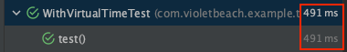

Reactive Programming을 사용할 때 Project Reactor를 주로 사용한다.

Reactor는 비동기로 동작하기 때문에 일반적인 테스트 방식으로 검증하기 어렵다. 그래서 `Reactor-test` 라이브러리를 제공한다.

## Dependency

우선 예시 동작을 위해서 아래와 같은 Dependency를 추가해야한다.

```groovy
testImplementation 'io.projectreactor:reactor-test:3.6.5'
```

## Reactive Streams 테스트가 어려운 이유

#### 1. 강제 동기화

아래 테스트 코드를 보자.

```kotlin
@Test
void test() {
    // given
    var expected = IntStream.range(0, 10).boxed()
        .collect(Collectors.toList());

    // when
    Flux<Integer> result = Flux.range(0, 10)
        .delayElements(Duration.ofSeconds(1));

    // then
    assertIterableEquals(expected, result.collectList().block());
}
```

테스트의 통과를 위해 `result.collectList().block()`와 같은 비동기 코드의 강제 동기화가 필요하다.

비동기 코드의 이점을 못살리는 것이다.

#### 2. 다양한 테스트가 어려움

아래 테스트 코드를 보자.

```kotlin
@Test
void test() {
    // when
    Flux<Integer> result = Flux.create(sink -> {
        for (int i = 0; i < 10; i++) {
            sink.next(i);
            if (i == 5) {
                sink.error(new RuntimeException("error"));
            }
        }
        sink.complete();
    });

    // then
    result.collectList().blocking() // 복잡한 검증을 어떻게 ..
}
```

해당 테스트의 then에서 1, 2, 3, 4가 잘 전달이 되었는 지, 기대했던 예외가 터졌는 지 등을 복합적으로 테스트하기 어렵다.

## Reactor Test

위 문제를 해결하기 위한 **Reactor Test**에서 제공하는 기능에 대해 알아보자.

#### StepVerifier

StepVerifier를 사용하면 Publisher가 제공하는 다양한 이벤트를 차례로 검증할 수 있다.

StepVerifier는 FirstStep, Step, LastStep으로 구성된다. 아래 코드를 보자.
- FirstStep은 없거나 1개 구성할 수 있다.
- Step은 없거나 N개를 구성할 수 있다.
- LastStep은 최종 결과를 검증하고 반드시 1개를 구성한다.

아래 코드를 보자.

```java
@Test
void test() {
    Flux<Integer> result = Flux.create(sink -> {
        for (int i = 0; i < 10; i++) {
            sink.next(i);
        }
        sink.complete();
    });
    
    StepVerifier.create(result)
            .expectSubscription()
            .expectNext(0, 1, 2, 3, 4, 5, 6, 7, 8, 9)
            .expectComplete()
            .verify();
}
```

StepVerifier를 create하면 테스트를 위한 환경이 준비된 것이다. 그것만으로는 동작이 발생하지 않는다.

`verify()`를 호출하면 실제로 Flux가 실행되면서 `expectSubscription()`, `expectNext()`, `expectComplete()`를 통해서 이벤트를 확인한다.

#### First Step

FirstStep은 StepVerifier의 정적 메서드인 `create()`로 생성되는 인터페이스이다.

```java
public interface StepVerifier {
    
    static <T> FirstStep<T> create(Publisher<? extends T> publisher) {
        return create(publisher, Long.MAX_VALUE);
    }
    
    static <T> FirstStep<T> create(Publisher<? extends T> publisher, long n) {
        return create(publisher, StepVerifierOptions.create().initialRequest(n));
    }
    
    static <T> FirstStep<T> create(Publisher<? extends T> publisher,
        StepVerifierOptions options) {
        return DefaultStepVerifierBuilder.newVerifier(options, () -> publisher);
    }
}
```

참고로 `create()`에서 사용하는 파라미터 `StepVerifierOptions`는 `StepVerifier`의 아래 속성을 지정할 수 있다.

- initialRequest: Subscription에 전달할 request 수 지정
- withInitialContext: Context 지정
- scenarioName: 시나리오 이름 부여 (에러 발생 시 노출)

아래 FirstStep은 Subscription이 제대로 이루어졌는 지 등을 검증할 수 있다.

```java
interface FirstStep<T> extends Step<T> {
    Step<T> expectNoFusionSupport();
    Step<T> expectSubscription();
    Step<T> expectSubscriptionMatches(Predicate<? super Subscription> predicate);
}
```

FirstStep은 Step을 상속하므로 동작을 생략하고 바로 Step으로 넘어갈 수도 있다.

## Step

Step은 StepVerifier에 의해 생성되어서 체이닝되는 객체의 클래스이다.

```java
interface Step<T> extends LastStep {
    default Step<T> assertNext(Consumer<? super T> assertionConsumer) {
        return consumeNextWith(assertionConsumer);
    }
    Step<T> expectNext(T t);
    Step<T> expectNext(T... ts);
    Step<T> expectNextCount(long count);
    Step<T> expectNextSequence(Iterable<? extends T> iterable);
    Step<T> expectNextMatches(Predicate<? super T> predicate);
    Step<T> expectNoEvent(Duration duration);
}
```

Step은 onNext로 전달되는 item을 하나씩 검증한다. 각 메서드의 역할은 아래와 같다.
- assertNext: Consumer로 item을 검증한다. 예외 미발생이면 통과
- expectNext: 한 개 이상의 item을 순서대로 비교한 후 동일하면 통과
- expectNextCount: onNext 이벤트가 발생한 횟수가 동일하면 통과
- expectNextSequence: Iterable의 Element들을 onNext로 전달되는 items와 일치면 통과
- expectNextMatches: 인자로 전달된 Predicate의 결과가 true이면 통과

아래는 해당 메서드를 조합한 예시이다.

```kotlin
void test() {
    var flux = Flux.range(0, 7);

    StepVerifier.create(flux)
            .assertNext(i -> {
                assertEquals(0, i);
            })
            .expectNext(1, 2)
            .expectNextCount(2)
            .expectNextSequence(List.of(4, 5))
            .expectNextMatches(i -> i == 6)
            .expectComplete()
            .verify();
}
```

Step은 다음의 특징을 가진다.
- 메서드들은 대부분 실행 후 Step을 반환하기 때문에 체이닝하여 다양한 검증이 가능하다.
- LastStep을 구현하기 때문에 바로 LastStep의 메서드를 사용할 수 있다.

#### LastStep

LastStep은 가장 마지막에 호출되어 최종 상태를 확인하는 기능을 제공한다.

```java
interface LastStep {
    StepVerifier expectError();
    StepVerifier expectError(Class<? extends Throwable> clazz);
    StepVerifier expectTimeout(Duration duration);
    StepVerifier expectComplete();
    Duration verifyError();
    Duration verifyError(Class<? extends Throwable> clazz);
    Duration verifyComplete();
}
```

LastStep은 아래 메서드를 제공한다.
- expectError: onError가 전달되었는 지 검증
- expectTimeout: Duradation 동안 onNext 혹은 onComplete 이벤트가 발생하지 않는 지 검증
- expectComplete: onComplete가 전달되었는 지 검증
- verifyXX: expectXX.verify()와 동일

아래는 예시 코드이다.

```java
@Test
void test() {
    StepVerifier.create(Mono.just(1))
            .expectNext(1)
            .verifyComplete();
}
```

LastStep의 expectXX 메서드는 StepVerifier를 반환한다.

아래는 StepVerifier의 메서드 일부이다.

```java
public interface StepVerifier {
    Duration verify() throws AssertionError;
    Duration verify(Duration duration) throws AssertionError;
    Assertions verifyThenAssertThat();
    Assertions verifyThenAssertThat(Duration duration);
}
```

반환된 StepVerifier의 `verify()`를 호출해서 Publisher에 대한 검증을 시작할 수 있다.
- Duration을 입력하지 않으면 영원히 결과를 기다리게 된다.
- verfyThenAssertThat을 사용해서 추가적인 검증을 할 수 있다.

## withVirtualTime

StepVerifier의 `withVirtualTime`을 사용하면 기존의 Scheduler 대신 VirtualTimeScheduler가 동작한다.

해당 Scheduler는 delay와 관련된 함수들을 실제로 대기하는 대신 건너뛸 수 있는 기능을 제공한다.

```java
@Test
void test() {
    StepVerifier.withVirtualTime(() -> {
            return Flux.range(0, 3)
                .delayElements(Duration.ofMinutes(1));
        })
        .thenAwait(Duration.ofMinutes(1))
        .expectNextCount(1)
        .thenAwait(Duration.ofMinutes(2))
        .expectNextCount(2)
        .verifyComplete();
}
```



실제 동작은 3분 이상이 소요되겠지만, 테스트에서는 491ms만 소요되었다.

## TestPublisher

Subscriber의 동작을 검증하기 위해서 직접 Publisher를 구현해야 할 수 있다. `reactor-test`는 `TestPublisher`를 제공한다.

```kotlin
public abstract class TestPublisher<T> implements Publisher<T>, PublisherProbe<T> {
    public static <T> TestPublisher<T> create() {}
    public abstract TestPublisher<T> next(@Nullable T value);
    public final TestPublisher<T> next(@Nullable T first, T... rest) {}
    public final TestPublisher<T> emit(T... values); {}
    public final TestPublisher<T> error(Throwable t);
    
    public abstract TestPublisher<T> assertMinRequested(long n);
    public abstract TestPublisher<T> assertMaxRequested(long n);
    public abstract TestPublisher<T> assertSubscribers();
    public abstract TestPublisher<T> assertSubscribers(int n);
    public abstract TestPublisher<T> assertNoSubscribers();
    public abstract TestPublisher<T> assertCancelled();
    public abstract TestPublisher<T> assertCancelled(int n);
    public abstract TestPublisher<T> assertNotCancelled();
    public abstract TestPublisher<T> assertRequestOverflow();
    public abstract TestPublisher<T> assertNoRequestOverflow();
}
```

`TestPublsher`를 사용하면 개발자가 직접 다양한 Event를 발생시키는 `Publisher`를 쉽게 생성할 수 있다.

`assertXX`를 사용하면 `Publisher`의 상태를 검증을 사용할 수도 있다. 아래 코드를 보자.
```java
@Test
void test() {
    TestPublisher<Integer> publisher = TestPublisher.create();

    publisher.subscribe(new Subscriber() {
        @Override
        public void onSubscribe(Subscription s) {
            s.request(5);
        }

        @Override public void onNext(Object o) { }
        @Override public void onError(Throwable t) { }
        @Override public void onComplete() { }
    });
    publisher.assertSubscribers(1);
    publisher.assertWasRequested();
    publisher.assertMinRequested(5);
    publisher.assertMaxRequested(5);

    publisher.emit(1, 2);
    publisher.assertNoSubscribers();
    publisher.assertWasNotCancelled();
}
```

`assertXX`를 사용하면 `SubScriber`가 구독하는 `TestPublisher`의 상태를 검증을 사용할 수 있다.

## 참고

- https://fastcampus.co.kr/courses/216172
- https://recordsoflife.tistory.com/1335