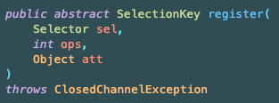

## Java NIO - busy-wait

자바 NIO에서는 아래의 문제가 있었다.
- main 쓰레드에서 accept가 완료되었는 지 주기적으로 확인 필요
- 각 쓰레드에서 read가 가능한 지 주기적으로 확인 필요
- 채널 상태를 수동으로 관리, 코드 복잡성 증가
- 동시 요청 시 연결 처리가 순차적으로 발생하여 성능이 감소

아래는 코드는 예시이다.

```java
while(true) {
    var clientSocket = serverChannel.accept();
    if(clientSocket == null) {
        Thread.sleep(100);
        continue;
    }
}
```

해당 코드는 루프를 통해 자원을 획득할 때까지 확인을 하는 구조를 가진다.


해당 문제를 주로 busy-wait 이라고 하고, 주로 동기 Non-Blocking에서 주로 발생한다. busy-wait은 아래 문제를 야기한다.
- 확인을 위해 CPU 자원이 지속적으로 낭비
- 확인하는 주기가 길다면 응답 시간 지연이 발생

이 문제를 해결하기 위한 패턴을 알아보자.

## Selector

Selector를 사용하면 busy-wait 문제를 일부 해결할 수 있다.

**Selector** 클래스는 `java.nio.channels` 패키지에 등록되어 있다.

여러 Channel의 이벤트를 등록하고 준비된 이벤트를 모아서 조회할 수 있는 기능을 제공한다. 


준비가 완료된 Event는 Thread에 전달한다.

`SelectableChannel`은 `regeister()`로 Selector와 `ops`라는 관심있는 이벤트 목록 등록할 수 있다.



ops의 종류는 다음과 같다.
- OP_READ: channel의 읽기 준비가 완료
- OP_WRITE: channel에 쓸 준비가 완료
- OP_ACCEPT: serverSocketChannel에서 accept 준비가 완료
- OP_CONNECT: socketChannel에서 connect 준비가 완료


