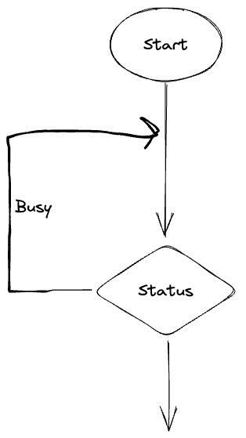
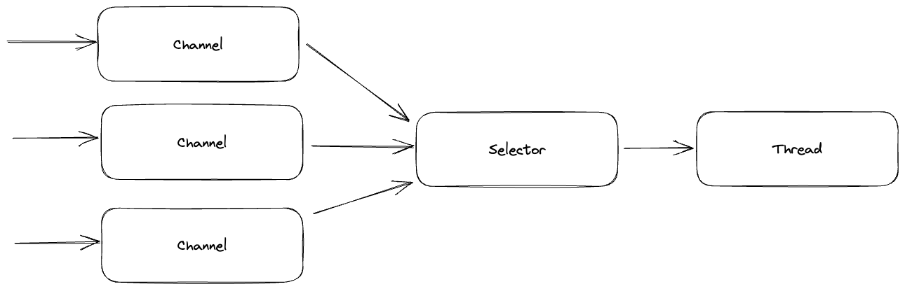
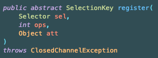
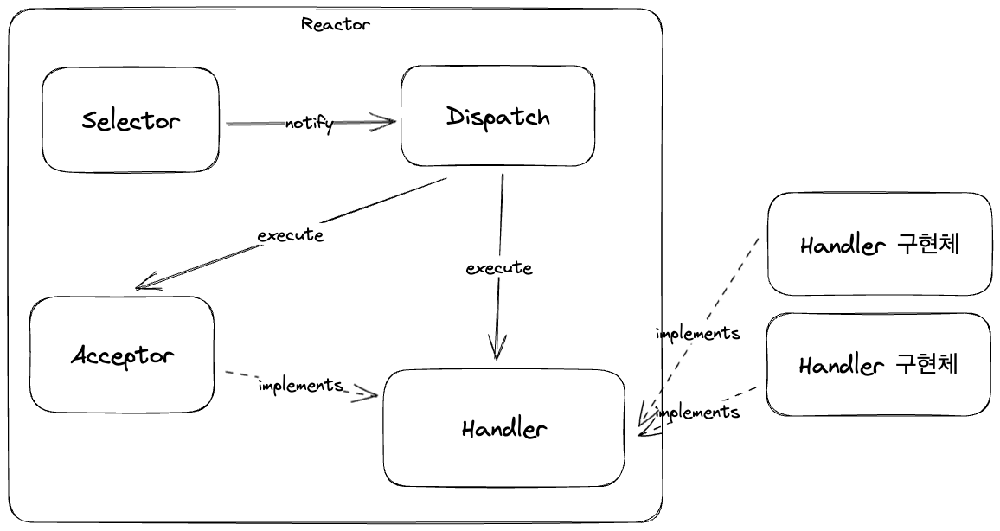

## Java NIO - busy-wait

자바 NIO에서는 아래의 문제가 있었다.
- main 쓰레드에서 accept가 완료되었는 지 주기적으로 확인 필요
- 각 쓰레드에서 read가 가능한 지 주기적으로 확인 필요
- 채널 상태를 수동으로 관리, 코드 복잡성 증가
- 동시 요청 시 연결 처리가 순차적으로 발생하여 성능이 감소

아래는 코드는 예시이다.

```java
while(true) {
    var clientSocket = serverChannel.accept();
    if(clientSocket == null) {
        Thread.sleep(100);
        continue;
    }
}
```

해당 코드는 루프를 통해 자원을 획득할 때까지 확인을 하는 구조를 가진다.



해당 문제를 주로 busy-wait 이라고 하고, 주로 동기 Non-Blocking에서 주로 발생한다. busy-wait은 아래 문제를 야기한다.
- 확인을 위해 CPU 자원이 지속적으로 낭비
- 확인하는 주기가 길다면 응답 시간 지연이 발생

이 문제를 해결하기 위한 패턴을 알아보자.

## Selector

Selector를 사용하면 busy-wait 문제를 일부 해결할 수 있다.

**Selector** 클래스는 `java.nio.channels` 패키지에 등록되어 있다.

여러 Channel의 이벤트를 등록하고 준비된 이벤트를 모아서 조회할 수 있는 기능을 제공한다. 



준비가 완료된 Event는 Thread에 전달한다.

`SelectableChannel`은 `regeister()`로 Selector와 `ops`라는 관심있는 이벤트 목록 등록할 수 있다.



ops의 종류는 다음과 같다.
- OP_READ: channel의 읽기 준비가 완료
- OP_WRITE: channel에 쓸 준비가 완료
- OP_ACCEPT: serverSocketChannel에서 accept 준비가 완료
- OP_CONNECT: socketChannel에서 connect 준비가 완료

Selector를 사용해서 대기하는 로직은 아래와 같이 작성할 수 있다.

```java
while(true) {
    selector.select();
    
    var selectedKeys = selector.selectedKeys().iterator();
    
    while(selectedKeys.hasNext()) {
        var key = selectedKeys.next();
        // 작업 처리
        selectedKeys.remove();
    }
}
```

결과적으로 여러 개의 채널을 하나의 Selector로 통합할 수 있게 된다.

이를 I/O Multiplexing이라고 표현한다.


#### 기존 코드

아래는 Selector를 활용하지 않은 코드이다.

```java
public class Main {
    
    public static void main(String[] args) {
        try (ServerSocketChannel serverSocket = ServerSocketChannel.open()) {
            serverSocket.bind(new InetSocketAddress("localhost", 8080));
            serverSocket.configureBlocking(false);

            while (true) {
                SocketChannel clientSocket = serverSocket.accept();
                if (clientSocket == null) {
                    Thread.sleep(100);
                    continue;
                }

                String requestBody = handleRequest(clientSocket);
                sendResponse(clientSocket, requestBody);
            }
        }
    }
    
    private String handleRequest(SocketChannel clientSocket) {
        // busy-wait
        while (clientSocket.read(requestByteBuffer) == 0) {}
        
        ByteBuffer requestByteBuffer = ByteBuffer.allocateDirect(1024);
        
        requestByteBuffer.flip();
        return StandardCharsets.UTF_8.decode(requestByteBuffer).toString();
    }

    private static void sendResponse(SocketChannel clientSocket, String requestBody) {
        // 외부 API 지연을 가정
        Thread.sleep(50);
        
        String content = "received: " + requestBody;
        ByteBuffer responeByteBuffer = ByteBuffer.wrap(content.getBytes());
        clientSocket.write(responeByteBuffer);
        clientSocket.close();
    }
}
```

`handleRequest()`에 있던 `clientSocket.read()`에서 반복문을 돌면서 체크를 했어야 했다.

#### 수정 코드

```java
public class Main {
    
    public static void main(String[] args) {
        try (ServerSocketChannel serverSocket = ServerSocketChannel.open();
             Selector selector = Selector.open();
        ) {
            serverSocket.bind(new InetSocketAddress("localhost", 8080));
            serverSocket.configureBlocking(false);
            serverSocket.register(selector, SelectionKey.OP_ACCEPT);

            while (true) {
                selector.select();
                Iterator<SelectionKey> selectedKeys = selector.selectedKeys().iterator();

                while (selectedKeys.hasNext()) {
                    SelectionKey key = selectedKeys.next();
                    selectedKeys.remove();

                    if (key.isAcceptable()) {
                        SocketChannel clientSocket = ((ServerSocketChannel)key.channel()).accept();
                        clientSocket.configureBlocking(false);
                        clientSocket.register(selector, SelectionKey.OP_READ);
                    } else if (key.isReadable()) {
                        SocketChannel clientSocket = (SocketChannel) key.channel();

                        String requestBody = handleRequest(clientSocket);
                        sendResponse(clientSocket, requestBody);
                    }
                }
            }
        }
    }
    
    private static String handleRequest(SocketChannel clientSocket) {
        ByteBuffer requestByteBuffer = ByteBuffer.allocateDirect(1024);
        clientSocket.read(requestByteBuffer);

        requestByteBuffer.flip();
        String requestBody = StandardCharsets.UTF_8.decode(requestByteBuffer).toString();
        return requestBody;
    }
    
    private static void sendResponse(SocketChannel clientSocket, String requestBody) {
        // 외부 API 지연을 가정
        Thread.sleep(50);

        String content = "received: " + requestBody;
        ByteBuffer responeByteBuffer = ByteBuffer.wrap(content.getBytes());
        clientSocket.write(responeByteBuffer);
        clientSocket.close();
    }
}
```

위에서는 `handleRequest()`에서 while 문을 사용하지 않고, 이미 이벤트를 받은 상황이기 때문에 clientSocket이 null이 아닌 것을 보장할 수 있게 된다.

결과적으로 각 NIO 작업에서 busy-wait을 하지 않아도 된다. 그리고 다수의 채널을 대상으로 동일한 처리가 가능해졌다.

여기서 한 가지 의문이 있다. 아래 두 코드는 어차피 busy-wait이 발생하니까 성능상 동일한 것이 아니냐는 것이다.

```java
while (true) {
    SocketChannel clientSocket = serverSocket.accept();
    if (clientSocket == null) {
        Thread.sleep(100);
        continue;
    }
    // 처리
}
```

```java
selector.select();
Iterator<SelectionKey> selectedKeys = selector.selectedKeys().iterator();
```

Selector는 각 플랫폼마다 최적화된 구현을 제공하고, `select()`는 기본적으로 System call을 사용하고, epoll_wait을 사용해서 채널이 하날라도 준비되지 않는다면 무한정 대기한다.

그래서 busy-wait이 발생하지 않게 된다.

코드적으로 아쉬운 점은 확장성이 떨어지는 부분이다.

현재 Main 메서드에서 이벤트를 전부 처리하고 있다. 이벤트에 대한 처리가 추가된다면 메인 메서드를 뜯어 고쳐야 한다.

## Reactor 패턴

Reactor 패턴은 **동시에 들어오는 요청들을 처리하는 이벤트 핸들링 패턴**이다.

- Service Handler는 들어오는 요청을 Demultiplexing 해서 Request Handler에게 동기적으로 전달한다.
- 이벤트를 한 곳에서 등록하여 관찰하고, 준비 완료된 이벤트들을 Request Handler에게 전달한다.

주요 컴포넌트의 역할은 아래와 같다.
- Reactor: 별도의 쓰레드에서 실행. 여러 요청의 이벤트를 등록하고 감시하고, 이벤트가 준비되면 dispatch 한다.
- Handler: Reactor로부터 이벤트를 받아서 처리한다.

Reactor 구현을 정리하면 다음과 같다.
- 여러 요청의 이벤트를 등록하고 감시한다. - Selector를 사용
- 별도의 쓰레드에서 동작해야 한다. - Runnable을 구현하고 별도 쓰레드에서 실행
- 이벤트가 준비되면 dispatch 한다. - EventHandler 인터페이스를 만들고 call

Handler 구현은 아래와 같다.
- Reactor로부터 이벤트를 받아서 처리 - eg. accept 이벤트와 read 이벤트를 각각 처리할 수 있는 EventHandler를 만든다.
- EventHandler의 처리가 Reactor에 영향을 주지 않아야 한다. - 별도 쓰레드에서 실행

그림으로 표현하면 다음과 같다.



- Acceptor는 EventHandler의 구현체의 일부 (accept 이벤트에만 집중)
- EventHandler 구현체는 read 이벤트에만 집중

## Reactor 패턴 기반의 HTTP 서버

먼저 아래와 같이 Reactor를 구현한다.

```java
public class Reactor implements Runnable {
    private static ExecutorService executorService = Executors.newSingleThreadExecutor();
    private final ServerSocketChannel serverSocket;
    private final Selector selector;
    
    public Reactor(int port) {
        selector = Selector.open();
        serverSocket = ServerSocketChannel.open();
        serverSocket.bind(new InetSocketAddress("localhost", port));
        serverSocket.configureBlocking(false);

        var acceptor = new Acceptor(selector, serverSocket);
        serverSocket.register(selector, SelectionKey.OP_ACCEPT).attach(acceptor);
    }

    @Override
    public void run() {
        executorService.submit(() -> {
            while (true) {
                selector.select();
                Iterator<SelectionKey> selectedKeys = selector.selectedKeys().iterator();

                while (selectedKeys.hasNext()) {
                    SelectionKey key = selectedKeys.next();
                    selectedKeys.remove();

                    dispatch(key);
                }
            }
        });
    }

    private void dispatch(SelectionKey selectionKey) {
        EventHandler eventHandler = (EventHandler) selectionKey.attachment();

        if (selectionKey.isReadable() || selectionKey.isAcceptable()) {
            eventHandler.handle();
        }
    }
}
```

Reactor는 여러 이벤트를 감시하고 이벤트가 발행되면 dispatch를 수행한다. dispatch도 별도의 쓰레드에서 실행된다.

`dispatch()`는 selectKey에서 attachment를 꺼내어서 EventHandler로 캐스팅 후 call한다.

아래는 EventHandler 인터페이스이다.

```java
public interface EventHandler {
    void handle();
}
```

이벤트가 dispatch되면 `handle()` 메서드가 실행된다.

아래는 Acceptor 클래스이다.

```java
@RequiredArgsConstructor
public class Acceptor implements EventHandler {
    private final Selector selector;
    private final ServerSocketChannel serverSocketChannel;
    
    @Override
    public void handle() {
        SocketChannel clientSocket = serverSocketChannel.accept();
        new HttpEventHandler(selector, clientSocket);
    }
}
```

`handle()`은 내부적으로 HttpEventHandler의 생성자를 호출한다.

아래는 EventHandler를 구현하는 HttpEventHandler이다.

```java
public class HttpEventHandler implements EventHandler {
    private final ExecutorService executorService = Executors.newFixedThreadPool(50);
    private final SocketChannel clientSocket;
    private final MsgCodec msgCodec;
    
    public HttpEventHandler(Selector selector, SocketChannel clientSocket) {
        this.clientSocket = clientSocket;
        this.clientSocket.configureBlocking(false);
        this.clientSocket.register(selector, SelectionKey.OP_READ).attach(this);
        this.msgCodec = new MsgCodec();
    }

    @Override
    public void handle() {
        String requestBody = handleRequest();
        sendResponse(requestBody);
    }
    
    private String handleRequest() {
        ByteBuffer requestByteBuffer = ByteBuffer.allocateDirect(1024);
        this.clientSocket.read(requestByteBuffer);
        return msgCodec.decode(requestByteBuffer);
    }
    
    private void sendResponse(String requestBody) {
        CompletableFuture.runAsync(() -> {
            try {
                ByteBuffer responeByteBuffer = msgCodec.encode(requestBody);
                this.clientSocket.write(responeByteBuffer);
                this.clientSocket.close();
            } catch (Exception e) { }
        }, executorService);
    }
}
```

생성자의 `this.clientSocket.register(selector, SelectionKey.OP_READ).attach(this);`를 넣었기 때문에 메인 메서드에서는 해당 클래스의 `handle()`을 실행하게 된다.

Reactor 패턴을 사용하면 메인 메서드에서는 각 이벤트의 처리를 담당하지 않아도 되었다. OCP를 만족하여 확장성이 생긴 것이다.

## 참고
- https://fastcampus.co.kr/courses/216172