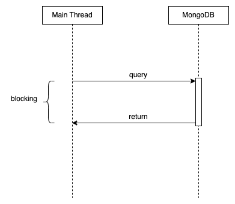
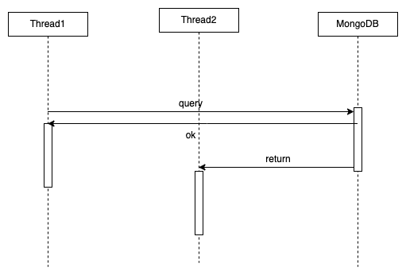

## MongoDB driver

MongoDB 회사 에서 공식적으로 2가지 드라이버를 제공한다.
- Java Driver (Sync)
- Reactive Streams Driver (Async)

#### Java driver (Sync)

Java Driver는 동기로 동작하는 애플리케이션을 위한 드라이버이다.

클라이언트는 요청을 보내면 응답이 돌아오기 전까지 쓰레드가 Blocking된다.

코드가 직관적이고 작성 난이도가 낮지만, 처리량이 비교적 높지 않다.

## Reactive Streams Driver

Reactive Streams driver는 비동기로 동작하는 애플리케이션을 위한 MongoDB 드라이버이다.

해당 드라이버에서는 먼저 쿼리가 잘 전달되었다는 응답을 받는다. 실제 결과 응답은 이후 시점에서 받게 된다.

## Spring Data Mongo

#### Entity

Spring Data Mongo에서 Entity는 `@Entity`가 아닌 `@Document` 애노테이션을 붙인다.

그리고 JPA와 다르게 필드에 `@Column` 애노테이션이 아니라 `@Field` 애노테이션을 붙인다.

#### ReactiveMongoTemplate

- ReactiveMongoOperations를 구현한다.
- 메서드 체이닝을 통해 쿼리를 수행하고 결과 Entity를 반환한다.

#### MongoTemplate

- MongoClient로 생성할 수 있다.

#### Id Mapping

MongoDB의 모든 document는 `_id`를 필요로 한다. MappingMongoConverter는 다음의 방법으로 `_id`를 감지한다.
- `@Id`가 붙어있는 필드
- 필드명이 id이고 `@Field`로 별도 이름이 부여되지 않은 경우

해당 경우가 존재하지 않으면 자동으로 `_id`를 추가한다.
