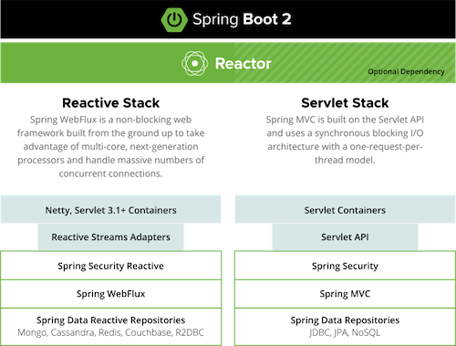
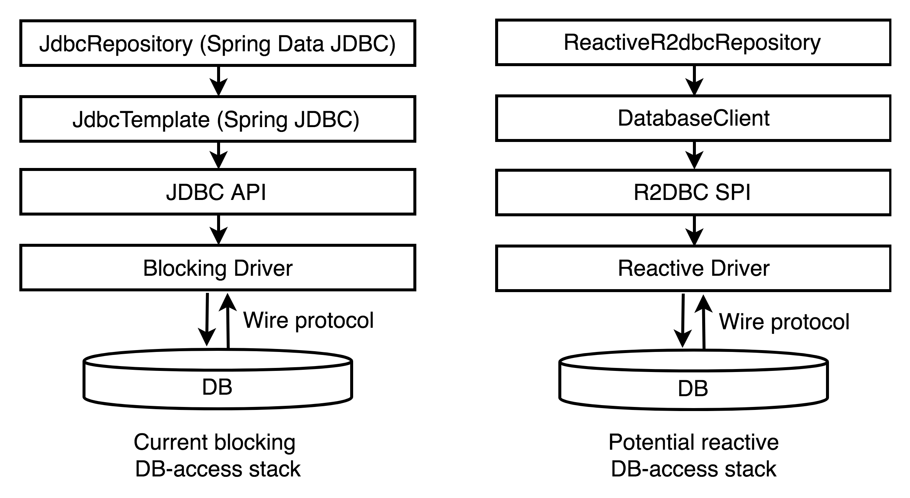

## Spring Webflux

Spring Webflux와 같은 Reactive Stack에서는 `Spring Data Repositories`가 아니라 `Spring Data Reactive Repositories`를 사용한다.

## Spring Data

Spring Data는 데이터 저장소의 특성을 유지하면서 Spring 기반의 프로그래밍 모델을 제공하는 라이브러리이다.
- https://spring.io/projects/spring-data

Spring Data는 다양한 데이터 접근 기술을 지원한다.
- RDB, NoSQL 등 지원
- map-reduce 프레임워크 지원
- 클라우드 기반의 Data 서비스 제공

Spring Data Reactive의 라이브러리들은 아래의 특징을 가진다.
- Reactive Streams, Reactor, Java NIO 등을 사용해서 Async Non-blocking을 지원
- Reactive client를 제공하고 이를 기반으로 ReactiveTemplate이나 ReactiveRepository 구현
- 일반적으로 데이터베이스에 대한 작업의 결과로 Publisher를 사용한다.

아래 그림을 보자.

`Spring Data JDBC` 영역을 Spring Reactive에서는 `Spring Data R2DBC`로 대체해서 사용할 수 있다.

## R2DBC

Spring Data Jdbc가 Non-blocking을 지원한다면 Hibernate ORM과 같은 기술을 그대로 유지할 수 있었을 것이다.

Jdbc는 동기 blocking I/O 기반으로 설계가 되어서 Socket 연결 및 쿼리 실행 모두 Blocking으로 동작해서 수정이 거의 불가능했고, 그래서 새로운 API와 드라이버를 만들게 되었다고 한다.

아래는 R2DBC(Reactive Relational Database Connectivity)에 대한 특징이다.
- 2017년 Pivotal 사에서 개발 시작
- 2018년부터 공식 프로젝트로 후원
- 비동기 Non-blocking 관계형 데이터베이스 드라이버 지원
- Reactive Streams 스펙을 제공하고 Reactor 기반 구현

현재 지원 범위는 아래와 같다.
- 공식지원
  - h2, mssql, pool
- 벤더(각 DBMS 개발 그룹) 지원
  - oracle, mariaDB, postgresql
- 커뮤니티 지원
  - mysql

