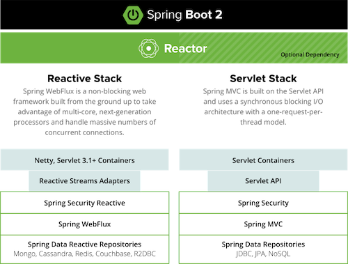
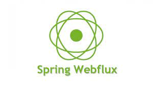
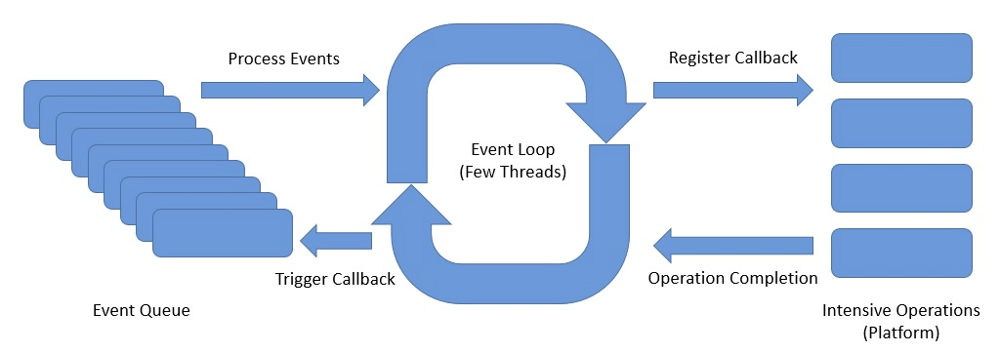
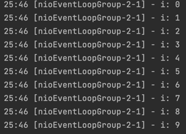
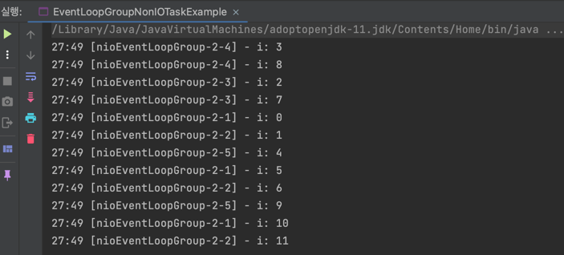
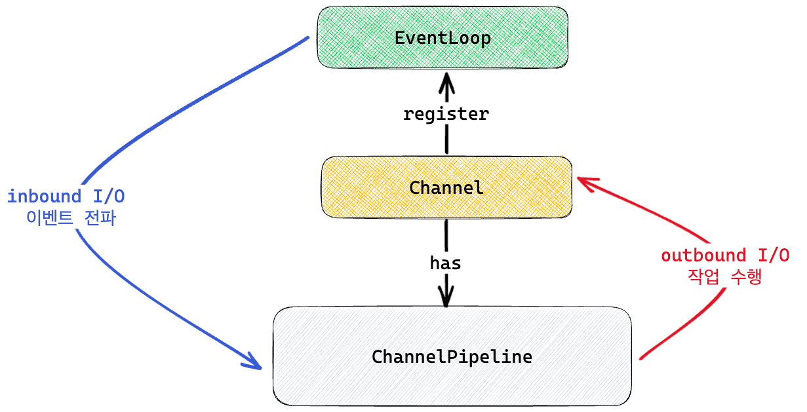
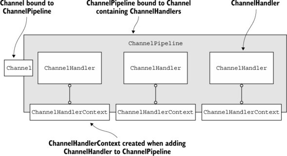
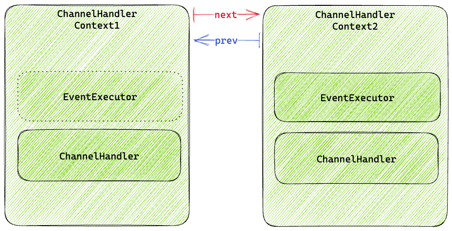

## Reactive Programming with Spring Boot

아래는 Spring 공식문서에 나와있는 Spring MVC와 Spring Webflux에 대한 설명이다.



Spring MVC는 동기 블로킹 기반의 서블릿 API와 request-per-thread 모델을 제공하고, Spring Webflux는 대량의 동시 커넥션이 가능한 Non-Blocking 웹 프레임워크이다. 

해당 부분을 조금 더 풀어서 알아보자.

## Spring Webflux

Spring MVC는 request-per-thread 모델이기 때문에 만약 1만개 이상의 요청이 동시에 들어온다면 쓰레드가 부족하게 된다.

Spring Webflux는 **쓰레드를 가능한 최소한으로 사용하는 쓰레드 모델**을 제공한다고 생각하면 된다.



Spring Webflux는 **비동기 + 리액티브 프로그래밍**을 기본으로 한다.
- 요청을 Event-Driven 방식으로 처리한다.
- 요청이 완료될 때까지 다른 일을 하다가, 처리가 완료되면 Callback 메서드를 통해 응답을 반환한다.
- 비동기 + 논블로킹

Webflux는 요청이 끝날 때까지 기다리지 않기 때문에 cpu, thread, memory의 자원을 최대한 낭비하지 않고 효율적으로 동작하는 고성능 애플리케이션 개발에서 사용한다.

토비님의 세미나에서는 **서비스 간 호출이 많은 마이크로 서비스 아키텍처에 적합**하고, 함수형 프로그래밍의 이점이 있는 것도 Webflux를 선택하기에 충분한 이유가 된다고 설명한다.

## Netty


Spring Webflux를 사용하면 요청을 받는 내장 서버로 기본적으로 **Netty**를 사용한다.

Netty는 Async / NIO(Non-Blocking IO)에 초점을 둔 이벤트 기반 네트워크 애플리케이션 프레임워크이다. Netty는 유지보수를 고려한 고성능 프로토콜 서버나 클라이언트를 개발할 때 주로 사용한다.

Netty의 장점은 아래와 같다.
- 비동기 이벤트 기반 네트워킹(Event Driven)을 지원
- Tomcat과 다르게 자원이 항상 스레드를 점유하고 Block을 유지하지 않으므로 처리량 대폭 증가
- 스레드 수가 적다.
- Context switching 오버헤드 감소 (1개 Thread에서 쌓인 Event Queue를 기반으로 Non-Blocking으로 동작하기 때문!)

### Event Loop

Netty에서 핵심은 Event Loop이다.



Event Loop에는 아래의 컴포넌트가 있다.
- Channel은 하나의 이벤트 루프에 등록된다.
- Channel에서 이벤트가 발생하면 해당 이벤트 루프의 이벤트 큐에 등록된다.
- Event Loop: 이벤트 큐에서 이벤트를 꺼내어서 작업을 비동기로 실행 (스레드 당 여러개 가질 수 있다.)
- Pipeline: 이벤트를 받아서 Handler로 전달

아래 코드를 보자.

EventLoopGroup은 `io.netty.channel`에 있는 Netty가 사용하는 EventLoopGroup이다. (Netty에서는 EventLoop를 직접 사용할 수 없다.)

```java
public static void main(String[] args) {
    EventLoopGroup eventLoopGroup = new NioEventLoopGroup(1);

    for (int i = 0; i < 10; i++) {
        final int idx = i;
        eventLoopGroup.execute(() -> {
            log.info("i: {}", idx);
        });
    }

    eventLoopGroup.shutdownGracefully();
}
```

EventLoop는 1개의 쓰레드에서 동작하기 때문에 아래와 같이 들어간 순서가 보장된다.



### Event Loop Group

Netty의 EventLoopGroup은 여러 개의 EventLoop를 포함할 수 있다.

```java
public static void main(String[] args) {
    EventLoopGroup eventLoopGroup = new NioEventLoopGroup(5);

    for (int i = 0; i < 12; i++) {
        final int idx = i;
        eventLoopGroup.execute(() -> {
            log.info("i: {}", idx);
        });
    }

    eventLoopGroup.shutdownGracefully();
}
```

결과는 아래와 같다. 



다른 EventLoop 간 쓰레드가 동일함을 보장하지 않으므로 순서를 보장하지 않는다.

단, 로그를 자세히 보면 동일한 EventLoop 간은 순서가 보장된다.

### Channel

Netty는 Java NIO의 Channel과 유사한 자체적인 Channel을 만들어서 사용한다. 차이점은 Pipeline이나 Future와 같은 추가적인 기능을 제공한다.

#### AbstractChannel

Netty의 AbstractChannel 내부적으로 Pipeline을 갖는다.

즉, Netty에서 제공하는 대부분의 Channel은 Pipeline을 사용한다고 이해하면 된다.

#### NioServerSocketChannel

Netty 서버를 구성할 때 NioServerSocketChannel을 주로 사용한다.

NioServerSocketChannel은 AbstractNioChannel을 상속하고, AbstractNioChannel은 내부적으로 자신이 등록된 Selector와 SelectableChannel을 가진다.

그래서 Selector와 SelectableChannel을 사용해서 더 쉽게 현재 상태를 파악할 수 있다.

### ChannelFuture

아래는 ChannelFuture 인터페이스의 일부이다.

```java
public interface ChannelFuture extends Future<Void> {
    
    Channel channel();

    @Override
    ChannelFuture addListener(GenericFutureListener<? extends Future<? super Void>> listener);

    @Override
    ChannelFuture removeListener(GenericFutureListener<? extends Future<? super Void>> listener);

    @Override
    ChannelFuture sync() throws InterruptedException;
    
    // ...
}
```

ChannelFuture는 아래 역할을 수행한다.
- Channel I/O 작업이 완료되면 isDone이 ture가 되는 Future
- FutureListener를 등록/삭제하여 Write이 완료되었을 때 비동기 처리 가능
- addListener: Channel I/O 작업이 완료되면 수행할 Listener 등록
- removeListener: 등록된 Listener 제거
- sync: 작업이 완료될 때까지 Blocking

### ChannelPipeline

Netty에서 매우 중요한 역할을 하는 것 중 하나가 ChannelPipeline이다.

아래 그림을 보자.



해당 그림을 설명하면 아래와 같다.
- EventLoop는 Channel의 Inbound I/O를 감시한다.
- EventLoop는 I/O가 준비되면 ChannelPipeline으로 이벤트를 전파한다.
- ChannelPipeline은 I/O 이벤트를 처리한다.
- ChanelPipeline은 처리가 완료되면 Channel에 결과를 Outbound I/O로써 write 한다.

즉, **ChannelPipeline을 어떻게 구성하는 지가 핵심 관심사**가 된다.

**ChannelPipeline의 내부**는 아래와 같이 구성된다.



ChannelHandlerContext와 ChannelHandler에 대해 알아보자.

## ChannelHandlerContext

위 그림과 같이 pipeline의 ChannelHandlerContext는 LinkedList 형태로 next, prev를 통해 연결되어 있다.

각 ChannelHandlerContext는 I/O 작업을 처리한 후 다음 Context에 넘기게 된다.

다음은 ChannelHandlerContext의 내부이다.



1개의 ChannelHandlerContext는 ChannelHandler를 가진다.

그리고 ChannelHandlerContext는 EventExecutor를 가질 수 있다. EventLoop에 Blocking이 생기는 것을 막고 별도 쓰레드에서 I/O 작업을 수행하기 위해 사용한다.


## ChannelHandler

ChannelHandler는 I/O 이벤트를 받아서 다음 Context에게 넘겨줄 수 있고, 직접 I/O 작업을 수행할 수도 있다.

inbound I/O 이벤트는 ChannelInboundHandler가 처리하고, Outbound I/O 이벤트는 ChannelOutboundHandler가 처리한다.

참고로 ChannelDuplexHandler는 ChannelInboundHandler, ChannelOutboundHandler 둘 다 구현한다.

#### ChannelInboundHandler

ChannelInboundHandler는 다양한 경우에 핸들링할 수 있는 메서드를 제공한다.

- channelRegistered: Channel이 EventLoop에 등록된 경우
- channelUnregistered: Channel이 EventLoop에서 제거된 경우
- channelActive: Channel이 Active된 경우
- channelInactive: Channel이 Inactive된 경우
- channelRead: Channel로부터 메시지를 읽을 준비가 된 경우
- channelReadComplete: Channel로부터 모든 메시지를 읽은 경우
- channelWritabilityChanged: Channel이 Write가 가능한 상태가 변경된 경우

#### ChannelOutboundHandler

ChannelOutboundHandler도 Outbound I/O 작업을 가로채서 처리할 수 있는 메서드를 제공한다.

- bind: serverSocketChannel에 bind 요청 시 호출
- connect: socketChannel이 connect 요청 시 호출
- disconnect: socketChannel이 disconnect 요청 시 호출
- deregister: eventLoop로부터 deregister되면 호출
- read: channel에 대한 read 요청 시 호출
- write: channel에 대한 write 요청 시 호출
- flush: flush 작업 수행 후 호출
- close: channel이 닫히면 호출

#### Sample Handlers

아래는 ChannelInboundHandlerAdapter를 상속받는 클래스이다. ChannelInboundHandlerAdapter는 ChannelInboundHandler 인터페이스에 대한 골격을 제공한다.

```java
public class SampleChannelInboundHandler extends ChannelInboundHandlerAdapter {
    @Override
    public void channelRead(ChannelHandlerContext ctx, Object msg) {
        if (msg instanceof String) {
            // 다음 context로 이벤트를 전달하지 않고, outbound I/O 작업을 수행한 후 채널을 닫는다.
            ctx.writeAndFlush("Hello, " + msg)
                    .addListener(ChannelFutureListener.CLOSE);
        } else if (msg instanceof ByteBuf) {
            // 메시지를 가공한 후 다음 context로 이벤트를 전달
            try {
                var buf = (ByteBuf) msg;
                var len = buf.readableBytes();
                var charset = StandardCharsets.UTF_8;
                var body = buf.readCharSequence(len, charset);
                ctx.fireChannelRead(body); // 다음 Context로 read 이벤트 전달
            } finally {
                ReferenceCountUtil.release(msg);
            }
        }
    }
}
```

받은 값을 그대로 bypass 하는 방식도 가능하다.

아래는 ChannelOutboundHandler의 구현이다.

```java
public class SampleChannelOutboundHandler extends ChannelOutboundHandlerAdapter {
    @Override
    public void write(ChannelHandlerContext ctx, Object msg, ChannelPromise promise) {
        if (msg instanceof String) {
            ctx.write(msg, promise);
        } else if (msg instanceof ByteBuf) {
            var buf = (ByteBuf) msg;
            var len = buf.readableBytes();
            var charset = StandardCharsets.UTF_8;
            var body = buf.readCharSequence(len, charset);
            ctx.write(body, promise);
        }
    }
}
```

해당 Handler는 String 타입일 경우 다음 OutboundHandler에게 패스하고, ByteBuf 타입이라면 가공한 후 write 한다.

## 예시 코드

아래와 같이 `Flux`나 `Mono`를 사용해서 Repository 조회를 한다면 **Async**/**Non-Blocking**으로 조회를 하여 리소스 효율성을 향상시킬 수 있다.

```java
private Flux<Employee> getAllEmployees() {
    return employeeRepository.findAllEmployees();
}
```


## 참고

- https://thalals.tistory.com/381
- https://perfectacle.github.io/2021/02/28/netty-event-loop
- https://recordsoflife.tistory.com/1314
- https://www.baeldung.com/spring-webflux-concurrency
- https://spring.io/reactive/
- https://fastcampus.co.kr/courses/216172