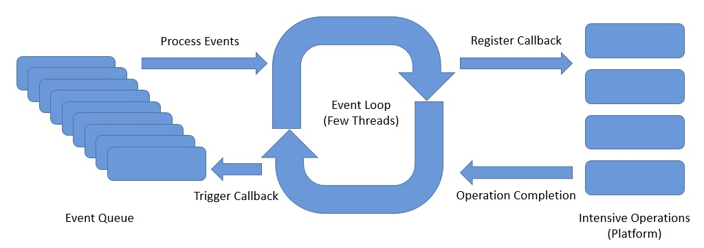
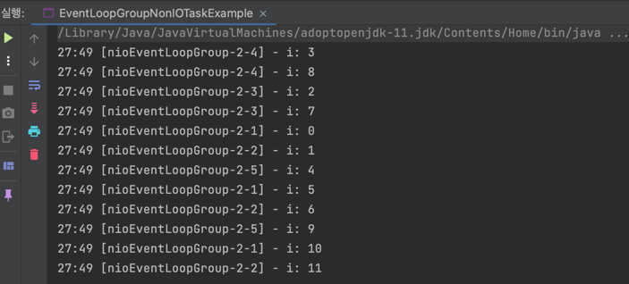

## Reactive Programming with Spring Boot

아래는 Spring 공식문서에 나와있는 Spring MVC와 Spring Webflux에 대한 설명이다.


Spring MVC는 동기 블로킹 기반의 서블릿 API와 request-per-thread 모델을 제공하고, Spring Webflux는 대량의 동시 커넥션이 가능한 Non-Blocking 웹 프레임워크이다. 

해당 부분을 조금 더 풀어서 알아보자.

## Spring Webflux

Spring MVC는 request-per-thread 모델이기 때문에 만약 1만개 이상의 요청이 동시에 들어온다면 쓰레드가 부족하게 된다.

Spring Webflux는 **쓰레드를 가능한 최소한으로 사용하는 쓰레드 모델**을 제공한다고 생각하면 된다.


Spring Webflux는 **비동기 + 리액티브 프로그래밍**을 기본으로 한다.
- 요청을 Event-Driven 방식으로 처리한다.
- 요청이 완료될 때까지 다른 일을 하다가, 처리가 완료되면 Callback 메서드를 통해 응답을 반환한다.
- 비동기 + 논블로킹

Webflux는 요청이 끝날 때까지 기다리지 않기 때문에 cpu, thread, memory의 자원을 최대한 낭비하지 않고 효율적으로 동작하는 고성능 애플리케이션 개발에서 사용한다.

토비님의 세미나에서는 **서비스 간 호출이 많은 마이크로 서비스 아키텍처에 적합**하고, 함수형 프로그래밍의 이점이 있는 것도 Webflux를 선택하기에 충분한 이유가 된다고 설명한다.

## Netty


Spring Webflux를 사용하면 요청을 받는 내장 서버로 기본적으로 **Netty**를 사용한다.

Netty는 Async / NIO(Non-Blocking IO)에 초점을 둔 이벤트 기반 네트워크 애플리케이션 프레임워크이다. Netty는 유지보수를 고려한 고성능 프로토콜 서버나 클라이언트를 개발할 때 주로 사용한다.

Netty의 장점은 아래와 같다.
- 비동기 이벤트 기반 네트워킹(Event Driven)을 지원
- Tomcat과 다르게 자원이 항상 스레드를 점유하고 Block을 유지하지 않으므로 처리량 대폭 증가
- 스레드 수가 적다.
- Context switching 오버헤드 감소 (1개 Thread에서 쌓인 Event Queue를 기반으로 Non-Blocking으로 동작하기 때문!)

### Event Loop

Netty에서 핵심은 Event Loop이다.



Event Loop에는 아래의 컴포넌트가 있다.
- Channel은 하나의 이벤트 루프에 등록된다.
- Channel에서 이벤트가 발생하면 해당 이벤트 루프의 이벤트 큐에 등록된다.
- Event Loop: 이벤트 큐에서 이벤트를 꺼내어서 작업을 비동기로 실행 (스레드 당 여러개 가질 수 있다.)
- Pipeline: 이벤트를 받아서 Handler로 전달

아래 코드를 보자.

EventLoopGroup은 `io.netty.channel`에 있는 Netty가 사용하는 EventLoopGroup이다. (Netty에서는 EventLoop를 직접 사용할 수 없다.)

```java
public static void main(String[] args) {
    EventLoopGroup eventLoopGroup = new NioEventLoopGroup(1);

    for (int i = 0; i < 10; i++) {
        final int idx = i;
        eventLoopGroup.execute(() -> {
            log.info("i: {}", idx);
        });
    }

    eventLoopGroup.shutdownGracefully();
}
```

EventLoop는 1개의 쓰레드에서 동작하기 때문에 아래와 같이 들어간 순서가 보장된다.


### Event Loop Group

Netty의 EventLoopGroup은 여러 개의 EventLoop를 포함할 수 있다.

```java
public static void main(String[] args) {
    EventLoopGroup eventLoopGroup = new NioEventLoopGroup(5);

    for (int i = 0; i < 12; i++) {
        final int idx = i;
        eventLoopGroup.execute(() -> {
            log.info("i: {}", idx);
        });
    }

    eventLoopGroup.shutdownGracefully();
}
```

결과는 아래와 같다. 



다른 EventLoop 간 쓰레드가 동일함을 보장하지 않으므로 순서를 보장하지 않는다.

단, 로그를 자세히 보면 동일한 EventLoop 간은 순서가 보장된다.

## 예시 코드

아래와 같이 `Flux`나 `Mono`를 사용해서 Repository 조회를 한다면 **Async**/**Non-Blocking**으로 조회를 하여 리소스 효율성을 향상시킬 수 있다.

```java
private Flux<Employee> getAllEmployees() {
    return employeeRepository.findAllEmployees();
}
```


## 참고

- https://thalals.tistory.com/381
- https://perfectacle.github.io/2021/02/28/netty-event-loop
- https://recordsoflife.tistory.com/1314
- https://www.baeldung.com/spring-webflux-concurrency
- https://spring.io/reactive/