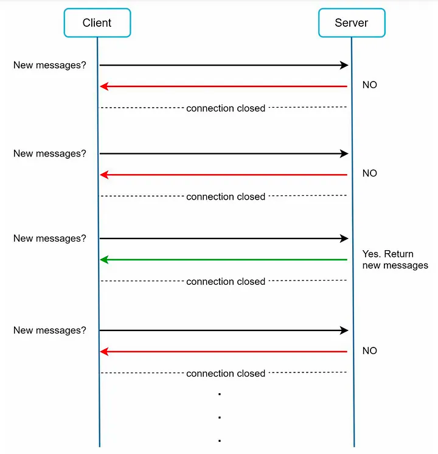
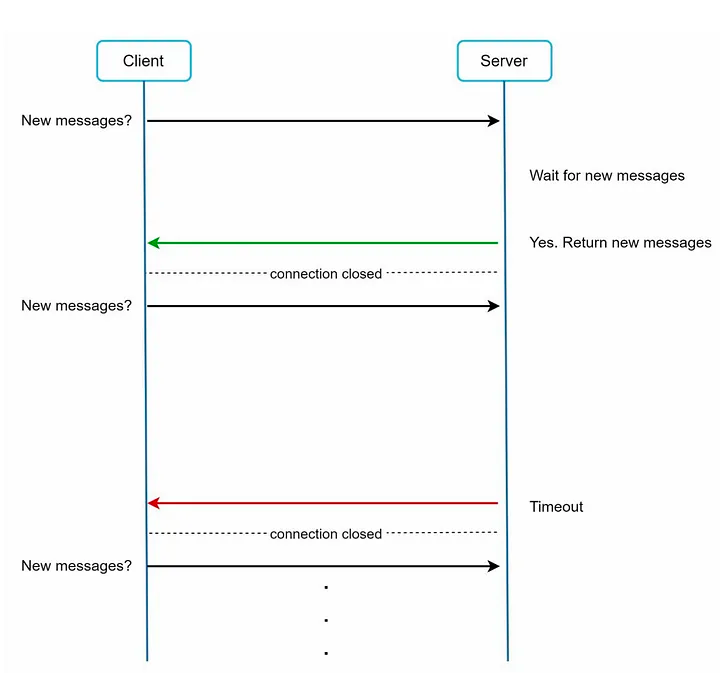
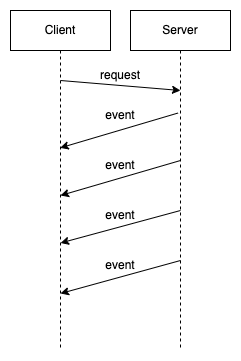
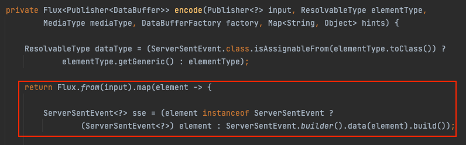
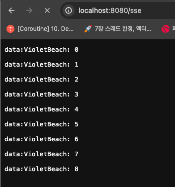

## Server Sent Event

Server Sent Event는 서버에서 클라이언트에게 일방적으로 이벤트를 전달하는 방식이다.

클라이언트에서 서버의 이벤트를 구독하기 위해서는 Polling 방식을 주로 사용했다.

## Polling

Polling 방식은 Client에서 Server에게 특정 주기로 요청을 보내서 데이터를 조회하는 방식이다.



구현이 간단하지만, 실시간성이 떨어지고 불필요한 네트워크 요청을 지속적으로 하기 때문에 자원을 낭비하게 된다.

## Long Polling

앞선 Polling의 문제를 해결하기 위해 Long Polling 기법이 나왔다.



Long Polling 방식은 서버가 요청을 받은 후 데이터가 생길 때까지 기다렸다가 응답을 보내는 방식이다.

이 방식은 불필요한 요청 수를 줄이고 실시간성을 보장할 수 있게 된다.

하지만, Event의 빈도가 잦다면 여전히 연결이 아주 많이 발생하는 문제가 있다. 

## Http Streaming

이 부분을 설명하는 이유는 Spring WebFlux에서 ServerSentEvent를 아래 방식으로 사용하기 때문이다. 

Http Streaming 방식은 위 문제들을 해결한 방식이다.



서버는 연결을 유지하고 데이터가 생길 때마다 전달할 이벤트, 데이터를 Chunk 단위로 전달한다.

아래는 Http Streaming의 특징이다.
- Transfer-Encoding 헤더
  - Transfer-Encoding: chunked를 헤더에 추가한다.
  - 빈 Chunk를 전달하기 전까지 값을 읽는다.
  - HTTP/1.1 이상에서만 사용할 수 있다. (Connection: keep-alive)
- EOF
  - Connection: close를 헤더에 추가한다.
  - 서버가 연결을 종료할 때까지 들어오는 값을 읽는다.
- Content-Length를 알 수 없다.
- 데이터를 청크 단위로 전송하므로 서버 입장에서 효율적으로 튜닝이 가능해진다.

이렇게하면 이벤트를 클라이언트에게 효율적으로 내려줄 수 있다.

## Server Sent Event

Spring WebFlux에서 ServerSentEvent를 사용해서 HTTP Streaming을 구현할 수 있다.

Spring WebFlux에서는 Handler의 Return Type으로 `Flux<ServerSentEvent>`, `Observable<ServerSentEvent>`를 지원한다.

내부적으로는 Chunked Transfer-Encoding 기반으로 아래와 같은 데이터를 전송한다.

```
id:0
event:add
:comment-i
data:data-0

id:1
event:add
:comment-i
data:data-1

id:2
event:add
:comment-i
data:data-2
```

해당 데이터는 아래 특징을 가진다.
- chunk 단위로 여러 줄로 구성된 문자열을 전달한다.
- new line으로 이벤트를 구분한다.
- 문자열은 {field}:{value} 형태로 구성한다.

필드는 아래 값을 가진다.
- id: 이벤트의 id를 가리킨다.
  - Client에서는 id를 저장해서 Last-Event-ID 헤더를 첨부하고, 서버는 해당 id 이후의 이벤트만 보낸다.
- event: 이벤트의 타입
- data: 이벤트의 데이터, 데이터가 많으면 Multi line으로 구성한다.
- retry: reconnection을 위한 대기 시간을 클라이언트에게 전달
- comment(Empty): 정보를 남기기 위한 역할

#### ServerSentEventHttpMessageWriter

Spring WebFlux는 Servlet Stack과 다르게 ~Converter가 아니라 ~Writer를 사용한다.

ServerSentEventHttpMessageWriter는 객체를 ServerSentEvent 형태로 encode해서 write하는 역할을 한다.

```java
public class ServerSentEventHttpMessageWriter implements HttpMessageWriter<Object> {
    private static final MediaType DEFAULT_MEDIA_TYPE = 
            new MediaType("text", "event-stream", StandardCharsets.UTF_8);
    private static final List<MediaType> WRITABLE_MEDIA_TYPES =
            Collections.singletonList(MediaType.TEXT_EVENT_STREAM);
}
```

ServerSentEventHttpMessageWriter는 MediaType으로 "event-stream"을 찾아서 핸들링한다.

내부를 보면 ServerSentEvent가 input으로 들어오면 그대로 사용하고, 아니라면 ServerSentEvent로 변환한다.



즉, Content-Type으로 `text/event-stream`을 사용하면 ServerSentEvent로 응답을 내릴 수 있다.

ServerSentEvent는 내부적으로 Flux의 값을 조금씩 흘려보낸다. 해당 부분에 대해 더 알아보자.

#### Controller 구현

아래 Controller는 Content-Type으로 `text/event-stream`을 사용한다.

```java
@Controller
public class SseController {
    @ResponseBody
    @GetMapping(path = "/sse", produces = "text/event-stream")
    Flux<String> sse() {
        return Flux.interval(Duration.ofMillis(1000))
                .map(i -> "VioletBeach: " + i);
    }
}
```

그 결과 아래와 같이 초마다 1Line씩 데이터가 출력된다.



더 상세한 응답을 하고 싶다면 `ServerSentEventBuilder`를 사용해서 `ServerSentEvent`를 생성해서 직접 반환하면 된다.

```java
public interface Builder<T> {
    Builder<T> id(String id);

    Builder<T> event(String event);

    Builder<T> retry(Duration retry);

    Builder<T> comment(String comment);

    Builder<T> data(@Nullable T data);
    
    ServerSentEvent<T> build();
}
```

## 알림 서버 구현

ServerSentEvent는 Chunk 단위의 데이터를 내려주는 것에도 의미가 있지만, 처음 언급했던 대로 알림 서버를 구현하는 데 사용할 수 있다.

```java
@RestController
@RequestMapping("/api/notifications")
@RequiredArgsConstructor
public class NotificationController {
    private static AtomicInteger lastEventId = new AtomicInteger(1);
    private final NotificationService notificationService;

    @GetMapping(produces = MediaType.TEXT_EVENT_STREAM_VALUE)
    public Flux<ServerSentEvent<String>> getNotifications() {
        return notificationService.getMessageFromSink()
                .map(message -> {
                    String id = lastEventId.getAndIncrement() + "";
                    return ServerSentEvent
                            .builder(message)
                            .event("notification")
                            .id(id)
                            .comment("this is notification")
                            .build();
                });
    }

    @PostMapping
    public Mono<String> addNotification(@RequestBody Event event) {
        String message = event.getType() + ": " + event.getMessage();
        notificationService.addMessage(message);
        return Mono.just("ok");
    }
}
```

결과적으로 사용자는 `GET /api/notifications`를 1번 호출하는 것 만으로 이후의 Notification을 지속적으로 받아올 수 있다.

## Websocket API

SSE(Server Sent Event) 방식과 유사한 방법 방식으로 Websocket이 있다.

SSE는 서버에서 클라이언트로만 메시지를 보내는 반면, Websocket 방식은 양방향 통신이 가능하다.하지만, SSE는 HTTP 위에서 동작하고 효율적이라는 장점이 있다.

Webflux에서는 Websocket을 매우 편리하게 구성하기 도구를 제공한다. 이 부분에 대해서는 아래 공식 문서를 참고하자.
- https://docs.spring.io/spring-framework/reference/web/webflux-websocket.html

## 참고

- https://fastcampus.co.kr/courses/216172
- https://medium.com/techieahead/http-short-vs-long-polling-vs-websockets-vs-sse-8d9e962b2ba8