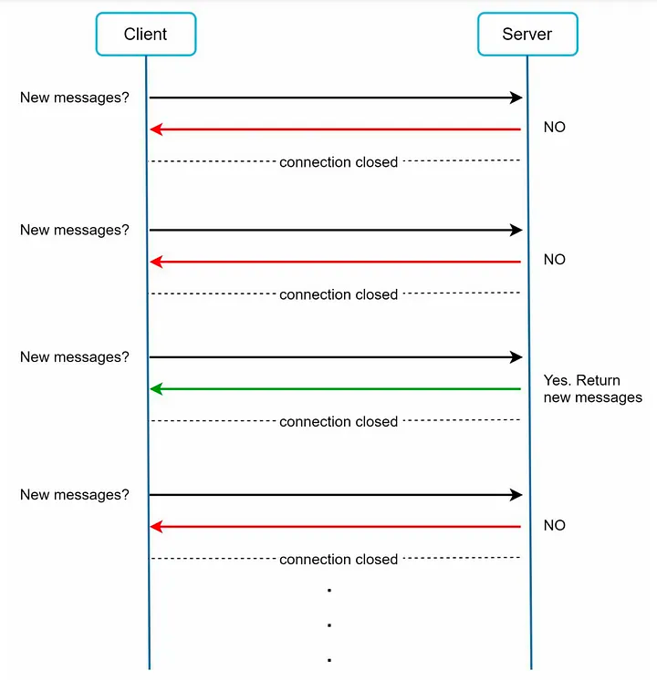
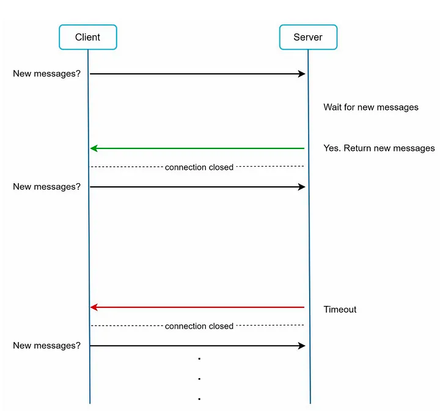
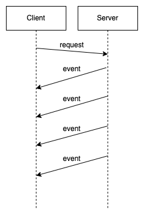

## Server Sent Event

Server Sent Event는 서버에서 클라이언트에게 일방적으로 이벤트를 전달하는 방식이다.

클라이언트에서 서버의 이벤트를 구독하기 위해서는 Polling 방식을 주로 사용했다.

## Polling

Polling 방식은 Client에서 Server에게 특정 주기로 요청을 보내서 데이터를 조회하는 방식이다.



구현이 간단하지만, 실시간성이 떨어지고 불필요한 네트워크 요청을 지속적으로 하기 때문에 자원을 낭비하게 된다.

## Long Polling

앞선 Polling의 문제를 해결하기 위해 Long Polling 기법이 나왔다.



Long Polling 방식은 서버가 요청을 받은 후 데이터가 생길 때까지 기다렸다가 응답을 보내는 방식이다.

이 방식은 불필요한 요청 수를 줄이고 실시간성을 보장할 수 있게 된다.

TODO 삭제? 하지만, Connection을 유지하기 위한 리소스가 낭비되는 문제가 있다. 그리고 브라우저나 게이트웨이의 Timeout도 고려해야 한다.

## Http Streaming

이 부분을 설명하는 이유는 Spring WebFlux에서 ServerSentEvent를 아래 방식으로 사용하기 때문이다. 

Http Streaming 방식은 위 문제들을 해결한 방식이다.



서버는 연결을 유지하고 데이터가 생길 때마다 전달할 이벤트, 데이터를 Chunk 단위로 전달한다.

아래는 Http Streaming의 특징이다.
- Transfer-Encoding 헤더
  - Transfer-Encoding: chunked를 헤더에 추가한다.
  - 빈 Chunk를 전달하기 전까지 값을 읽는다.
  - HTTP/1.1 이상에서만 사용할 수 있다. (Connection: keep-alive)
- EOF
  - Connection: close를 헤더에 추가한다.
  - 서버가 연결을 종료할 때까지 들어오는 값을 읽는다.
- Content-Length를 알 수 없다.
- 데이터를 청크 단위로 전송하므로 서버 입장에서 효율적으로 튜닝이 가능해진다.

이렇게하면 이벤트를 클라이언트에게 효율적으로 내려줄 수 있다. 하지만, 커넥션을 지속해야 하는 점은 계속 존재한다.

## Server Sent Event

Spring WebFlux에서는 Handler의 Return Type으로 `Flux<ServerSentEvent>`, `Observable<ServerSentEvent>`를 지원한다.


내부적으로는 Chunked Transfer-Encoding 기반으로 아래와 같은 데이터를 전송한다.

```
id:0
event:add
:comment-i
data:data-0

id:1
event:add
:comment-i
data:data-1

id:2
event:add
:comment-i
data:data-2
```

해당 데이터는 아래 특징을 가진다.
- chunk 단위로 여러 줄로 구성된 문자열을 전달한다.
- new line으로 이벤트를 구분한다.
- 문자열은 {field}:{value} 형태로 구성한다.

필드는 아래 값을 가진다.
- id: 이벤트의 id를 가리킨다.
  - Client에서는 id를 저장해서 Last-Event-ID 헤더를 첨부하고, 서버는 해당 id 이후의 이벤트만 보낸다.
- event: 이벤트의 타입
- data: 이벤트의 데이터, 데이터가 많으면 Multi line으로 구성한다.
- retry: reconnection을 위한 대기 시간을 클라이언트에게 전달
- comment(Empty): 정보를 남기기 위한 역할

## 참고

- https://medium.com/techieahead/http-short-vs-long-polling-vs-websockets-vs-sse-8d9e962b2ba8