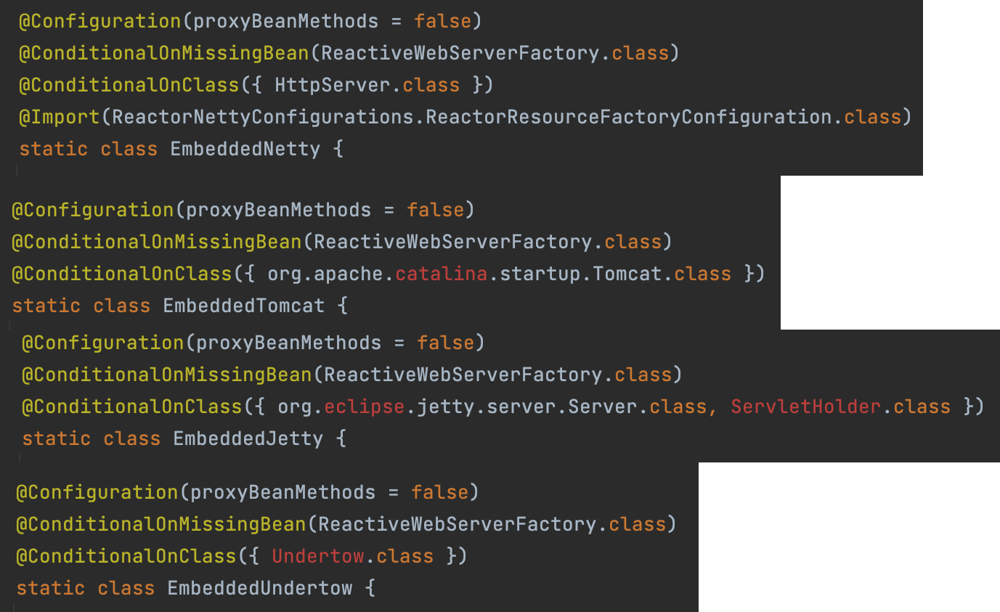
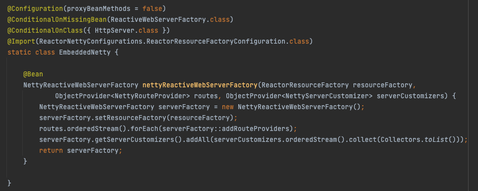
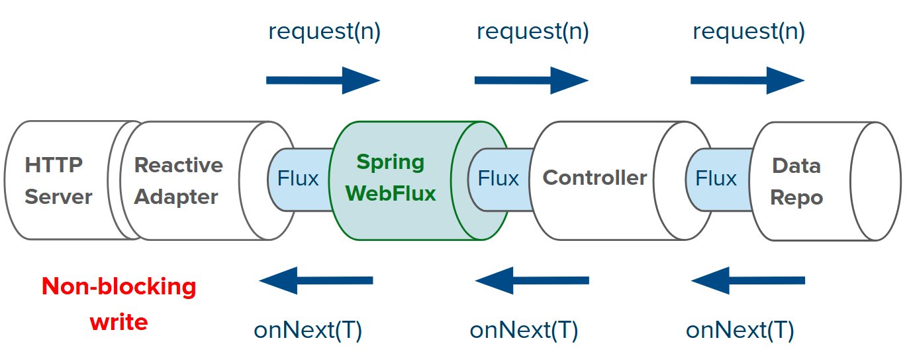
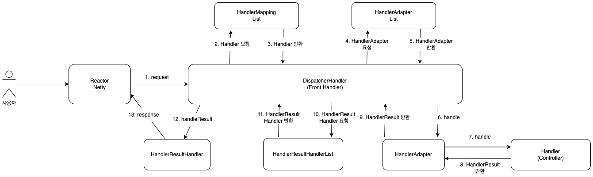

해당 포스팅은 Spring Webflux에 대한 짤막한 소개와 Netty, Reactor를 넘어서 Spring Webflux에 대한 자세히 다룬다. 

## Spring Reactive Stack

1편에서 봤던 Spring Reactive Stack을 다시 살펴보자.


그림만 봐서는 잘 모르겠다.

#### WebFluxAutoConfiguration

WebFluxAutoConfiguration은 SpringWebflux 사용을 위한 필수적인 AutoConfiguration이다.

아래 코드를 보자.

```java
@AutoConfiguration(after = { ReactiveWebServerFactoryAutoConfiguration.class, CodecsAutoConfiguration.class,
        ReactiveMultipartAutoConfiguration.class, ValidationAutoConfiguration.class,
        WebSessionIdResolverAutoConfiguration.class })
@ConditionalOnWebApplication(type = ConditionalOnWebApplication.Type.REACTIVE)
@ConditionalOnClass(WebFluxConfigurer.class)
@ConditionalOnMissingBean({ WebFluxConfigurationSupport.class })
@AutoConfigureOrder(Ordered.HIGHEST_PRECEDENCE + 10)
public class WebFluxAutoConfiguration {
    // ..생략
}
```

@AutoConfiguration의 after를 보면 ReactiveWebServerFactoryAutoConfiguration이 있다.

해당 클래스를 들여다 보자.

```java
@Import({ ReactiveWebServerFactoryAutoConfiguration.BeanPostProcessorsRegistrar.class,
        ReactiveWebServerFactoryConfiguration.EmbeddedTomcat.class,
        ReactiveWebServerFactoryConfiguration.EmbeddedJetty.class,
        ReactiveWebServerFactoryConfiguration.EmbeddedUndertow.class,
        ReactiveWebServerFactoryConfiguration.EmbeddedNetty.class })
public class ReactiveWebServerFactoryAutoConfiguration
```

내부적으로 EmbeddedTomcat, EmbeddedJetty, EmbeddedUndertow, EmbeddedNetty를 Import한다.



해당 클래스를 보면 @ConditionalOnClass로 인해서 기본적으로 EmbeddedNetty만 빈으로 등록된다. (spring-boot-starter-webflux 의존성은 spring-boot-starter-reactor-netty를 포함한다.)



EmbeddedNetty가 등록되면 NettyReactiveWebServerFactory를 빈으로 등록하는 것을 볼 수 있다.

해당 코드를 보자.

```java
import reactor.netty.http.HttpProtocol;
import reactor.netty.http.server.HttpServer;

public class NettyReactiveWebServerFactory extends AbstractReactiveWebServerFactory {
    @Override
    public WebServer getWebServer(HttpHandler httpHandler) {
        HttpServer httpServer = createHttpServer();
        ReactorHttpHandlerAdapter handlerAdapter = new ReactorHttpHandlerAdapter(httpHandler);
        NettyWebServer webServer = createNettyWebServer(httpServer, handlerAdapter, this.lifecycleTimeout,
                getShutdown());
        webServer.setRouteProviders(this.routeProviders);
        return webServer;
    }
}
```

import를 보면 **Reactor Netty**로 부터 제공받은 HttpServer로 ReactorHttpHandlerAdapter를 만든다. 최종적으로는 NettyWebServer를 만들게 된다.

앞서서 Netty와 Project Reactor를 학습했었다. Reactor Netty는 무엇일까?

## Reactor Netty

Reactor Netty는 Reactor를 기반으로 Netty를 Wrapping한 라이브러리이다.

Reactor Netty는 아래의 장점을 제공한다.
- Netty의 높은 성능
- Reactor의 조합성, 편의성

아래 코드를 보자.

```java
Consumer<HttpServerRoutes> routesConsumer = routes ->
        routes.get("/hello", (request, response) -> {
            var data = Mono.just("Hello World!");
            return response.sendString(data);
        });

HttpServer.create()
        .route(routesConsumer)
        .port(8080)
        .bindNow()
        .onDispose()
        .block();
```

Reactor의 Publisher를 활용해서 요청을 처리할 수 있도록 구성되어 있다.

Spring Webflux는 Netty와 Reactor를 활용한 Reactor Netty 기반의 WebServer를 제공한다.

## ReactiveAdapterRegistry

Spring Webflux는 Reactor 뿐 아니라 RxJava, Mutiny, Coroutine도 모두 지원한다.

ReactiveAdapterRegistry에 ReactiveAdapter를 등록해서 사용한다.

아래 예시를 보자.

```java
ReactiveAdapter adapter = getAdapterRegistry().getAdapter(null, attribute);
Mono.from(adapter.toPublisher(attribute));
```

attribute로 RxJava의 Flowable이 들어온다고 가정할 시, adapter에 의해 Publisher로 변경된 후 Mono로 변경한다.



그래서 Spring Webflux 환경에서 ReactiveStreams의 Publisher 혹은 Reactor의 Mono나 Flux 기준으로 개발만 한다면, ReactiveAdapter를 통해서 여러 라이브러리를 지원할 수 있다.

#### HttpHandler

아래는 `org.springframework.http.server.reactive`의 HttpHandler 인터페이스이다.

```java
public interface HttpHandler {
    Mono<Void> handle(ServerHttpRequest request, ServerHttpResponse response);
}
```

해당 인터페이스는 아래와 같이 구현한다.
- ServerHttpRequest와 ServerHttpResponse를 전달받는다.
- Http 요청 처리가 끝나면 Mono<Void>를 반환한다.
  - ServerHttpResponse의 setComplete 혹은 writeWith가 Mono<Void>를 반환하므로 그대로 사용하는 경우가 많다.

아래 구현을 보자.

```java
var httpHandler = new HttpHandler() {
    @Override
    public Mono<Void> handle(
            ServerHttpRequest request,
            ServerHttpResponse response) {
        String nameQuery = request.getQueryParams().getFirst("name");
        String name = nameQuery == null ? "world" : nameQuery;

        String content = "Hello " + name;
        log.info("responseBody: {}", content);
        Mono<DataBuffer> responseBody = Mono.just(
                response.bufferFactory()
                        .wrap(content.getBytes())
        );

        response.addCookie(ResponseCookie.from("name", name).build());
        response.getHeaders().add("Content-Type", "text/plain");
        return response.writeWith(responseBody);
    }
};
```

해당 HttpHandler는 request의 값을 사용해서 응답을 만들어서 response에 write한다.

구현한 HttpHandler는 Reactor Netty의 ReactorHttpHandlerAdapter로 Wrapping해서 사용할 수 있다.

```java
var adapter = new ReactorHttpHandlerAdapter(httpHandler);
HttpServer.create()
        .host("localhost")
        .port(8080)
        .handle(adapter)
        .bindNow()
        .channel().closeFuture().sync();
```

여기서 사용한 HttpServer도 Reactor Netty의 컴포넌트이다. HttpServer는 별도의 channel이나 eventLoopGroup을 명시하지 않아도 알아서 관리해준다.

## Thread

Spring Webflux는 내부적으로 Reactor Netty에서 제공하는 서버를 사용한다.

즉, 기존 Spring MVC에서는 Thread per request 모델이었지만, Spring Webflux에서는 Reactor Netty의 EventLoop 기반으로 동작한다.

참고로 SpringBoot에서 사용하는 Tomcat의 max thread-pool size는 default가 200이다. Spring WebFlux에서 Worker thread default size는 core 개수로 설정되어 있다.

즉, 서버의 core 수가 4개라면 worker thread 4개로 트래픽을 감당하게 된다.

## HttpWebHandlerAdapter

WebHandler는 spring-web에서 다양한 기능을 제공하기 위한 컴포넌트이다.

```java
public interface WebHandler {
    Mono<Void> handle(ServerWebExchange exchange);
}

public interface WebFilter {
    Mono<Void> filter(ServerWebExchange exchange, WebFilterChain chain);
}

public interface WebExceptionHandler {
    Mono<Void> filter(ServerWebExchange exchange, Throwable ex);
}
```

공통적으로 사용하는 ServerWebExchange에 대해 알아보자.

#### ServerWebExchange

ServerWebExchange는 아래와 같이 요청과 응답 등을 꺼내 사용할 수 있는 메서드를 제공한다.

```java
public interface ServerWebExchange {
    ServerHttpRequest getRequest();
    ServerHttpResponse getResponse();
    Map<String, Object> getAttributes();
    Mono<WebSession> getSession();
    <T extends Principal> Mono<T> getPrincipal();
    Mono<MultiValueMap<String, String>> getFormData();
    Mono<MultiValueMap<String, Part>> getMultipartData();
    ApplicationContext getApplicationContext();
}
```

이를 활용하면 아래와 같이 WebHandler를 생성할 수 있다.

```java
var webHandler = new WebHandler() {
    @Override
    public Mono<Void> handle(ServerWebExchange exchange) {
        final ServerHttpRequest request = exchange.getRequest();
        final ServerHttpResponse response = exchange.getResponse();

        String nameQuery = request.getQueryParams().getFirst("name");
        String name = nameQuery == null ? "world" : nameQuery;

        String content = "Hello " + name;
        log.info("responseBody: {}", content);
        Mono<DataBuffer> responseBody = Mono.just(
                response.bufferFactory()
                        .wrap(content.getBytes())
        );

        response.addCookie(
                ResponseCookie.from("name", name).build());
        response.getHeaders()
                .add("Content-Type", "text/plain");
        return response.writeWith(responseBody);
    }
};
```

WebHandler는 WebHttpHandlerBuilder를 사용해서 filters, exceptionHandlers, sessionManager 등을 조합한 후 HttpWebHandlerAdapter로 만들 수 있다.

```java
public HttpHandler build() {
    WebHandler decorated = new FilteringWebHandler(this.webHandler, this.filters);
    decorated = new ExceptionHandlingWebHandler(decorated,  this.exceptionHandlers);

    HttpWebHandlerAdapter adapted = new HttpWebHandlerAdapter(decorated);
    if (this.sessionManager != null) {
        adapted.setSessionManager(this.sessionManager);
    }
    if (this.codecConfigurer != null) {
        adapted.setCodecConfigurer(this.codecConfigurer);
    }
    if (this.localeContextResolver != null) {
        adapted.setLocaleContextResolver(this.localeContextResolver);
    }
    if (this.forwardedHeaderTransformer != null) {
        adapted.setForwardedHeaderTransformer(this.forwardedHeaderTransformer);
    }
    if (this.applicationContext != null) {
        adapted.setApplicationContext(this.applicationContext);
    }
    adapted.afterPropertiesSet();

    return (this.httpHandlerDecorator != null ? this.httpHandlerDecorator.apply(adapted) : adapted);
}
```

HttpWebHandlerAdapter는 위에서 봤던 HttpHandler를 구현한다.

그래서 각 컴포넌트를 조합해서 HttpServer를 구성할 수 있게 된다. 그리고 각 컴포넌트들이 통신하는 데이터가 ServerWebExchange이다.

Spring Webflux에서는 WebHandler, WebFilter, WebExceptionHandler를 만든 이후 HandlerAdapter를 만들어서 ReactorNetty 기반의 서버를 구성해준다고 보면 될 것 같다. 

다음으로 HandlerAdapter가 빈으로 등록한 컨트롤러 메서드를 실행하는 원리를 알기 위해 DispatcherHandler의 역할을 알아보자.

## DispatcherHandler

Spring Webflux에서는 DispatcherServlet과 유사하게 DispatcherHandler를 사용한다.

아래는 DispatcherHandler의 일부이다.

```java
public class DispatcherHandler 
        implements WebHandler, PreFlightRequestHandler, ApplicationContextAware {
    
    @Nullable
    private List<HandlerMapping> handlerMappings;

    @Nullable
    private List<HandlerAdapter> handlerAdapters;

    @Nullable
    private List<HandlerResultHandler> resultHandlers;
}
```

해당 DispatcherHandler가 요청을 처리하는 방식은 아래와 같다.



각 컴포넌트는 아래 역할을 수행한다.
- HandlerMapping: ServerWebExchange를 입력받은 후 요청을 처리할 Handler를 Mono로 반환한다.
  - 반환하는 handler: HandlerMethod, HandlerFunction, WebHandler, ...
- HandlerAdapter:
  - support: HandlerMapping에서 전달받은 Handler를 지원하는 지 여부를 확인한다.
  - handle: 실제 요청을 처리하고 HandlerResult를 Mono로 반환한다.
  - ex. RequestMappingHandlerAdapter, SimpleHandlerAdapter, ...
- HandlerResultHandler:
  - support: HandlerAdapter를 통해 받은 HandlerResult를 지원하는 지 여부를 확인한다.
  - handleResult: ServerWebExchange와 result를 받아서 응답을 Write하고 `Mono<Void>`를 반환한다.
  - ex. ResponseEntityResultHandler, ResponseBodyResultHandler, ...

아래 컨트롤러를 등록했다고 가정하자.

```java
@Controller
@RequestMapping(path = "/hello")
public class HelloController {
    @ResponseBody
    @GetMapping(params = "name")
    Mono<String> helloQueryParam(@RequestParam String name) {
        String content = "Hello " + name;
        return Mono.just(content);
    }
}

```

ReactorNetty는 DispatcherHandler에게 요청을 보낸다. DispatcherHandler의 동작은 요약하면 아래와 같다.
- DispatcherHandler가 HandlerMapping를 찾는다.
  - RequestMappingHandlerMapping에 의해 `helloQueryParam()`을 호출하는 HandlerMethod가 반환된다.
- DispatcherHandler가 HandlerAdapter를 찾는다.
  - HandlerMapping에게 전달받은 것이 HandlerMethod이므로 RequestMappingHandlerAdapter가 반환된다.
- RequestMappingHandlerAdapter의 `handle()`을 실행해서 실제 핸들러(컨트롤러) 메서드를 수행한다.
- 결과를 처리할 수 있는 HandlerResultHandler를 찾는다.
  - ResponseBodyResultHandler를 반환한다.
- ResponseBodyResultHandler가 응답을 write하고 결과를 ReactorNetty에 넘겨준다.

Spring WebFlux에서 DispatcherHandler를 사용해서 요청을 처리하는 방법을 알아봤다. 

#### Reactive Stack

ServletStack에서 Arguments로 사용하는 객체와 Reactive Stack에서 사용하는 객체는 차이가 꽤 존재한다.

아래는 Reactive Stack에서 사용하는 객체이다.

**1. Method Argument**
- ServerWebExchange:
  - HttpServletRequest, HttpServletResponse 대신 사용한다.
  - ServerHttpRequest, ServerHttpResponse만 사용할 수도 있다.
- WebSession
  - HttpSession 대신 WebSession을 지원한다.
  - HttpSession과 다르게 새로운 Session 생성을 강제하지 않으므로 null이 될 수 있다.

**2. Return**
- Rendering
  - ModelAndView 대신 Rendering을 지원한다.
  - view, model, status, header, redirect 등의 정보를 포함한다.
- Reactive Stack에서는 HttpMessageConverter 대신 HttpMessageWriter를 사용한다.

## 참고
- https://docs.spring.io/spring-framework/reference/
- https://fastcampus.co.kr/courses/216172