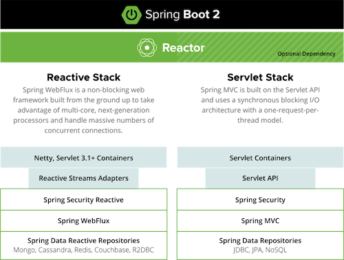

해당 포스팅은 Spring Webflux에 대한 짤막한 소개와 Netty, Reactor를 넘어서 Spring Webflux에 대한 자세히 다룬다. 

## Spring Reactive Stack

1편에서 봤던 Spring Reactive Stack을 다시 살펴보자.



그림만 봐서는 잘 모르겠다.

#### WebFluxAutoConfiguration

WebFluxAutoConfiguration은 SpringWebflux 사용을 위한 필수적인 AutoConfiguration이다.

아래 코드를 보자.

```java
@AutoConfiguration(after = { ReactiveWebServerFactoryAutoConfiguration.class, CodecsAutoConfiguration.class,
		ReactiveMultipartAutoConfiguration.class, ValidationAutoConfiguration.class,
		WebSessionIdResolverAutoConfiguration.class })
@ConditionalOnWebApplication(type = ConditionalOnWebApplication.Type.REACTIVE)
@ConditionalOnClass(WebFluxConfigurer.class)
@ConditionalOnMissingBean({ WebFluxConfigurationSupport.class })
@AutoConfigureOrder(Ordered.HIGHEST_PRECEDENCE + 10)
public class WebFluxAutoConfiguration {
    // ..생략
}
```

@AutoConfiguration의 after를 보면 ReactiveWebServerFactoryAutoConfiguration이 있다.

해당 클래스를 들여다 보자.

```java
@Import({ ReactiveWebServerFactoryAutoConfiguration.BeanPostProcessorsRegistrar.class,
		ReactiveWebServerFactoryConfiguration.EmbeddedTomcat.class,
		ReactiveWebServerFactoryConfiguration.EmbeddedJetty.class,
		ReactiveWebServerFactoryConfiguration.EmbeddedUndertow.class,
		ReactiveWebServerFactoryConfiguration.EmbeddedNetty.class })
public class ReactiveWebServerFactoryAutoConfiguration
```

내부적으로 EmbeddedTomcat, EmbeddedJetty, EmbeddedUndertow, EmbeddedNetty를 Import한다.


해당 클래스를 보면 @ConditionalOnClass로 인해서 기본적으로 EmbeddedNetty만 빈으로 등록된다.


EmbeddedNetty가 등록되면 NettyReactiveWebServerFactory를 빈으로 등록하는 것을 볼 수 있다.

해당 코드를 보자.

```java
import reactor.netty.http.HttpProtocol;
import reactor.netty.http.server.HttpServer;

public class NettyReactiveWebServerFactory extends AbstractReactiveWebServerFactory {
    @Override
    public WebServer getWebServer(HttpHandler httpHandler) {
        HttpServer httpServer = createHttpServer();
        ReactorHttpHandlerAdapter handlerAdapter = new ReactorHttpHandlerAdapter(httpHandler);
        NettyWebServer webServer = createNettyWebServer(httpServer, handlerAdapter, this.lifecycleTimeout,
                getShutdown());
        webServer.setRouteProviders(this.routeProviders);
        return webServer;
    }
}
```

import를 보면 **Reactor Netty**로 부터 제공받은 HttpServer로 ReactorHttpHandlerAdapter를 만든다. 최종적으로는 NettyWebServer를 만들게 된다.

앞서서 Netty와 Project Reactor를 학습했었다. Reactor Netty는 무엇일까?

## Reactor Netty

Reactor Netty는 Reactor를 기반으로 Netty를 Wrapping한 라이브러리이다.

Reactor Netty는 아래의 장점을 제공한다.
- Netty의 높은 성능
- Reactor의 조합성, 편의성

아래 코드를 보자.

```java
Consumer<HttpServerRoutes> routesConsumer = routes ->
        routes.get("/hello", (request, response) -> {
            var data = Mono.just("Hello World!");
            return response.sendString(data);
        });

HttpServer.create()
        .route(routesConsumer)
        .port(8080)
        .bindNow()
        .onDispose()
        .block();
```

Reactor의 Publisher를 활용해서 요청을 처리할 수 있도록 구성되어 있다.

Spring Webflux는 Netty와 Reactor를 활용한 Reactor Netty 기반의 WebServer를 제공한다.

## ReactiveAdapterRegistry

Spring Webflux는 Reactor 뿐 아니라 RxJava, Mutiny, Coroutine도 모두 지원한다.

ReactiveAdapterRegistry에 ReactiveAdapter를 등록해서 사용한다.

아래 예시를 보자.

```java
ReactiveAdapter adapter = getAdapterRegistry().getAdapter(null, attribute);
Mono.from(adapter.toPublisher(attribute));
```

attribute로 RxJava의 Flowable이 들어온다고 가정할 시, adapter에 의해 Publisher로 변경된 후 Mono로 변경한다.

그래서 Spring Webflux 환경에서 ReactiveStreams의 Publisher 혹은 Reactor의 Mono나 Flux 기준으로 개발만 한다면, ReactiveAdapter를 통해서 여러 라이브러리를 지원할 수 있다.

