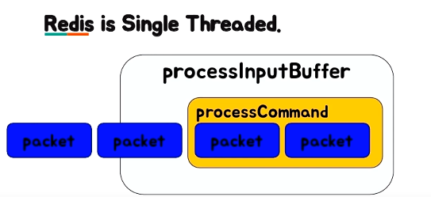

## Redis에 대해 제대로 알아보자

최근에 정보 공유를 하는 곳에서 Redis에 대한 얘기를 많이 들었다.
- Redis를 광적(?)으로 선호하고 만세를 외치시는 분들이 정말 정말 많다!
- 사기템, 만세, 짱짱, 충성, ...

Redis에 대해 이렇게 얘기하시는 분들도 많은 것 같다.
- 조금 큰 규모의 회사라면 대부분 Redis 터지면 서비스가 다 죽을 것이다.
- Redis가 없으면 문닫을 회사도 많다(?)

뭔가 이야기를 듣다보니깐 내가 잘 모르고 있구나.. 라는 것을 느꼈다. (미공감 ㅠ)

그래서 Redis에 대해 더 자세히 알아보자.

## Cxxpang Redis 사태

2019년 7월 24일에 쿠팡의 모든 판매 상품 재고가 '0'으로 표시되어 주문 및 구매를 할 수 없는 큰 장애가 일어난다.

사유는 해당 시스템이 Redis DB를 통해 데이터를 불러오는 과정에서 버그가 발생했다고 설명했다.

**Redis**는 **Remote Dictionary Server**의 약자이며 직역하면 **외부에 있는 Key-Value 값의 자료구조(Dictionary)를 저장하는 서버** 정도로 해석할 수 있다.

이때 Key-Value 형태에서 Key의 개수가 int의 범위를 넘어가면서 문제가 생긴 것이었다.

그래서 Redis 4.0.7에서 해당 이슈를 파악하고 Key Index 값을 int에서 long 타입으로 수정했다.
```diff
- static int _dictKeyIndex(dict *ht, const void *key, unsigned int hash, dictEntry **existing);
+ static long _dictKeyIndex(dict *ht, const void *key, unsigned uint64_t hash, dictEntry **existing);
```

## Redis

이제 Redis가 DB라는 것도 알고 Dictionary라는 자료구조를 사용하는 것도 알았다.

추가로 Redis는 In-memory Data Structure Store 서버이며 다양한 자료구조를 제공한다.

## 1차 저장소와 2차 저장소

Redis는 저장할 데이터가 정말로 휘발성인 경우에 1차 저장소로 사용할 수 있다. 이 경우 Redis가 터지면 저장한 데이터가 모두 날아간다.

Redis는 앞서 언급했듯 In-memory Data Structure Store 방식으로 메모리 안에 데이터를 저장해서 사용한다. 그래서 높은 처리 속도를 가지기 때문에 MySQL 같은 DB를 1차 저장소로 사용하고 Redis를 캐시를 용도로 하는 2차 저장소로 사용할 수도 있다.

이러한 특징 때문에 Redis는 나중의 요청에 대한 결과를 미리 저장했다가 빠르게 사용하는 Cache의 목적으로 주로 사용한다.

In-memory가 왜 처리 속도가 빠른지는 Memory Hierarchy 관련해서 찾아보길 바란다. 해당 포스팅에서는 생략 한다.

In-memory를 사용할 때의 특징을 간략 하게만 소개하면 아래와 같다.
- 적당히 빠르다. (여기서 적당히라고 말한 이유는 CPU Cache와 비교했을 때 느린 거지 HDD나 SSD와는 비교도 안될만큼 빠르다.)
- 적당히 크다.
- 휘발성이다.

## Java

그렇다면 In-memory DB가 꼭 필요할까?

```java
private final Map<String, Object> cache = new HashMap<>();
```

이렇게 해시맵을 구현해 데이터베이스로 사용해도 메모리 데이터베이스이다.

하지만 이럴 경우에 Consistency(일관성)의 문제가 발생한다. 즉, 서버가 여러 대일 경우 각 서버가 보관하는 데이터가 다를 수 있게 된다.

추가로 Race Condition이 발생할 수 있다. 즉, 여러 개의 쓰레드에서 하나의 Map을 사용하면서 이슈가 발생할 수 있다.
- Redis에서는 이런 문제를 해결하기 위해 기본적으로 Single Threaded 기반으로 동작한다.
  - 사실은 메인 쓰레드 1개와 별도의 시스템 명령을 사용하는 Sub Thread 3개가 존재하지만, 실제로 처리에 사용되는 쓰레드는 메인 쓰레드 1개라고 이해하면 된다.
- 추가로 Atomic Critical Section에 대한 동기화를 제공한다.
- 그래서 각 Transaction이 Read/Write를 동기화하면서 원치 않는 결과를 얻는 것을 방지한다.

## 주의할 점

Redis는 단순한 get/set이라면 초당 10만 TPS 이상이 가능할 정도로 빠르다. 하지만, 앞에서 언급했듯 Redis는 Single Thread 서버이므로 명령의 시간 복잡도를 고려해야 한다.



만 processCommand가 O(N)이 수행되는 Keys, Flush, Get all과 같은 명령이라면 뒤의 요청들이 병목이 발생할 수 있다.

추가로 In-memory DB 특성 메모리 파편화, 가상 메모리 등의 이해가 필요하다.

## 사용
Local cache
Redis cache
Redis pub/sub을 통해 변경된 내용에 대해 모든 사용자에게 전파

## 참고
- https://redis.io/docs/manual/client-side-caching/#what-to-cache
- https://www.youtube.com/watch?v=Gimv7hroM8A