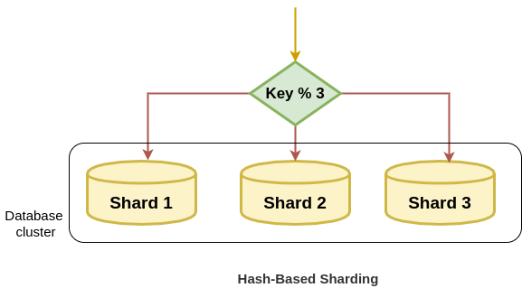
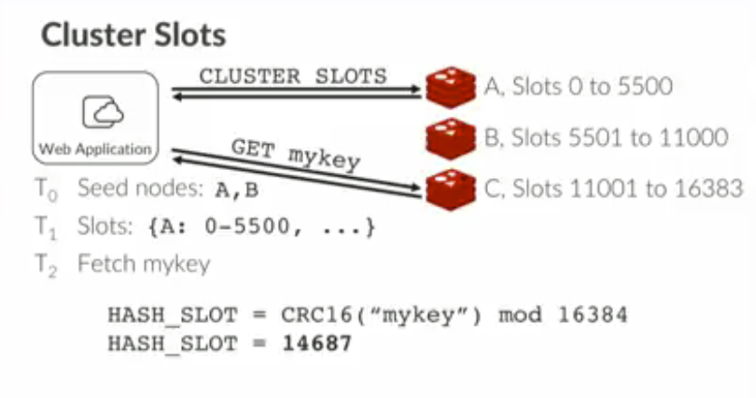
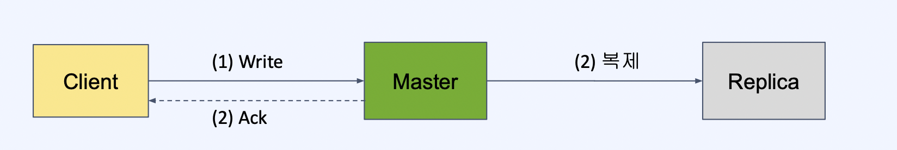
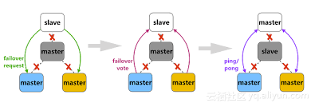

## 레디스 클러스터 이해하기

## Sharding

샤딩을 할 때 아래와 같이 Hash-Based Sharding을 사용할 수 있다.

문제는 위의 경우 샤드가 하나 늘어날 때마다 데이터들을 모두 다 전혀 다른 곳으로 이동(대격변)시켜야 한다.

레디스는 이러한 점을 해결하고자 HashSlot이라는 것을 사용하고 있다.

- Redis는 16384개의 Hash Slot으로 Key 공간을 나누어서 관리한다.
- 각 키는 CRC16 해싱 후 16384로 Modulo 연산을 하고 Hash Slot에 매핑한다.
- Hash slot은 각 노드들에게 나누어 분배한다.

이러한 과정으로 인해 새로운 샤드가 추가되더라도 모든 데이터가 영향을 받지 않고 Slot이 겹쳐지는 일부 샤드의 데이터만 옮겨주면 된다.

## Moved Error

클러스터 노드는 요청이 온 Key에 해당하는 노드로 자동으로 Redirect 해주지 않고 Moved Error를 발생한다.

클라이언트는 Moved Error를 받고 해당 노드로 다시 요청을 해야 한다.
- ex. `(error) MOVED 16000 127.0.0.1:7005`를 반환받고 해당 주소로 다시 요청하게 됨

클라이언트의 라이브러리가 Key값과 노드의 매핑 테이블을 캐싱하고 있기 때문에 이런 경우가 자주 발생하지는 않는다.

만약 클라이언트의 라이브러리가 구현이 잘 되어있는 환경이 아니라면 redirect를 직접 구현해야 한다.

## 데이터 일관성

Redis CLuster는 고성능과 확장성을 제공하지만, 적절한 수준의 데이터 안정성과 가용성을 유지하는 것을 목표로 설계되었다.

Redis Cluster는 Strong consistency를 제공하지 않는다.

높은 성능을 제공하기 위해 복제 이후에 응답을 보내는 것이 아니라, 응답과 동시에 비동기로 복제를 수행하기 때문에 복제가 완료되기 전에 master가 죽으면 데이터는 유실될 수 있다.

## 가용성

일부 노드(master)의 네트워크가 단절되더라도 과반수 이상의 master가 남아있고, 사라진 master의 replace가 있다면 클러스터는 failover된다.

이경우 해당 Master 노드는 스스로 error 상태로 빠지고, 더이상 write 요청을 받지 않게 된다.

결과적으로 해당 Master 노드의 Slave 노드 중 1개가 Master 노드로 승격하게 된다.

만약 Spring에서 Redis Cluster 환경을 구성했다면 해당과 같이 Fail over가 일어났을 때, yaml을 별도로 수정하지 않아도 Sentinal이나 Redis Cleint 라이브러리가 자동으로 승격한 새로운 Master 노드로 연결될 수 있게 된다.

## 제약

#### 1. Cluster에서는 DB0만 사용 가능하다.

- 싱글 Redis는 인스턴스에 여러 데이터베이스를 가질 수 있다.
- 클러스터에서는 해당 기능을 사용할 수 없고 DB0으로 고정된다.

#### 2. Multi key operation 사용이 불가능하다.

- Cluster 환경에서는 MSET과 같은 multi-key operation을 사용할 수 없다.
- 같은 노드 안에 속한 key들에 대해서는 multi-key operation이 가능
- hash tags를 사용해서 여러 key들이 같은 hash slot에 속하게 할 수 있음 (ex. MSET {user:a}age 20 {user:a}city seoul)

## 참고

- https://velog.io/@inhwa1025/Redis-Cluster-%EA%B5%AC%EC%A1%B0-Mesh-Sharding-Failover
- https://www.alibabacloud.com/blog/understanding-the-failover-mechanism-of-redis-cluster_594707