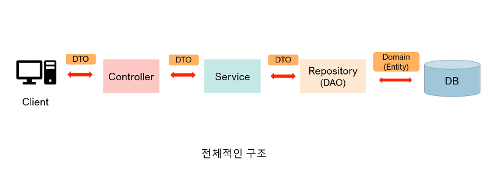
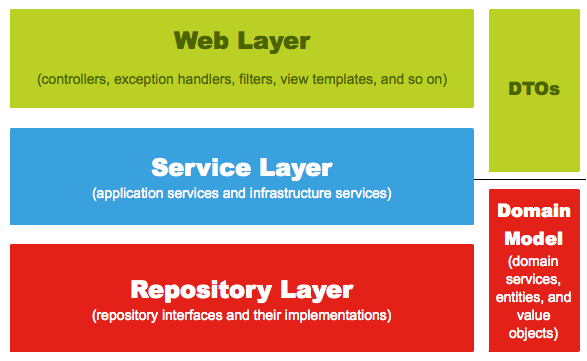

## 각 클래스에 맞는 파라미터 사용하기!

## 전통 MVC

아래는 전통적인 MVC 패턴의 아키텍처이다.

DTO 형태로 요청을 받아서 Controller, Service, Repository 등이 통신할 때 사용한다.

이게 정말 좋은 방식일까?

## 아키텍처

아키텍처 관점으로 봤을 때 Controller는 Service를 알아야 한다. 하지만 Service도 Controller를 알 필요는 없다.

각 계층은 자신보다 하위의 있는 계층을 사용하면 된다.

그런데 Controller를 위해 DTO를 자신의 계층에 맞게끔 사용한다면 Service또한 DTO를 통해 간접적으로 웹 계층에 의존하고 있다.

- 즉 DTO를 통해 모든 계층이 강하게 결합될 수 있다.

## 사용하지 않는 필드

Controller에서 필요한 Request, Response와 Service에서 필요한 Request, Response의 스펙이 엄연히 다를 수 있다.

예를 들어보자.

Controller에 입력으로 들어오는 객체는 User에 관한 정보는 사용하지 않을 것이다. 반면, Service에서는 유저의 정보가 반드시 입력으로 들어와야 한다.

Controller에서 사용했던 DTO와 유저 정보를 따로 Service에게 인자로 넘길 수 있다.

하지만 Clean Code에서는 가장 이상적인 메서드 파라미터는 0개, 많아야 1개가 적합하다고 말한다.
- 백기선님 코드 리뷰에서도 의미가 전혀 다른 것이 아니라면 완성된 객체 1개를 넘기는 게 객체 지향적으로 적합하다고 한다. 

정리하면 Controller에서 유저 정보들을 취합해서 Service에 맞는 Request 객체를 새로 만들어서 Service에 넘겨 주어야 한다.

설령 지금 당장은 Controller와 Service의 스펙이 같더라도 이는 요구사항이 많아지면서 수정에 대한 변화가 예측하지 못한 곳으로 전파될 수 있다. 이는 소프트웨어가 변화에 취약하게 만든다.

## 클린 아키텍처 

클린 아키텍처에서는 각자의 클래스가 자신이 필요한 파라미터를 받고, 결과를 반환해야 한다고 말한다.
- 추가로 각자의 계층 관점에서의 유효성 검증을 해야 한다.

Service를 수정을 했는데 Controller에도 영향을주고, Controller Spec을 수정했는데 Service에도 영향을 줄 수 있다면 잘못된 설계이다.

그래서 Controller에 맞는 Request, Response 객체가 필요하고, Service에 맞는 Request, Response 객체가 필요하다.

이런 작업은 처음에는 공수가 많이 들겠지만 유지보수하는 동안에는 분명히 빛을 발할 것이다.

## 멀티 모듈

추가로 멀티 모듈에서도 DTO를 하나로 사용하면 문제가 생긴다.

멀티 모듈에서는 Domain, Service, Controller가 각기 다른 모듈에서 존재할 수 있다.

이 경우 하나의 DTO를 사용하면 어떻게 될까..?

Domain 모듈, Service 모듈에도 DTO가 생기게 된다.

그리고 해당 모듈들은 Web 계층을 필요로 하지 않는다. 그렇기 때문에 일반적으로 직렬화나 역직렬화를 고려한 `@JsonIgnore`, `@JsonProperty` 애노테이션 등은 필요가 없고, 불필요한 의존성을 추가할 이유도 없다.

## 참고
- https://www.youtube.com/watch?v=Z1W53PcdbHo