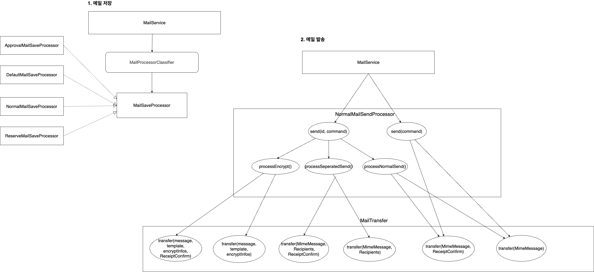
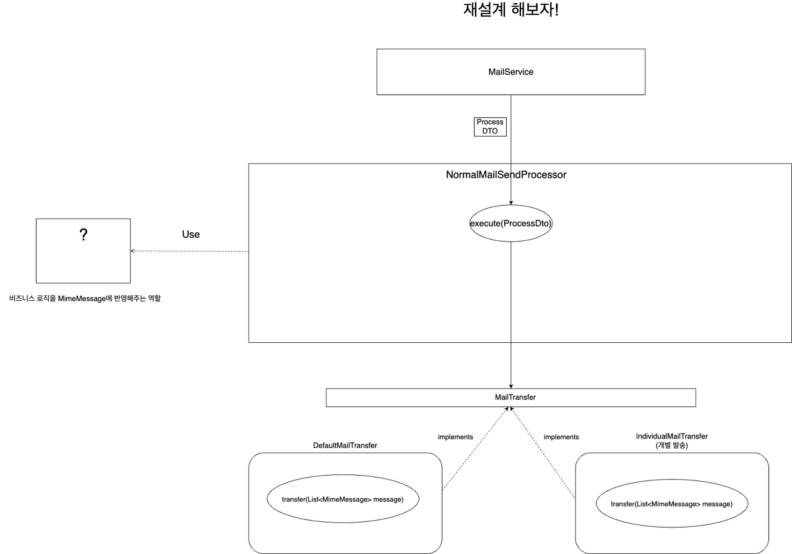
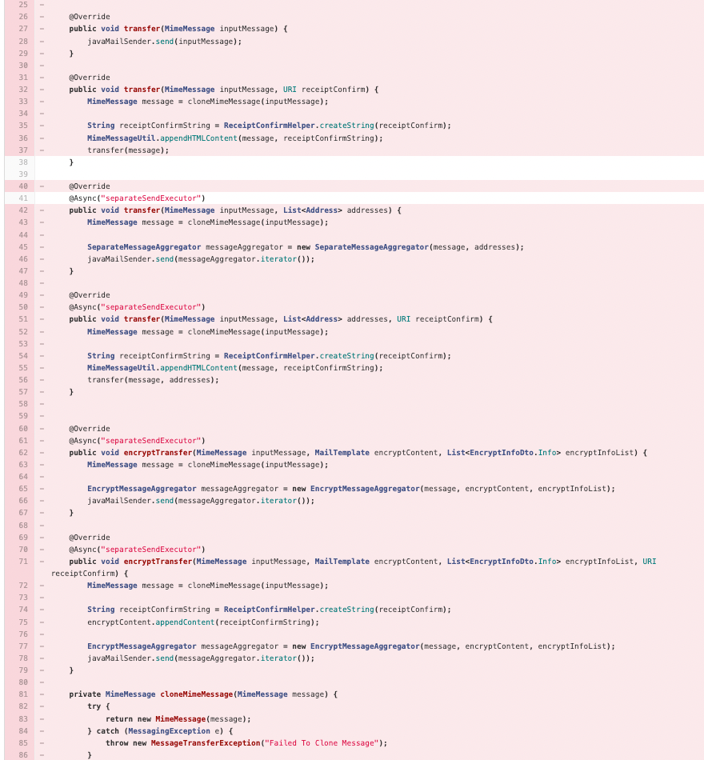

회사에서 동료들과 메일 서비스의 레거시 개편을 수행하고 있다.

- From. PHP CodeIgniter, To. Java SpringBoot

그런데 새롭게 오픈하는 API임에도 불구하고 레거시적인 측면이 있었다.

가장 복잡한 로직인 발송 로직이 가장 지저분하다. 그래서 구조를 정리해봤다!



메일 발송(+ 저장)에서는 복잡한 비즈니스 로직을 Processor 라고 부르는 클래스가 처리를 담당하고 있다.

- MailService에서는 SaveProcessor를 사용해서 메일을 저장한 후
- SendProcessor를 통해 메일을 발송한다.
    - SendProcessor는 MailTransfer를 호출해서 SMTP 서버로 메일을 발송한다.

## 절차적인 코드

해당 구조가 지저분하게 보이는 이유는 발송 프로세스 쪽에 있다.

- 로직 파악이 너무 어렵다.
    - send 메서드가 두개인데 무슨 차이인지 모르겠다. (내부적으로 하는 역할이 다르다.)
    - 위와 같이 정리된 설계도를 보면 이해가 조금.. 가능하지만 코드를 보면 정말 로직이 안보인다.
- 각 클래스의 책임이 모호하다.
    - SendProcessor와 Transfer의 책임의 경계가 없다.
    - 두 클래스가 강하게 결합되어 유연성이 떨어진다.
- 절차 지향적이다.
    - SendProcessor는 각 메서드가 자신에 맞는 MailTransfer의 메서드를 호출하고 있다.
    - 사실 상 큰 로직을 클래스를 많이 만들어서 분리한 것 밖에는 되지 않는다.
- 의미 없이 재정의한 메서드가 많다.

### 목표

그래서 아래의 **개선**을 목표했다!

- MailSendProcessor의 역할을 간소화 한다.
    - MimeMessage를 완성해서 Trasnfer를 호출하는 것 까지만 책임을 지자!
    - (기존에는 Transfer도 MimeMessage를 수정한다.)
- Transfer의 역할을 간소화 한다.
    - 실제로 메일을 SMTP로 발송하는 부분과 예외 처리만 담당한다.
- 필요 시 유틸성 클래스나 객체를 사용한다.
    - Transfer의 기존 책임을 MailSendProcess에 위임하면서 역할이 비대해지는 것을 방지
    - 비즈니스 로직을 MimeMessage에 반영하는 클래스

## 재설계

아래는 문제가 되는 발송 프로세스를 재설계한 것이다.



책임은 위에서 계획한 대로 분리했다.

- SendProcessor는 MimeMessage를 만드는 책임만 진다.
- Transfer는 실제로 메일을 발송하는 책임만 진다.
    - MimeMessage 이외의 파라미터는 가지지 않는다.

추가로 SendProcessor의 send() 메서드 2개를 병합했다.

- 기존에는 저장된 메일이 있는 지 여부에 따라서 send() 메서드를 따로 호출했다.

**send() 메서드 병합**

```java
optionalMailId.ifPresentOrElse(
        mailId -> mailSendProcessor.send(processCommand, mailId),
        () -> mailSendProcessor.send(processCommand));
}
```

해당 부분은 어떤 로직 상 차이가 있는지 밖에서 파악하기 힘들다.

- 저장된 메일이 없으면 암호 메일 / 승인 메일 / 예약 메일 등을 고려하지 않는다.

메서드명으로 비즈니스를 노출할 것이 아니라면 Process 내부에서 분기를 하는 것이 좋다고 생각했고, 실제로 괜찮은 방법인 것 같다. 그래서 분기를 제거하고 send()만 호출하도록 로직을 수정했다.

```java
mailSendProcessor.send(processCommand);
```

메일의 저장 여부나 Id의 같은 경우에는 ProcessCommand 안으로 넣었다.

- Processor에서 이를 확인하고 비즈니스를 처리

### Transfer에서 SendProcessor로 책임 옮기기

기존에는 SendProcessor의 메서드와 각 Transfer의 메서드가 강하게 결합되어 있었다.

책임이 명확하지가 않아서 SendProcessor의 로직을 건들 수가 없었다.

- MimeMessage를 만드는 부분을 SendProcessor, Transfer가 함께 수행함
- 로직 파악이 어렵고 강결합 때문에 로직 순서가 매우 중요하게 된다.

그래서 기존 Transfer의 메서드를 하나 빼고 싹다 제거했다.



그래서 코드가 아래와 같이 변경되었다.


기존에 `transfer()`에서 하던 역할(MimeMessage를 조작하 부분)은 MailSendProcessor가 담당하는 것이 맞다고 판단했다.

- SendProcessor에서 너무 책임이 많아지면 Util 클래스나 하위 모듈을 DI로 주입받아서 책임을 덜어준다고 생각

## SendProcessor

아래는 MailSendProcessor의 기존의 로직이다.

```java
public void send(MailProcessDto.Send command, Long mailId) {
    Mail mail = mailReader.getMail(office.getNo(), mailId);
    MimeMessage message = command.getMessage();
    boolean withReceiptConfirm = command.isRequiredReceiptConfirm();

    // 암호 메일인 경우
    if (command.isRequiredEncrypt()) {
        processEncrypt(office, mail, message, withReceiptConfirm);
        return;
    }

    // 개인별 보내기인 경우
    if (command.isRequiredSeparatedSend()) {
        processSeparatedSend(office.getNo(), mail, message, withReceiptConfirm);
        return;
    }

    processNormalSend(office.getNo(), mail, message, withReceiptConfirm);
}


public void send(MailProcessDto.Send command) {
    MimeMessage message = command.getMessage();

    if (command.isRequiredSeparatedSend()) {
        List <Address> allRecipients = MimeMessageUtil.getDistinctRecipients(message);
        mailTransfer.transfer(message, allRecipients);
        return;
    }

    mailTransfer.transfer(message);
}
```

리팩토링 이후에는 아래와 같이 변경되었다. Transfer가 Message에 관여하는 부분을 MailSendProcessor에 옮길 수 있었다.

(참고로 MailTransfer가 책임 지던 부분은 private method에서 담당하고 있다.)

```java
public void send(Office office, MailsendCommand sendCommand) {
    MimeMessage message = sendCommand.getMessage();
    sentEvent(office, message);
    addAuthInfoHeader(message);

    if(sendCommand.wasSavedMail()) {
        Mail mail = mailReader.getMail(office.getNo(), sendCommand.getSavedMailId());

        if(sendCommand.isRequiredReceiptConfirm()) {
            attachReceiptConfirm(message, office.getNo(), mail);
        }

        if (sendCommand.isRequiredEncrypt()) {
            Iterator<MimeMessage> encryptMessages = getEncryptMessages(office, mail, message);
            mailTransfer.transfer(encryptMessages);
            return;
        }

   }

    if (sendCommand.isRequiredSeparatedSend()) {
        Iterator<MimeMessage> separatedMessages = getSeperatedMessages(message);
        mailTransfer.transfer(separatedMessages);
        return;
    }

    mailTransfer.transfer(message);
}
```

하지만 여전히 해결되지 않은 문제가 있다.

send() 메서드에서 mailTransfer.transfer()를 호출하는 부분이다.

- mailTransfer.transfer()가 호출되는 시점이 3개나 존재한다.
- 로직을 확인해보니 Iterator 때문이었다.

**Iterator**를 사용하면서 아래 문제가 발생하고 있었다.
- 비즈니스 로직을 조합할 수 없었다.
    - 비즈니스 로직의 Input: MimeMessage, Output: Iterator<MimeMessage>가 되어버리니까 비즈니스 로직을 조합할 수 없게 된다.
    - 암호 메일을 발송할 때는 본문을 전부 갈아엎어야 하기 때문에 MimeMessage에 반영했던 내용들이 전부 날라간다.
- 결과적으로 Iterator를 반환하는 모든 메서드에서 중복된 로직을 열심히 붙여줘야했다.
    - 각 비즈니스 로직에서 암호 메일 / 예약 메일 / 승인 메일 / 개별 발송 등을 중복으로 처리해야 함
    - 로직 순서가 매우 중요하게 되었다..! (먼저 수행할 로직에 따라 비즈니스를 중복으로 적용할 수 있었다.)
        - (로직을 변경하거나 확장하기가 너무 무섭다..)

### Iterator

그러면 Iterator를 안쓰면 되지 않을까..?

List를 사용한다면 충분히 MailSendProcessor를 아래의 형태로 바꿀 수 있었다.

1.  비즈니스 규칙에 맞게 메시지 List를 빌드한다.
    - 개별 발송 반영 (Input: MimeMessage, Output: List<MimeMessage)
    - 암호 메일 반영 (Input: List<MimeMessage>, Output: List<MimeMessage>)
    - 수신 확인 태그 반영 (Input: List<MimeMessage>, Output: List<MimeMessage>)
2.  즉, MimeMessage를 필요한 만큼 만들고, 모든 발송 대상 MimeMessage에 순차대로 비즈니스를 반영해주면 된다.

하지만 성능 상 이슈가 있다. 비즈니스 중에 사용자 1명이 300명에게 메일을 개별로 발송하는 기능이 있다.

- Iterator를 사용하지 않으면 MimeMessage 300개가 Heap(Memory)에 올라가게 된다.

이런 **메모리 사용량**이 높아지는 것을 방지하고자 Iterator를 사용한다.


SMTP 서버와 Connection을 맺은 후 **원본을 기준으로 메시지를 하나씩 빌드**하고 **발송**한다.

그래서 Iterator는 유지를 해야 하는 것이 맞았다.

### Iterator 이후에 입혀야 하는 로직

암호 메일을 발송할 때는 기존 본문을 전부 갈아 치운다. 이때 기존에 본문에 추가했던 수신 확인 태그가 날라가는 현상이 발생했다.

이를 해결하기 위해서는 암호 메일 처리 **Iterator.next()** 이후에 수신 확인 태그를 본문에 붙여야 했다.

- 로직이 중복으로 적용되지 않도록 분기 필요
    - MimeMessage에 로직을 적용한 이후
    - Iterator.next() 이후에는 적용한 부분이 날라감
- 로직을 여러 클래스에서 중복해서 가지지 않도록 처리가 필요
    - SendPrcessor, Iterator(?)
- 해결할 수 있는 방법이 없을까..? (Iterator.next() 이후에 로직을 실행 시키면서..)

나는 이 문제를 **Decorator**로 해결했다!

Decorator를 선택한 이유가 Iterator.next() 직후에 로직 적용이 필요했기 때문이다. 그래서 프록시 방식인 Decorator를 사용하기 적합했다고 생각했다.

```java
@RequiredArgsConstructor
public class ReceiptConfirmDecorator implements Iterator<MimeMessage> {
    private final Iterator<MimeMessage> iterator;
    private final ReceiptConfirmProcess receiptConfirmProcess;
    private final String certKey;

    @Override
    public boolean hasNext() {
        return iterator.hasNext();
    }

    public MimeMessage next() {
        MimeMessage message = iterator.next();
        receiptConfirmProcess.attachReceiptConfirm(message, certKey);
        return message;
    }

}
```

ReceiptConfirmProcess라는 이름의 클래스를 만들고 책임을 위임해서 로직이 중복되는 것을 방지했다.

```java
if(sendCommand.isRequiredReceiptConfirm()) { 
    URI receiptConfirmUri = receiptConfirmProcess.createReceiptConfirm(mail);
    individualMessages = new ReceiptConfirmDecorator(individualMessages,\
        receiptConfirmProcess, mail.getCertKey());
}
```

결과적으로 MailSendProcess가 아래의 코드가 되었다.

```java
@Override
public void send(MailSendCommand sendCommand) {
    MimeMessage message = sendCommand.getMessage();
    sentEvent(office, message);
    addAuthInfoHeader(message);

    if (sendCommand.isRequiredSeparatedSend()) {
        individualSend(message, sendCommand);
    } else {
        send(message, sendCommand);
    }

}

private void individualSend(MimeMessage message, MailSendCommand sendCommand) {
    Mail mail = sendCommand.wasSavedMail() ?
            mailReader.getMail(office.getNo(), sendCommand.getSavedMailId()) : null;
  
    Iterator<MimeMessage> individualMessages; = getSeperatedMessages(message);

    if(sendCommand.isRequiredEncrypt()) {
        individualMessages = new EncryptDecorator(individualMessages, encryptProcess, mail.getCertKey());
    }

    if(sendCommand.isRequiredReceiptConfirm()) {
        URI receiptConfirmUri = receiptConfirmProcess.createReceiptConfirm(mail);
        individualMessages = new ReceiptConfirmDecorator(individualMessages, receiptConfirmProcess, mail.getCertKey(), receiptConfirmUri);
    }

    mailTransfer.transfer(individualMessages);
}
```

복잡했던 로직이 그나마 한눈에 볼 수 있도록 어느정도 정리가 되었다.

- 기존의 send() 메서드에서 세 곳에서 transfer()를 호출 후 return 하는 부분이 한 곳에서만 수행하도록 되었다.
- 메시지를 전체 빌드한 후 한번에 전송하게 되었다.
- SendProcessor와 Transfer의 책임이 분리되었다.

### 미해결된 문제

- 비즈니스 요구사항을 담지 않고 isRequiredReceiptConfirm(), isRecuiredEncrypt() 메서드를 호출하는 부분..
    - Applier에서 RequestPayload와 Office 설정, User 설정을 조회해서 조합한 후 암호 메일 여부나 승인 메일 여부를 파악함
        - sendCommand를 반환 (isRequired, ...를 소유)
    - SendProcessor에서는 비즈니스 로직을 모르는 채 isRequired...만 보고 절차적으로 작업을 진행
- 해당 부분의 경우 나중에 리팩토링을 해봐야겠다! 

### 참고

- [https://sabarada.tistory.com/60](https://sabarada.tistory.com/60)
- [https://velog.io/@gmtmoney2357/%EB%94%94%EC%9E%90%EC%9D%B8-%ED%8C%A8%ED%84%B4-%ED%94%84%EB%A1%9D%EC%8B%9C-%ED%8C%A8%ED%84%B4Proxy-Pattern-%EB%8D%B0%EC%BD%94%EB%A0%88%EC%9D%B4%ED%84%B0-%ED%8C%A8%ED%84%B4Decorator-Pattern](https://velog.io/@gmtmoney2357/%EB%94%94%EC%9E%90%EC%9D%B8-%ED%8C%A8%ED%84%B4-%ED%94%84%EB%A1%9D%EC%8B%9C-%ED%8C%A8%ED%84%B4Proxy-Pattern-%EB%8D%B0%EC%BD%94%EB%A0%88%EC%9D%B4%ED%84%B0-%ED%8C%A8%ED%84%B4Decorator-Pattern)