이번 포스팅은 회사에서 메일 원문 다운로드 API를 개발하면서 생긴 이슈에 대해 공유한다.

이해하기 쉽도록 메일 원문 대신 **첨부 파일**로 재해석해서 작성했다.

> 요즘은 파일 스토리지로 외부 인프라를 많이 사용해서 직접 설계해야 되는 상황이 드물긴 하다. 

## 파일 접근

게시판의 첨부파일 기능을 생각해보자.

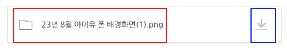

메타 데이터에는 빨간 네모와 같이 파일명과 확장자, 파일 사이즈, 다운로드 경로 등이 저장될 것이다. 다운로드를 클릭하면 실제 파일 스토리지에 접근해서 파일을 Binary 형태로 가져올 것이다.

게시판을 노출하기 위해서 메타 데이터를 가져올 때 파일 정보까지 모두 가져오면 오버헤드가 발생할 것이다. 그래서 2개의 End-point로 분리했다.

## Accept

REST API에서는 url에 자원에 대한 경로를 지정한다.

아래의 예시를 보자.
- GET /boards/:boardId/attachments/:attachmentId
- POST /board/:boardId/attachments/:attachmentId/download

좋아보일 수도 있지만 **REST API**에서 **좋은 설계는 아니다.** url에 행위에 대한 설명이 들어있기 때문이다.
- 참고: https://meetup.nhncloud.com/posts/92

REST API에서는 **헤더를 활용**하기를 권장한다.
- GET /boards/:boardId/attachments/:attachmentId
- GET /boards/:boardId/attachments/:attachmentId Accept: application/octet-stream

**Accept 헤더**에 `application/octet-stream`을 넣으면 **해당 포맷의 데이터로 응답해달라**는 뜻이다.

## 예시 코드

아래는 스프링 애플리케이션에서 해당 요구사항을 적용한 예시이다.

```java
@RestController
@RequestMapping("/attachments")
class AttachmentController {

    @GetMapping("/{attachmentId}")
    public ResponseEntity<Attachment> getAttachmentMeta(@PathVariable String attachmentId) {
        Attachment attachment = new Attachment(attachmentId, "test.img", "/path");
        return ResponseEntity.ok(attachment);
    }

    @GetMapping(value = "/{attachmentId}", produces = MediaType.APPLICATION_OCTET_STREAM_VALUE)
    public ResponseEntity<Resource> getAttachmentData(@PathVariable String attachmentId) throws IOException {
        InputStream is = new FileInputStream(getFile(attachmentId));
        Resource resource = new InputStreamResource(is);
        return ResponseEntity.ok(resource);
    }
}
```

실제로 요청을 해보면 아래와 같이 **JSON** 형태의 메타 데이터 응답이 잘 나온다.


아래와 같이 Accept 헤더를 넣었을 때도 **바이너리 데이터**가 잘 나오는 것을 확인할 수 있었다.

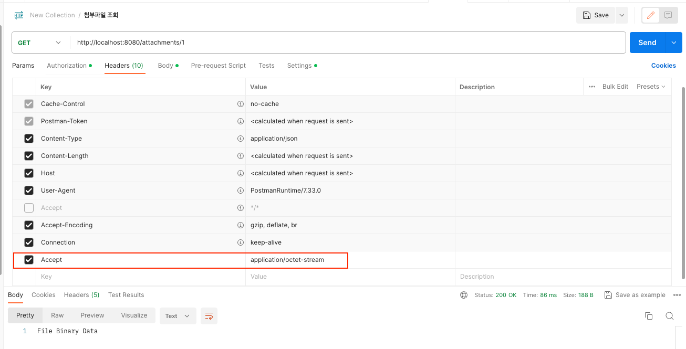

## 에러 핸들링 문제

그런데 **에러 처리**가 되면 어떻게 될까? 각 컨트롤러 메서드에 아래 부분을 추가했다.

```java
if(attachmentId.isEquals("1")) {
    throw new RuntimeException();
}
```

메타 데이터 조회의 경우 잘 핸들링이 되었지만

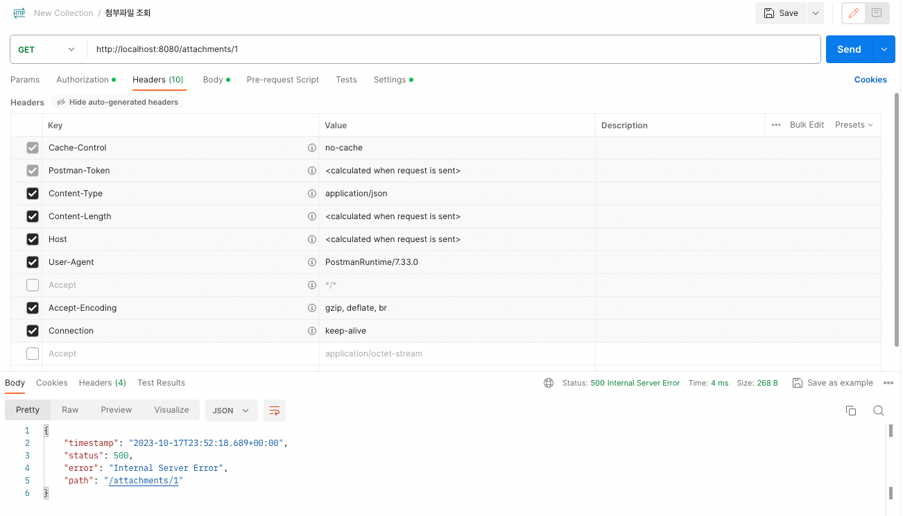

아래와 같이 파일 데이터 조회의 경우 **응답 Payload가 전혀 없었다.**

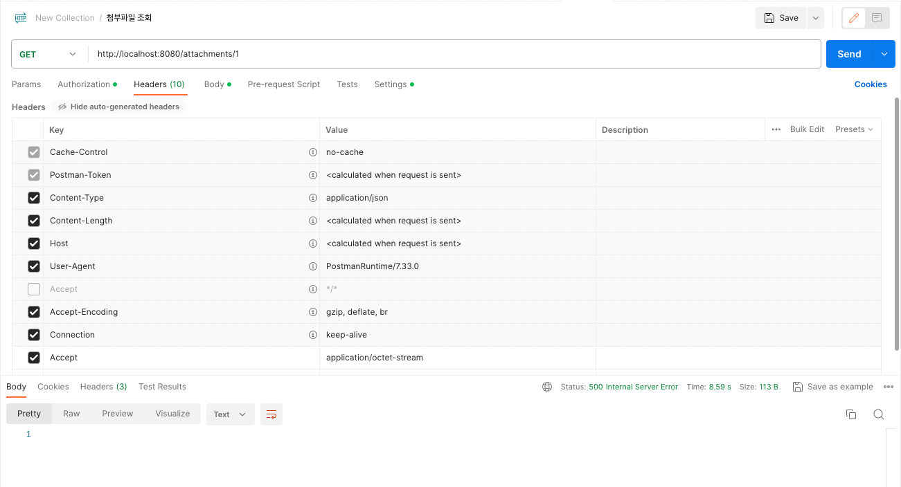

'PostMan의 문제가 아닐까..?' 생각했지만 아래와 같이 **서버에서 내려주는 Content-Length가 0**이었다.

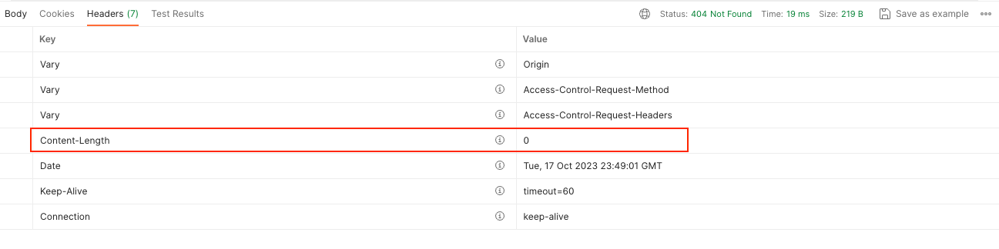

## AbstractMessageConverterMethodProcessor

위 두 가지 End-point를 각각 호출 후 디버깅한 결과 아래 사실을 알 수 있었다.

`Accept`가 `*/*` 또는 `application/json`으로 보낸 경우에는 `AbstractMessageConverterMethodProcessor`의 `writeWithMessageConverters` 동작 중 `compatibleMediaTypes`의 size가 2가 나와서 예외가 터지지 않았다.

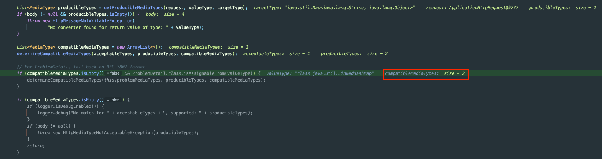

`compatibleMediaTypes`는 아래와 같았다.

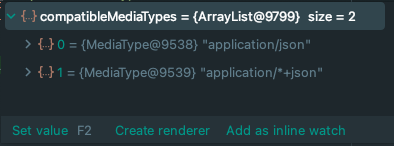

결과적으로 아래와 같이 **Body에 에러 메시지를 쓰고** **flush** 할 수 있었다.

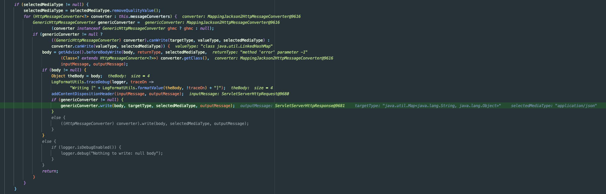

## Accept: application/octet-stream

`Accept: application/octet-stream`으로 요청을 보낸 것을 디버깅 한 결과 `compatibleMediaTypes`가 비어있어서 예외가 터지고 Body에 데이터를 쓰지 못했다.

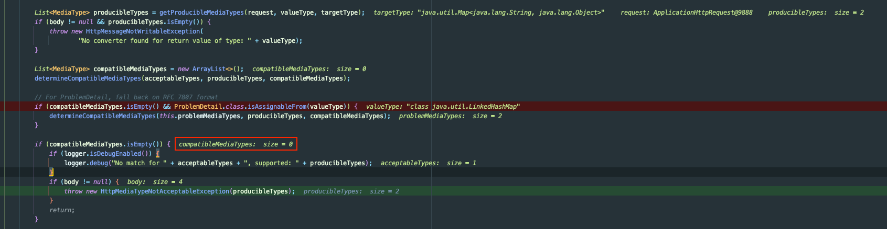

`compatibleMediaTypes`는 `Accept` 헤더로 들어온 값 (`application/octet-stream`)이 **Body 데이터와 호환 되는 타입**의 리스트ㅎ 반환한다. 

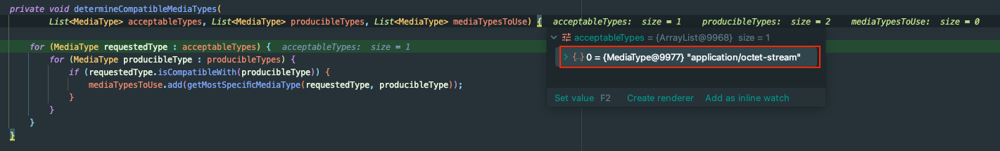

즉, `application/octet-stream`으로 **Body를 나타낼 수 없다고 판단**했기에 Spring이 데이터를 내려주지 않은 것이다.

## 해결 - application/problem+json를 추가

`Accept` 헤더는 복수 개를 명시할 수 있다. 여기서 `application/problem+json`을 사용한다면 이를 해결할 수 있다.
- `+`는 RFC 6838에서 지원하는 `suffix`이며 MediaType의 기본 구조를 지정한다.
- `problem` 뿐 아니라 Custom한 다른 용어를 사용해도 정상적으로 동작한다.

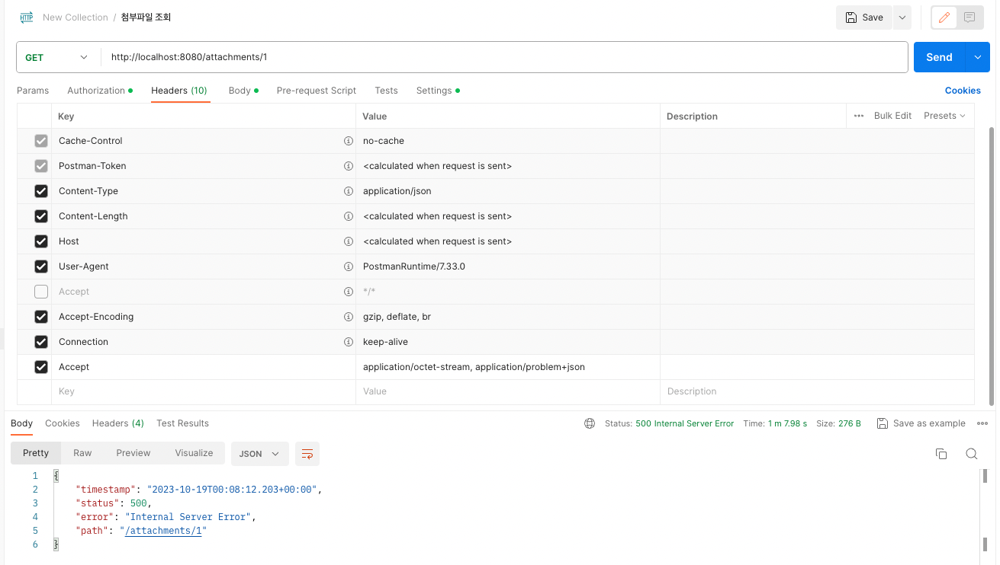

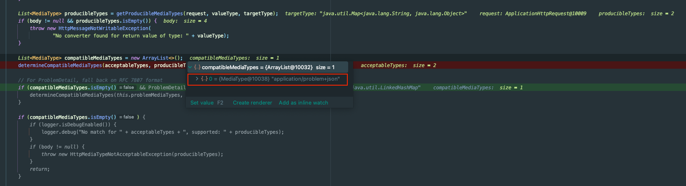

`application/problem+json`은 RFC 7807의 스펙이며, `application/json`과 호환된다.

Accept에 정상적일 때 받을 동작과, 에러 메시지로 받을 형식을 둘다 명시해서 에러 메시지도 API가 내려줄 수 있도록 정보를 전달해서 해결할 수 있었다.

## 참고

- https://meetup.nhncloud.com/posts/92
- https://datatracker.ietf.org/doc/html/rfc6838
- https://datatracker.ietf.org/doc/html/rfc7807