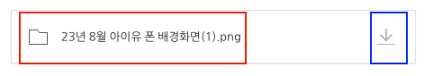
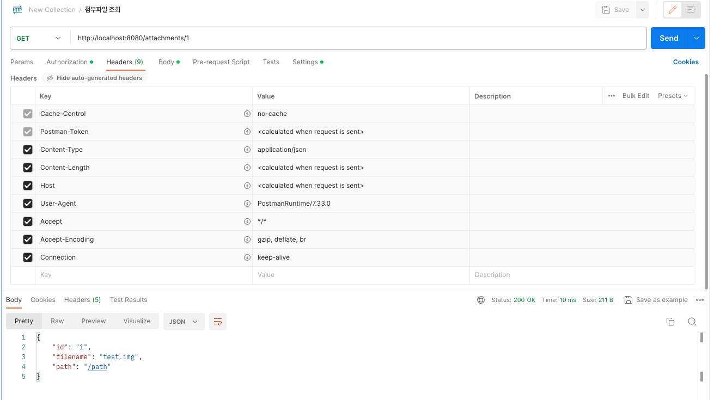
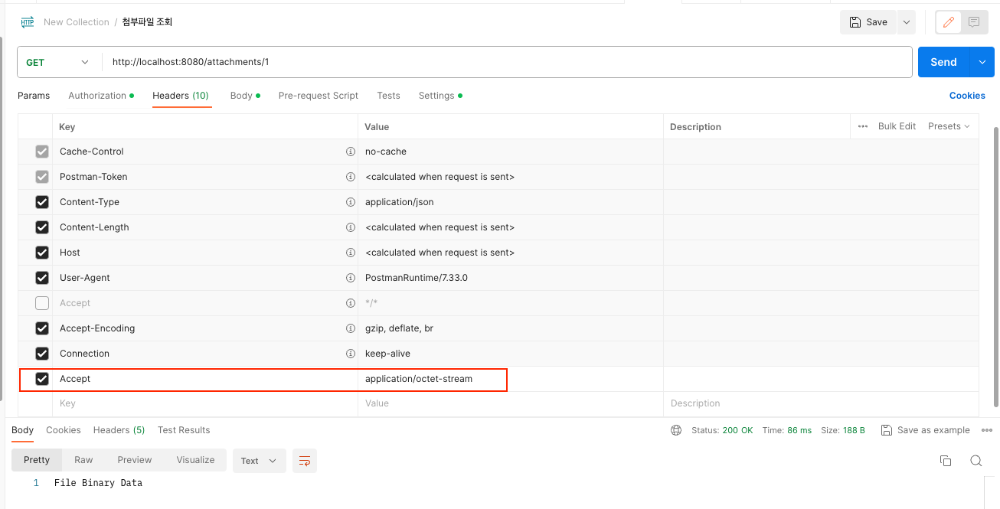
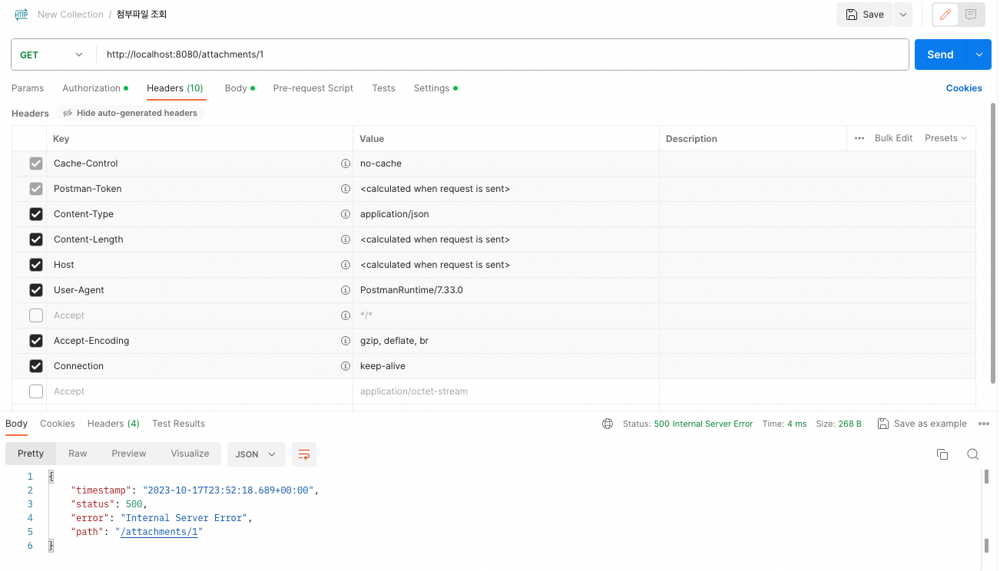
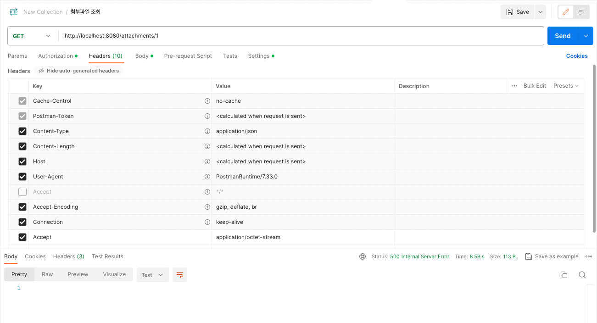
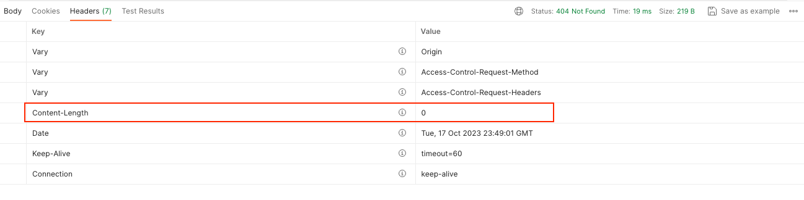

회사에서 개방하던 메일 원문 다운로드 API를 개발하면서 생긴 이슈에 대해 공유한다.

해당 포스팅에서는 이해하기 쉽도록 메일 원문 대신 **첨부 파일**로 재해석해서 작성한다.

> 요즘은 파일 스토리지로 외부 인프라를 많이 사용해서 직접 설계해야 되는 상황이 드물긴 하다. 

## 파일 접근

게시판의 첨부파일 기능을 생각해보자.



메타 데이터에는 빨간 네모와 같이 파일명과 확장자, 파일 사이즈, 다운로드 경로 등이 저장될 것이다. 다운로드를 클릭하면 실제 파일 스토리지에 접근해서 파일을 Binary 형태로 가져올 것이다.

게시판을 노출하기 위해서 메타 데이터를 가져올 때 파일 정보까지 모두 가져오면 오버헤드가 발생할 것이다. 2개의 End-point로 분리해야 할 수 있다.

## Accept

REST API에서는 url에 자원에 대한 경로를 지정한다.

아래의 예시를 보자.
- GET /boards/:boardId/attachments/:attachmentId
- POST /board/:boardId/attachments/:attachmentId/download

좋아보일 수도 있지만 REST API에서 좋은 설계는 아니다. url에 행위에 대한 설명이 들어있기 때문이다.
- 참고: https://meetup.nhncloud.com/posts/92

REST API에서는 헤더를 활용하기를 권장한다.
- GET /boards/:boardId/attachments/:attachmentId
- GET /boards/:boardId/attachments/:attachmentId Accept: application/octet-stream

Accept 헤더에 `application/octet-stream`을 넣으면 **해당 포맷의 데이터로 응답해달라**는 뜻이다.

## 예시 코드

아래는 해당 요구사항을 그대로 적용한 예시이다.

```java
@RestController
@RequestMapping("/attachments")
class AttachmentController {

    @GetMapping("/{attachmentId}")
    public ResponseEntity<Attachment> getAttachmentMeta(@PathVariable String attachmentId) {
        Attachment attachment = new Attachment(attachmentId, "test.img", "/path");
        return ResponseEntity.ok(attachment);
    }

    @GetMapping(value = "/{attachmentId}", produces = MediaType.APPLICATION_OCTET_STREAM_VALUE)
    public ResponseEntity<Resource> getAttachmentData(@PathVariable String attachmentId) throws IOException {
        InputStream is = new FileInputStream(getFile(attachmentId));
        Resource resource = new InputStreamResource(is);
        return ResponseEntity.ok(resource);
    }
}
```

실제로 요청을 해보면 아래와 같이 메타 데이터 응답이 잘 나오고



아래와 같이 Accept 헤더를 넣었을 때도 바이너리 데이터가 잘 나오는 것을 확인할 수 있었다.



## 에러 핸들링 문제

그런데 에러 처리가 되면 어떻게 될까? 각 컨트롤러 메서드에 아래 부분을 추가했다.

```java
if(attachmentId.isEmpty()) {
    throw new RuntimeException();
}
```

메타 데이터 조회의 경우 잘 핸들링이 되었지만



실제 데이터 조회의 경우 아래와 같이 응답 Payload가 전혀 없었다.



PostMan의 문제가 아닐까..? 생각했지만 아래와 같이 서버에서 내려주는 Content-Length가 0이었다.




## 참고

- https://meetup.nhncloud.com/posts/92