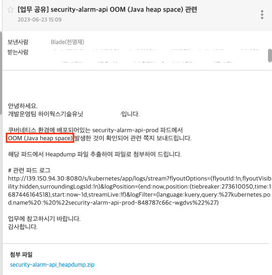
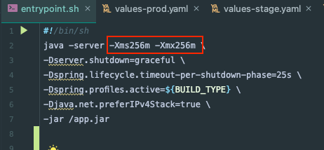
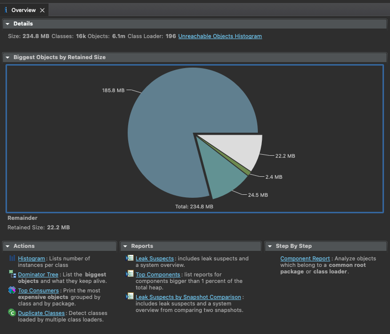
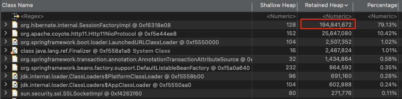
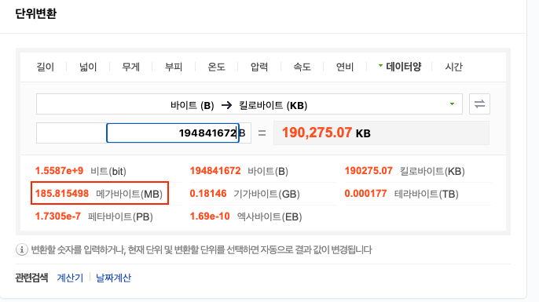
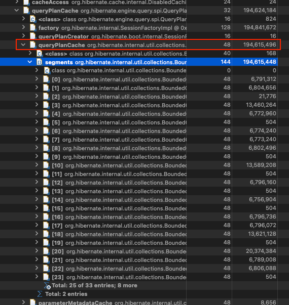
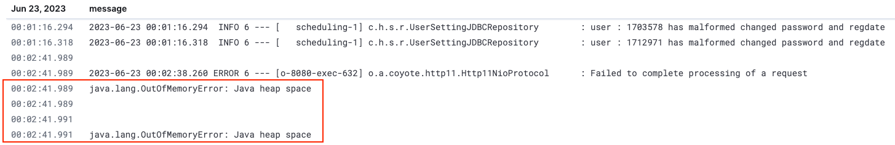
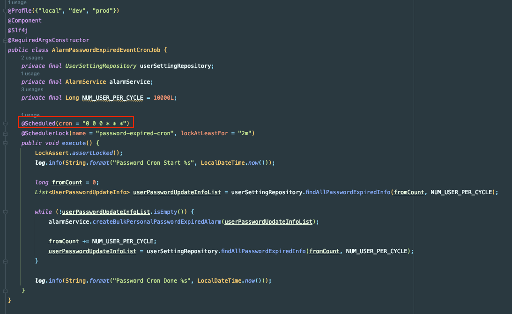
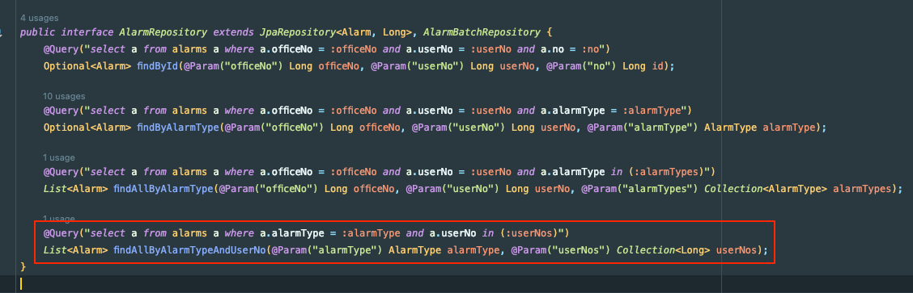

오늘 우리 팀에서 이전 퇴사자 분이 관리하시던 security-alarm-api에서 OOM 이 터졌다는 요청이 왔다.

그래서 팀에서 해당 API를 새로 실행했고, 원인을 찾기로 했다.

전달받은 힙 덤프와 해당 프로젝트를 다운받았다.

## HeapSize 확인

첫 번째로 살펴본 부분은 HeapSize였다.

놀랍게도 HeapSize가 256m 이었다. 일단 Size가 너무 적었기 때문에 누수가 아니라, 트래픽 급증 등이 원인일 수도 있겠다고 생각을 했다.

## HeapDump 확인

해당 HeapDump를 확인한 결과 185MB를 차지하는 부분이 있었다.

SessionFactoryImpl의 Retained Heap(연결된 오브젝트의 크기를 포함한 사이즈)의 byte를 MB로 환산해보니 185MB 정도 나왔다.

## queryPlanCache

SessionFactoryImpl 안에서도 queryPlanCache가 너무 큰 것을 확인할 수 있다.

Hibernate는 QueryPlanCache를 사용해서 파라미터와 반환값에 대한 정보를 저장하고, 모든 SQL 실행마다 Cache를 확인하여 Query Plain이 있는 지 확인한다. 없는 경우에만 Query Plan을 새로 생성한 후 캐시에 저장한다.
- 다행히 간단한 구글링으로도 쉽게 찾을 수 있었다.
- NHN 기술 블로그에 특히 잘 정리되어 있다. (https://meetup.nhncloud.com/posts/211)

## 문제가 되는 부분

OOM이 터진 시간은 00시 02분이며

해당 시간에는 Scheduler가 동작한다.

`alarmService.createBulkPersonalPasswordExpiredAlarm(userPasswordUpdateInfoList);` 를 타고 내려가보면

where in 절을 사용하는 메서드가 하나 나온다. (해당 프로젝트 내에서 in절을 사용하는 유일한 코드이다.)

해당 부분에 userNos에는 최초 조회한 최대 10000개의 userNo 리스트가 들어간다. 

## 해결 방법

해당 부분을 해결하기 위해서는 아래 방법을 적용할 수 있다.
1. in_clause_parameter_padding: true -> in 절을 2의 거듭제곱 단위로 Padding 처리한다.
2. plan_cache_max_size: {N} -> query Plan의 최대 개수 제한한다. 기본 값은 2048이다.
3. plan_parameter_metadata_max_size: {N} -> 캐시에 저장할 ParameterMetadata의 개수를 관리한다. 기본 값은 2048이다.

> 일반적으로 첫 번째 방법이 코드의 변경 없이 성능을 향상시킬 수 있는 좋은 방법이라고 한다.
> 
> 각각 true, 64, 64를 주면 문제를 해결되는 것 같다. 

그런데 사실 참고했던 블로그들 사례에서는 메모리가 최소 2GB부터 6GB 정도 되었다.

현재 Schedule에서 대상 유저 목록을 조회한 다음, where in 절에 유저를 10000명까지 넣고 있긴 하다. 즉, 해당 설명대로라면 QueryPlanCache 조정이 꼭 필요한 것이 맞다.

(TEMP)

## HeapSize 증량

그런데 사실 참고했던 블로그들 사례에서는 메모리가 최소 2GB부터 6GB 정도 된다.

그리고 API와 스케줄러가 붙어있는 형태라 해당 쿼리만 캐시로 저장되진 않는다.
- (다른 쿼리들도 많이 사용되므로 캐시에 해당 쿼리의 캐시가 여러개 쌓이진 않을 수 있음. 실제로 터진 시각도 크론 작업 직후)

그래서 우선 HeapSize를 512로 늘려보고 판단하는 것이 더 좋을 수 있을 것 같다.

## 참고

- https://shuiky.tistory.com/entry/java-heap-dump-%EB%B6%84%EC%84%9D
- https://hyos-dev-log.tistory.com/29
- https://meetup.nhncloud.com/posts/211
- https://www.baeldung.com/hibernate-query-plan-cache

