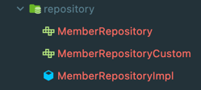
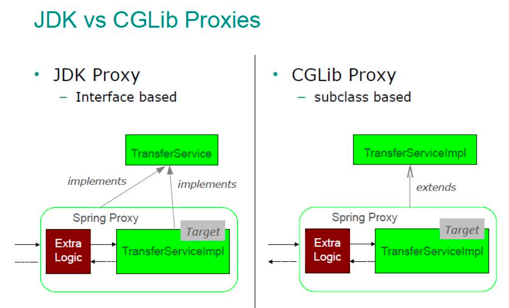
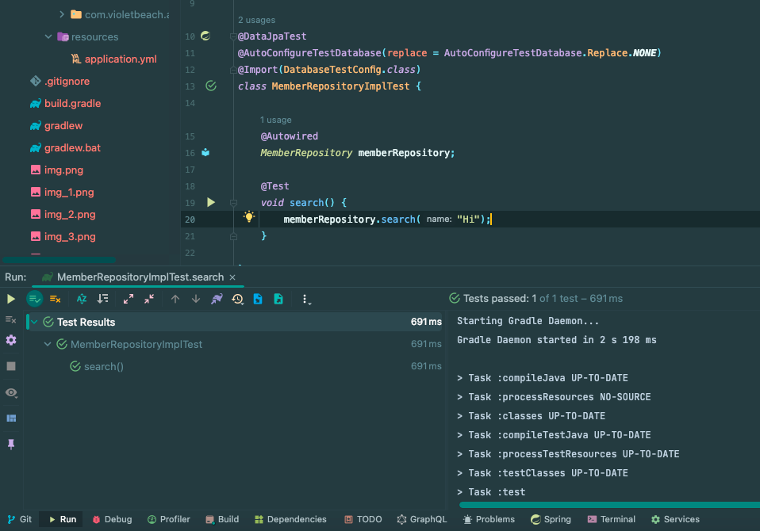
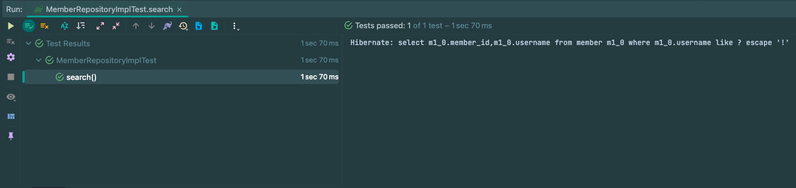
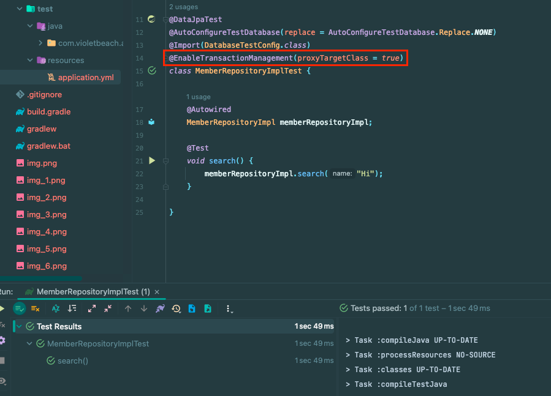
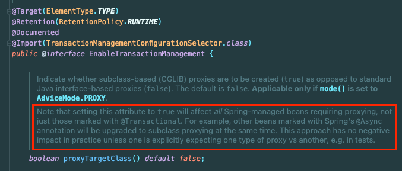
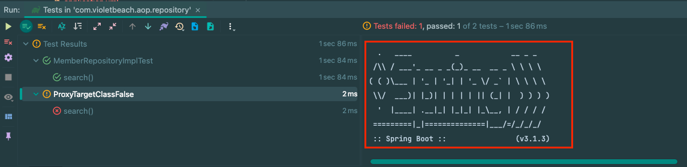
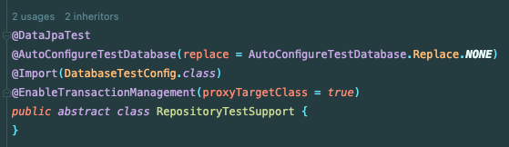
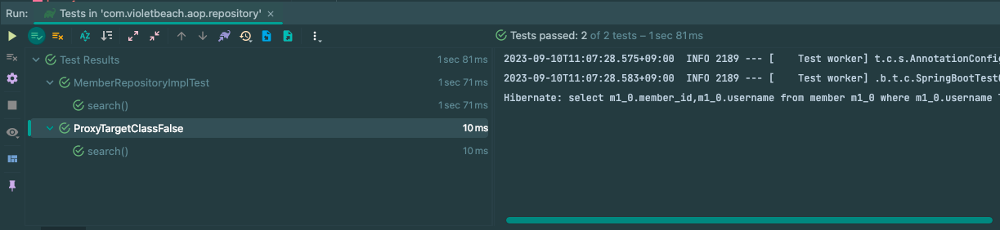

## 문제 상황

실무에서 `QueryDsl`을 사용한 `Repository`의 테스트 코드에서 에러가 터졌다.

문제를 이해하고 해결한 과정이 인상깊어서 소개하고자 한다.

아래 프로젝트는 소개를 위해 만든 프로젝트의 패키지 구조이다.



우리가 익히 아는 JPA + QueryDsl을 사용할 때 사용하는 패키지 구조이다.

QueryDsl을 사용하는 Repository는 아래와 같다.

```java
@Repository
@RequiredArgsConstructor
@Transactional(readOnly = true)
public class MemberRepositoryImpl implements MemberRepositoryCustom {
    private final JPAQueryFactory queryFactory;

    @Override
    public List<Member> search(String name) {
        return queryFactory
                .select(member)
                .from(member)
                .where(member.username.like(name))
                .fetch();
    }
}
```

아래는 실무에서 문제가 생겼던 테스트를 간소화한 것이다.

```java
@DataJpaTest
@AutoConfigureTestDatabase(replace = AutoConfigureTestDatabase.Replace.NONE)
@Import(DatabaseTestConfig.class)
class MemberRepositoryImplTest {

    @Autowired
    MemberRepositoryImpl memberRepositoryImpl;

    @Test
    void search() {
    }

}
```

`MemberRepositoryImpl`을 주입받지도 못하고 **테스트가 실패**한다.

뭐가 문제일까..?

## BeanNotOfRequiredTypeException

발생한 에러는 아래와 같다.

```
Error creating bean with name 'com.violetbeach.aop.repository.MemberRepositoryImplTest':
Unsatisfied dependency expressed through field 'memberRepositoryImpl':
Bean named 'memberRepositoryImpl' is expected to be of type 'com.violetbeach.aop.repository.MemberRepositoryImpl' but was actually of type 'jdk.proxy3.$Proxy106'
org.springframework.beans.factory.UnsatisfiedDependencyException:Error creating bean with name 'com.violetbeach.aop.repository.MemberRepositoryImplTest': Unsatisfied dependency expressed through field 'memberRepositoryImpl': Bean named 'memberRepositoryImpl' is expected to be of type 'com.violetbeach.aop.repository.MemberRepositoryImpl' but was actually of type 'jdk.proxy3.$Proxy106'
    at app//org.springframework.beans.factory.annotation.AutowiredAnnotationBeanPostProcessor$AutowiredFieldElement.resolveFieldValue(AutowiredAnnotationBeanPostProcessor.java:716)
    at app//org.springframework.beans.factory.annotation.AutowiredAnnotationBeanPostProcessor$AutowiredFieldElement.inject(AutowiredAnnotationBeanPostProcessor.java:696)
    at app//org.springframework.beans.factory.annotation.InjectionMetadata.inject(InjectionMetadata.java:145)
    at app//org.springframework.beans.factory.annotation.AutowiredAnnotationBeanPostProcessor.postProcessProperties(AutowiredAnnotationBeanPostProcessor.java:483)
    at app//org.springframework.beans.factory.support.AbstractAutowireCapableBeanFactory.populateBean(AbstractAutowireCapableBeanFactory.java:1416)
```

해당 에러를 해석하면 아래와 같다.

> 의존성을 주입받을 memberRepositoryImpl 빈이 MemberRepositoryImpl 타입일 것으로 기대했으나 jdk.proxy3.$Proxy106 입니다.


주입받을 빈의 타입이 일치하지 않는다는 내용이다. 

## AOP

문제를 해결하려면 `AOP`와 `Proxy`를 일정수준 이해해야 한다.

코드에서 `MemberRepositoryImpl`은 `@Transactional` 어노테이션으로 인해 `Spring AOP`는 `Java`언어 차원에서 제공하는 **자동 프록시 생성기**를 통해 **프록시 객체(JDK 동적 프록시, JDK 다이나믹 프록시)** 를 생성한다.

그리고 **실제 빈이 아니라 프록시 빈**을 등록한다.

### JDK Dynamic Proxy

**Spring AOP**는 기본적으로 **JDK Dynamic Proxy**를 사용한다.

`MemberRepositoryImpl`의 `@Transactional` 어노테이션으로 인해서 `Jdk Dynamic Proxy`가 빈으로 등록되었다.

`JDK Dynamic Proxy`는 다음의 특징을 가진다.
- 인터페이스를 구현한 클래스가 아니면 프록시 객체를 생성할 수 없다.
- 구체 클래스로는 빈을 주입받을 수 없고, 반드시 인터페이스로만 주입받아야 한다.

실제로 `@Transactional` 애노테이션만 제거하면 테스트가 정상적으로 통과한다.

### CGLib

`JDK Dynamic Proxy`는 **Interface를 구현하는 방식**으로 동작한다. 그래서 **Interface가 반드시 필요**하다.

스프링에서는 인터페이스가 없는 경우 `CGLib`이라는 **바이트 조작 라이브러리**를 사용해서 클래스 상속으로 프록시를 구현한다.



그래서 Interface를 구현하지 않는 클래스도 AOP 및 Proxy가 정상적으로 작동할 수 있다.

## 해결 방법

### 1. 인터페이스 주입

**AOP**와 **Proxy** 내용을 기반으로 다시 문제를 보고 해결해보자.

빈 주입이 실패한 이유는 `memberRepositoryImpl`은 `Interface`가 있으므로 `CGLib` 방식이 아닌 `JDK Dynamic Proxy` 방식으로 동작했으므로 **구체 클래스로 빈을 주입받을 수 없다.**

구체 클래스가 아니라 Interface로 빈을 주입받아 보자.



그러자 테스트가 성공한다.

인터페이스 주입을 하면 문제는 해결할 수 있지만 테스트 코드에서 **인터페이스를 상속하는 많은 구체 클래스**가 있는 경우 **어떤 구체 클래스를 테스트할 지**가 명확하지 않아지는 문제가 있다.

### 2. AOP 애노테이션 제거

`Jdk Dyanmic Proxy`로 감싸지 않는다면 문제를 해결할 수 있을 것 같다. 그래서 `AOP`로 프록시를 생성하는 `@Transactional` 애노테이션을 제거하거나 상위 클래스로 위임한다면 테스트가 성공할 수 있지 않을까? 

```java
@Repository
// @Transactional(readOnly = true)
public class MemberRepositoryImpl implements MemberRepositoryCustom {
    private final JPAQueryFactory queryFactory;

    public MemberRepositoryImpl(JPAQueryFactory queryFactory) {
        this.queryFactory = queryFactory;
    }

    @Override
    public List<Member> search(String name) {
        return queryFactory
                .select(member)
                .from(member)
                .where(member.username.like(name))
                .fetch();
    }
}
```



실제로 테스트가 통과했다.

하지만 **AOP를 유연하게 제어할 수 없게** 되므로 좋은 방법이라고 볼 수 없었다.

### 3. proxyTargetClass

스프링은 프록시를 구현할 때 기존처럼 `JDK Dynamic Proxy`으로 생성할 지 `CGLib`으로 생성할 지에 대한 옵션으로 `proxyTargetClass` 옵션을 제공한다. 

`proxyTargetClass`가 `true`면 CGLib 기반의 프록시를 생성한다. `proxyTargetClass`의 기본 값은 `false`이다.

해당 값을 `true`로 변경하려면 아래 프로퍼티를 적용하면 된다.

```properties
spring.aop.proxy-target-class=true
```

만약 스프링 앱에서 **특정 환경 전체**보다는 **특정 테스트 코드**에서만 값을 변경하고 싶다면 테스트 코드에 **해당 AOP 애노테이션**의 `proxyTargetClass`속성을 변경하면 된다.



아래 공식 문서를 보면 해당 속성을 설정하면 `@Transactional` 어노테이션 뿐만 아니라 `Proxy`가 필요한 모든 스프링 빈에 영향을 준다고 한다.



그래서 **Test Context를 재활용**하고 있는 경우에는 해당 속성을 변경한 것이 **Context 전체에 영향**을 줄 수 있다는 점을 주의해야 한다.

각 테스트의 `proxyTargetClass` 옵션이 다르면 아래와 같이 `Context`를 새로 띄운다.



예제 코드에서는 `@DataJpaTest`를 사용하고 있었고, 각 DB 별로 테스트 컨텍스트를 사용한다. 그래서 각 테스트가 상속받는 `super class`에서 속성을 일괄적으로 적용해서 1개 컨텍스트 내에서만 속성을 적용할 수 있었다.



결과 아래와 같이 `Context`를 새로 생성하지 않고 기존의 Context를 재활용할 수 있었다.



예제 코드는 아래에 있으니 참고하자.
- https://github.com/violetbeach/blog-code/tree/master/spring/aop

## 참고
- https://mangkyu.tistory.com/175
- https://minkukjo.github.io/framework/2021/05/23/Spring


