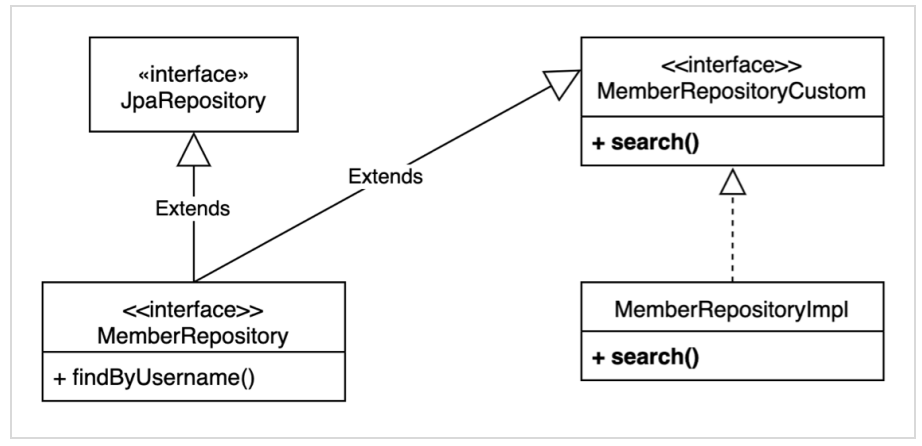
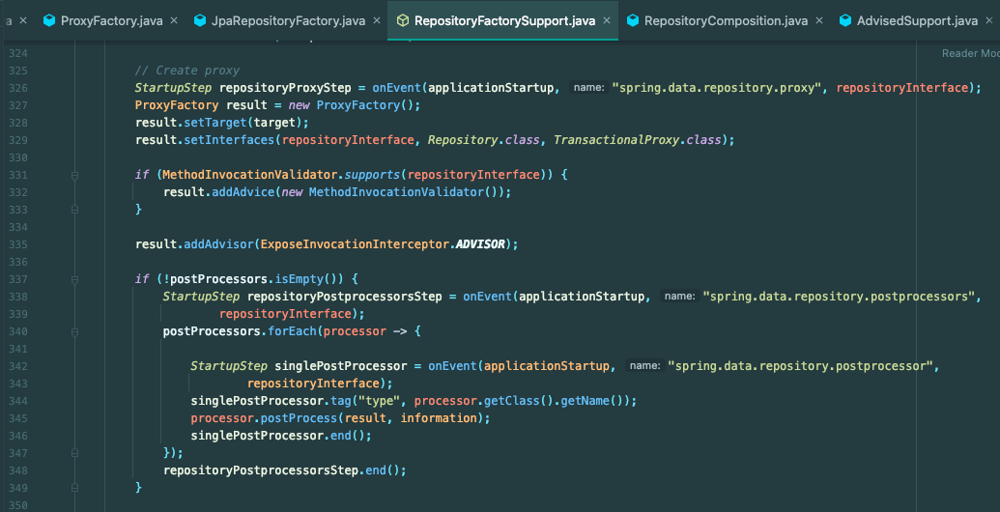
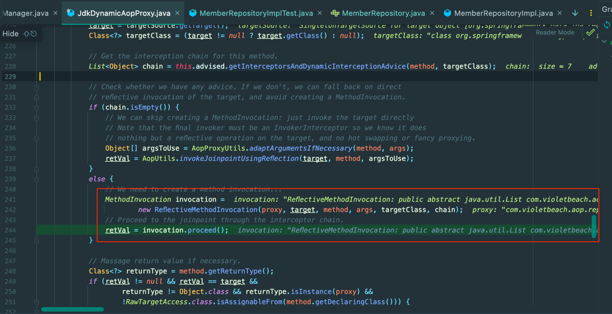

QueryDsl을 사용할 때 위 구조를 많이 사용한다. 이 구조가 어떻게 가능한 지 한번 생각해보자. 아래는 해당 구조를 사용할 때의 과정이다.

- MemberRepository는 JpaRepository를 상속받는다.
- MemberRepository는 MemberRepositoryCustom을 상속받는다.
- MemberRepositoryImpl은 MemberRepositoryCustom을 구현한다.
- **MemberRepository를 주입받아서 SimpleJpaRepository, MemberRepositoryImpl의 메서드 모두를 사용한다.**

`SimpleJpaRepository`, `MemberRepositoryImpl`은 **구체 클래스**이다. 둘 다 빈으로 등록되는 것인가? 접근은 `MemberRepository`로 하는데 어떻게 가능한 것인가

`SpringDataCommons`에서는 `MethodInterceptor` + `ReflectiveMethodInvocation`으로 풀어내고 있다.

 
기본적으로는 `SimpleJpaRepository`를 target으로 한다.

를 사용해서 여러 인터페이스의 구현체를 조합한다.

`BeanFactory`에서 빈을 등록할 때는 `Proxy`를 등록하고 해당 다이나믹 프록시가 `ReflectiveMethodInvocation`을 사용해서 **구현체의 메서드를 직접 실행**한다.

결과적으로 1개의 `MemberRepository`를 구현한 다이나믹 프록시가 등록되고 아래와 같이 다른 인스턴스의 메서드를 사용하는 방식으로 동작한다. 그래서 **1개의 빈으로 여러 구현체의 메서드를 사용**할 수 있게 된다.

