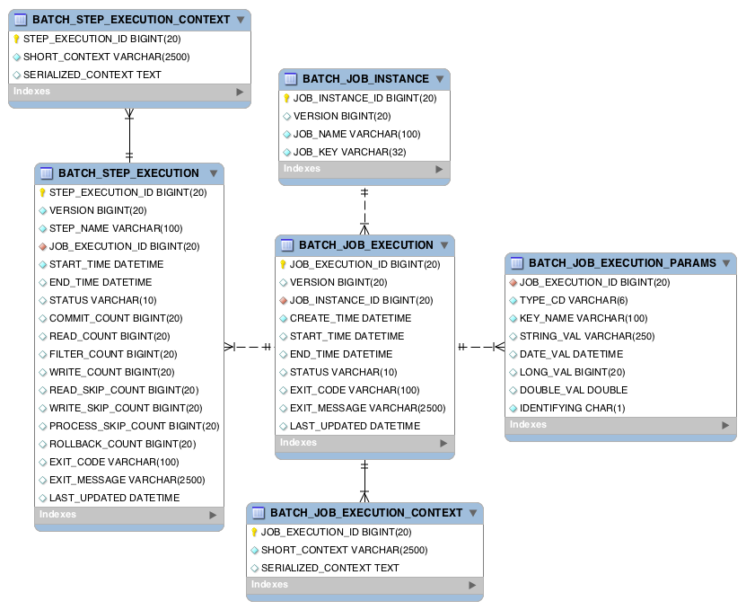

## Spring - 스프링 배치(Spring Batch)란 무엇인가?

## 스프링 배치

자바에서 표준으로 제공하는 일괄 처리(배치)를 위한 기술이 존재하지 않았었다.

스프링 배치(Spring Batch)는 이러한 문제를 해결하기 위해서 탄생했으며, Spring Source와 Accenture가 공동으로 개발했다. (Accenture는 배치 아키텍처를 구현하면서 쌓은 기술적인 경험과 노하우를 가진 기업)

### 배치

아래의 경우에 배치를 효율적으로 사용할 수 있다.

- 주기적으로 배치 프로세스를 커밋
- 적당한 양의 데이터로 분할 처리
- 동시 다발적인 Job의 병렬 처리
- 의존 관계가 있는 step 여러 개를 순차적으로 처리
  - 조건적 Flow 구성을 통한 체계적이고 유연한 배치 모델 구성
- 반복, 재시도, Skip 처리

### 배치 핵심 프로세스

아래는 배치에 가장 주요한 세 가지 단계이다.
- Read - 데이터베이스, 파일, 큐에서 다량의 데이터를 조회한다.
- Process - 특정 방법으로 데이터를 가공한다.
- Write - 가공된 데이터를 필요에 따라 저장하거나 사용한다.

## Spring Batch Layer

아래는 Spring Batch에서 공식적으로 제공하는 Layer의 그림이다.


[Application]
- Spring batch를 사용해서 개발자가 필요에 맞게 구현한 Job과 커스텀 코드
- 개발자는 Application 구현에만 집중하고, 코어한 기능은 프레임워크에 위임한다.

[Batch Core]
- Job을 실행, 모니터링, 관리하는 API 등을 말한다.
- JobLauncher, Job, Step, Flow과 같은 클래스를 말한다.

[Batch Infrastructure]
- Application, Core 모두 해당 Infrastructure 위에서 빌드된다.
- Job의 실행 흐름과 처리를 위한 틀을 제공
- Reader, Processor, Writer, Skip, Retry 등을 말한다.

## 설정 클래스

Spring Batch를 사용하려면 아래의 애노테이션을 Configuration에 등록하면 된다.

```java
@EnableBatchProcessing
```

결과적으로 스프링 배치의 실행 및 초기화가 이루어진다.

이때 총 3개의 설정 클래스가 설정으로 등록된다.

#### 1. BatchAutoConfiguration

- 스프링 배치가 초기화 될 때 자동으로 실행되는 설정 클래스
- Job을 수행하는 JobLauncherApplicationRunner 빈을 생성

#### 2. SimpleBatchConfiguration
- JobBuilderFactory와 StepBuilderFactory 빈 생성
- 스프링 배치의 주요 구성 요소 생성 (프록시 객체)

#### 3. BatchConfigurerConfiguration

아래 두 개의 설정 클래스를 가진다.

- BasicBatchConfigurer
  - SimpleBatchConfiguration에서 생성한 프록시 객체의 실제 대상 객체를 생성하는 설정 클래스
- JpaBatchConfigurer
  - BasicBatchConfigurer를 상속받는다.
  - JPA 관련 객체를 생성하는 설정 클래스

실행 순서는 아래와 같다.


해당 클래스들은 BatchConfigurer 인터페이스를 구현한다. 즉 커스텀으로 직접 구현해서 등록하는 것도 가능하다.

## JobConfiguration

Job은 아래와 같은 Configuration 클래스에서 등록할 수 있다.

```java
@Configuration
@RequiredArgsConstructor
public class HelloJobConfiguration {

    private final JobBuilderFactory jobBuilderFactory;
    private final StepBuilderFactory stepBuilderFactory;

    @Bean
    public Job HelloJob() {
        return jobBuilderFactory.get("helloJob")
                .start(helloStep())
                .build();
    }
    
    @Bean
    public Step helloStep() {
        return stepBuilderFactory.get("helloStep")
                .tasklet(((stepContribution, chunkContext) -> {
                    System.out.println("Hello");
                    return RepeatStatus.FINISHED;
                }))
                .build();
    }

}
```

해당 클래스에서는 JobBuilderFactory와 StepBuilderFactory를 사용해서 Job과 Step의 빈을 등록한다.

Job을 생성할 때는 Job이 구동될 때 어떤 Step들을 실행할 지 구성을 정의하고, Step에서는 어떤 Tasklet을 실행할 지 구성을 정의한다.
- (Tasklet는 비즈니스 로직을 포함한다.)

즉, Job과 Step과 Tasklet은 1:n:nm이 되겠다.
- 그리고 나중에 알아보겠지만 Step이 Tasklet이 아니라 Chunk를 실행하도록 구현할 수도 있다.

## Meta data

데이터의 일괄처리 등을 담당하게 되면 이력이나 해당 처리의 진행 상황이나 상태 등이 매우 중요하게 된다. 가령 MSA의 경우 외부 시스템 호출이 빈번하게 발생하기 때문에 성공/실패 여부나 진행 상태 등을 시스템적으로 파악하기가 어렵다.

스프링 배치에서는 기본적으로 실행 및 관리를 위한 목적으로 Job, Step, JobParameters 등의 정보들을 저장, 업데이트, 조회할 수 있는 메타 데이터 스키마를 제공한다. 해당 메타데이터를 활용하면 Job의 실행했던 이력과 성공 및 실패 여부 등을 매우 자세하게 스프링 배치가 관리해주기 때문에 리스크 발생시 빠른 대처가 편리하다.



Schema는 기본적으로 Spring Batch에서 자체적으로 정의하고 있다. DBMS 별로 해당 스키마의 DDL을 제공한다.

ddl 스크립트는 /org/springframework/batch/core/schema-{dbms}.sql을 수동으로 실행시키거나
spring.batch.jdbc.initialize-schema 프로퍼티를 수정하면 된다.
- ALWAYS
  - 항상 실행
- EMBEDDED (default)
  - 내장 DB일때만 실행
- NEVER
  - 스크립트를 항상 실행하지 않음

### Schema

Job 관련 테이블

- BATCH_JOB_INSTANCE
  - Job이 실행될 때 job_name이 key로 저장된다.
- BATCH_JOB_EXECUTION
  - job이 실행될 때 생성, 시작, 종료 시간, 실행 상태, 메시지 등을 관리
- BATCH_JOB_EXECUTION_PARAMS
  - Job과 함께 시랳ㅇ되는 JobParameter 정보를 저
- BATCH_JOB_EXECUTION_CONTEXT
  - Job이 실행동안 여러가지 상대 정보와 공유 데이터 등을 직렬화(JSON)해서 저장
  - Step간 서로 공유가 가능

Step 관련 테이블

- BATCH_STEP_EXECUTION
  - Step의 실행 정보 및 생성, 시작, 종료 시간, 실행 상태, 메시지 등을 관리
- BATCH_STEP_EXECUTION_CONTEXT
  - Step의 실행동안 여러가지 상태 정보와 공유 데이터 등을 직렬화(JSON)해서 저장
  - Step 별로 지정되므로 Step 간 서로 공유할 수 없음

## 참고
- https://docs.spring.io/spring-batch/docs/current/reference/html/schema-appendix.html
- https://docs.spring.io/spring-batch/docs/current/reference/html/spring-batch-architecture.html
