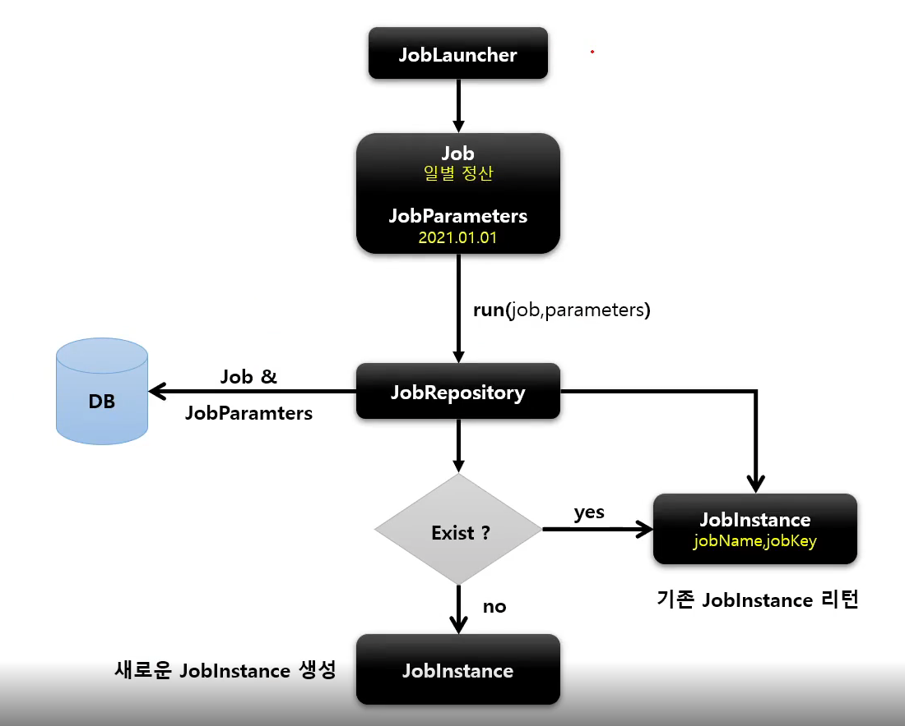
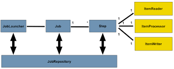
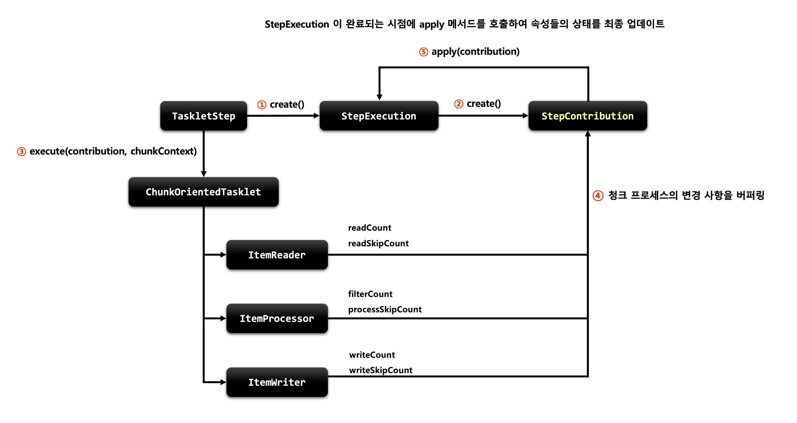

## Spring Batch - 기본 주요 도메인 이해하기!

# Job

배치 계층에서 가장 상위에 있는 개념으로 하나의 작업 자체를 의미한다.

Job Configuration을 통해 생성되고, 하나의 작업을 어떻게 구성하고 실행할 것인지 전체적으로 명세한다.

여러 개의 Step으로 구성되기 때문에 최소한 1개 이상의 Step을 구성해야 한다.

Job의 경우 빈으로 등록한 후 수동으로 실행시킬 수도 있고, SpringBoot의 BatchAutoConfiguration에서 기본으로 빈으로 등록한 Job을 수행한다.

#### Job 구현체

SimpleJob
- 순차적으로 Step을 실행시키는 Job
- 모든 Job에서 유용하게 사용할 수 있는 표준 기능을 가지고 있다.

FlowJob
- 특정한 조건과 흐름에 따라 Step을 구성하여 실행시키는 Job
- Flow 객체를 실행시켜서 작업을 진행한다.

## JobInstance

Job이 실행될 때 생성되는 job의 논리적 실행 단위 객체로서 고유하게 식별 가능한 작업을 실행한다.

하루에 한번씩 배치 Job이 실행된다면 매일 실행되는 각각의 Job을 JobInstance라고 표현한다.
- 처음 시작하는 Job + JobParameter일 경우 새로운 JobInstance를 생성
- 이전과 동일한 Job + JobParameter로 실행할 경우 이미 존재하는 JobInstance 리턴
  - 내부적으로 JobName + JobKey(jobParameters의 해시값)을 가지고 JobInstance 객체를 얻는다.
- Job과 1:M 관계

JobInstance는 JobRepository에 의해 BATCH_JOB_INSTANCE 테이블에 저장된다.

## JobRepository
JobLauncher로 Job을 실행시킬 때 아래의 코드를 구성할 수 있다.
```java
@Component
@RequiredArgsConstructor
public class JobRunner implements ApplicationRunner {

    private final JobLauncher jobLauncher;
    private final Job job;

    @Override
    public void run(ApplicationArguments args) throws Exception {
        JobParameters jobParameters = new JobParametersBuilder()
                .addString("userId", "violetbeach")
                .toJobParameters();
        jobLauncher.run(job, jobParameters);
    }

}
```



내부적으로 JobRepository가 현재 실행중인 Job이 처음 실행하는 것인지, 이미 실행된 (존재하는) JobInstance인지 확인한다.

존재 여부에 따라 기존의 JobInstance를 반환하거나 새로운 JobInstance를 생성한다.
- 기존의 JobInstance가 완료가 된 상태라면 예외를 발생한다.

## JobParameters

그럼 jobParameters는 어떻게 구성될까?

JobParameters는 내부적으로 `LinkedHashMap <String, JobParameter>를 가진다.

JobParameter는 아래의 세 개의 필드를 가진 Object이다.
- Object parameter
- ParameterType parameterType (String, Data, Long, Double)
- boolean identifying

## JobExecution

JobInstance에 대한 한번의 시도를 의미하는 객체로서 Job 실행 중 발생한 정보들을 저장한다.
- 시작 시간, 종료 시간, 상태(시작, 완료, 실패, 종료), 결과를 가진다.
- 예외가 터지면 어떤 예외가 왜 터졌는지 등도 추적이 가능하다.

JobExecution의 상태에 따라 JobInstance는 아래의 영향을 받는다.
- COMPLETED라면 재실행이 불가능하다.
- FAILED라면 재실행이 가능하다.
  - JobParameters가 동일해도 재실행이 가능하다.

지금까지 Job에 대해 알아봤다.

# Step

Step은 Job을 구성하는 독립적인 하나의 단계로서 하나의 작업을 처리를 정의하고 실행하는데 필요한 정보를 가지고 있다.

Step은 아래의 기본 구현체들이 있다.
- TaskletStep - 가장 기본이 되는 클래스로 Tasklet를 구성하고 제어
- PartitionStep - 멀티 스레드 방식으로 Step을 여러 개를 병렬로 실행한다.
- JobStep - Step 내에서 Job을 실행한다.
  - JobExecution 인스턴스를 사용한다.
- FlowStep - Step 내에서 Flow를 실행한다.

Step을 AbstractStep이 구현하고, 각 구현체들이 이를 상속한다. 

### Tasklet

Step은 내부에 Tasklet이나 ItemReader, ItemProcessor, ItemWriter 등 Chunk 기반 클래스를 구성할 수 있다.



### Chunk

스프링에서는 Chunk기반으로 Step을 처리할 수 있도록 ChunkOrientedTasklet을 제공한다.
- Tasklet을 사용하는 것과 원리는 동일하다.

## StepExecution

Step에 대한 한번의 시도를 의미하는 객체로서 Step 실행 중 발생한 정보들을 저장한다.
- 시작 시간, 종료 시간, 상태(시작, 완료, 실패, 종료), Commit count, Rollback count 등을 가진다.
- Job이 재시작되더라도 이미 성공한 Step은 재 실행하지 않고, 실패한 Step만 처리한다.
  - 이전 단계 Step의 실패로 인해 Step이 실행되지 않았다면 StepExecution도 생성되지 않는다.
- JobExecution이 가지는 StepExecution이 하나라도 실패하면 JobExecution도 실패한다.

## StepContribution

StepContribution은 청크 프로세스의 변경 사항을 버퍼링한 후 StepExecution 상태를 업데이트하는 도메인 객체이다.
- 청크 Commit 직전에 StepExecution의 apply 메서드를 호출하여 상태를 업데이트한다.
- ExitStatus의 기본 종료코드 외 사용자 정의 종료코드를 생성하여 적용할 수도 있음

최종적으로는 StepContribution을 통해 우리는 Chunk 기반의 프로세싱의 진행상황을 추적할 수 있게 된다.

#### 구성
- readCount - 성공적으로 read한 아이템 수
- writeCount - 성공적으로 write한 아이템 수
- filterCount - ItemProcessor에 의해 필터링된 아이템 수
- parentSkipCount - 부모 클래스인 StepExecution의 총 Skip 횟수
- readSkipCount - read에 실패해서 스킵된 횟수
- writeSkipCount - write에 실패해서 스킵된 횟수
- processSkipCount - process에 실패해서 스킵된 횟수
- ExitStatus - 실행결과를 나타내는 클래스로서 종료코드를 포함
  - (UNKNOWN, EXECUTING, COMPLETED, NOOP, FAILED, STOPPED)



위는 실행 순서를 도식화한 것이다. 
1. TaskletStep은 StepExecution 객체를 생성
2. StepExecution은 StepContribution을 생성
3. Step은 Tasklet을 호출한다.
4. Item Reader, ItemWriter 등에 의해 Chunk 작업을 처리한다.
    - StepContribution에 readCount, readSkipCount 등 진행 상황을 반영해둔다.
- StepExecution이 완료되는 시점에 apply()를 호출해서 진행 상황을 최종적으로 반영한다.

## 참고

- https://inf.run/p7si
- https://jojoldu.tistory.com/325


